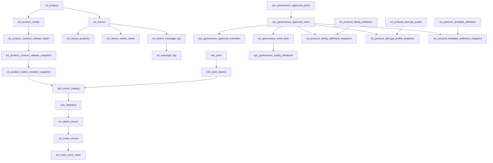
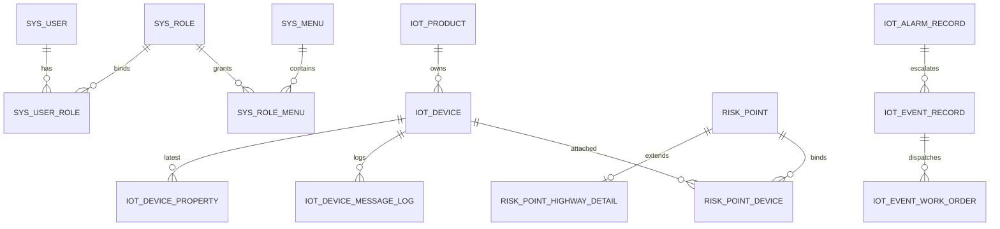

# 04 数据库设计与初始化数据

> 文档定位：数据库结构、初始化数据和命名兼容口径说明。
> 适用角色：后端、DBA、运维、测试、交付人员。
> 权威级别：一级权威。
> 上游来源：`schema/**/*.json` registry、`schema-governance/*.json` registry、`sql/init.sql`、`sql/init-data.sql`、`sql/init-tdengine.sql`、`schema/generated/mysql-schema-sync.json`、运行时 bootstrap manifest、实体与 mapper 实现。
> 下游消费：环境初始化、历史库对齐、帮助中心治理、验收核表。
> 变更触发条件：表结构变化、初始化样例变化、历史库对齐策略变化、命名兼容变化。
> 更新时间：2026-04-18

本文件以 `schema/` registry 为结构真相源，以 `schema-governance/` registry 为 archived / pending_delete / seed 退场 / 真实库审计的治理真相源，以 `sql/init.sql`、`sql/init-data.sql`、`sql/init-tdengine.sql` 为可执行初始化出口。

职责边界：
- 本文件只负责表结构、初始化数据、ER 入口和字段字典索引。
- 多租户、组织范围与数据权限口径以 [13-数据权限与多租户模型.md](./13-数据权限与多租户模型.md) 为准。
- 交付能力与验收判定以 [21-业务功能清单与验收标准.md](./21-业务功能清单与验收标准.md) 为准。

## 1. 库与初始化入口

- 目标业务库：`rm_iot`（MySQL）
- 目标时序库：`iot`（TDengine）
- 全量初始化：
  1. 执行 `sql/init.sql`
  2. 执行 `sql/init-data.sql`
- TDengine 初始化：
  1. 执行 `sql/init-tdengine.sql`
- 历史库对齐：以最新 `sql/init.sql`、`sql/init-data.sql`、`sql/init-tdengine.sql` 为准重建或人工比对；正式基线仍不依赖独立增量 SQL 目录，但允许在 `sql/upgrade/` 下补充仅用于历史数据清理的一次性脚本。
- 时序表初始化：仓库当前已提供可直接执行的 `sql/init-tdengine.sql`，用于初始化 `iot_device_telemetry_point` 兼容表、telemetry v2 raw stable（`iot_raw_measure_point`、`iot_raw_status_point`、`iot_raw_event_point`）以及 `iot_agg_measure_hour` 小时聚合 stable；应用启动阶段仍只保留 `iot_device_telemetry_point` 与 raw stable 的 `CREATE IF NOT EXISTS` 级别 schema 补齐能力，用于历史环境兜底，不自动回灌历史数据。当前共享 TDengine 基线不接受 `metric_id ... COMPOSITE KEY` 语法，因此 raw stable 已统一收口为普通 `metric_id` 列，并由运行时按 `ingested_at` 基准为每个 raw 点分配唯一单调 `ts` 行键、把设备真实采集时间保留在 `reported_at`，避免同一条 `$dp` 上报中的多指标点位互相覆盖。对象洞察趋势等历史读口径也会优先按 `ingested_at/ts` 聚桶，不再把传感器采集时间直接当作趋势主时间轴。`iot_agg_measure_hour` 必须继续通过脚本手动初始化，应用运行时只会自动派生 `tb_ah_<tenantId>_<deviceId>` child table；若后续要在其它 TDengine 版本开启小时聚合，仍需先复验同小时多指标写入语义。真实环境 legacy stable 继续由环境侧治理，代码不负责补 stable DDL。
- telemetry v2 latest 投影表：`iot_device_metric_latest` 已进入 `sql/init.sql`，新库初始化即可直接建表。
- 无效上报最新态表：`iot_device_invalid_report_state` 已进入 `sql/init.sql`，设备接入失败治理与无效上报治理默认可用。

### 1.1 `sql/` 目录脚本分类

- `sql/init.sql`：全量 DDL 基线。脚本会先 `CREATE DATABASE rm_iot`、`USE rm_iot`、`SET NAMES utf8mb4`，再按“先删视图、后删表、再重建”的顺序创建当前基线 `60` 张 MySQL 表，并在末尾补齐 `iot_message_log` 兼容视图。
- `sql/init-data.sql`：全量初始化样例数据。主要采用 `INSERT ... ON DUPLICATE KEY UPDATE`、变量查询和幂等删除重建关联数据的方式，适合在同一环境重复执行；当前已显式为验收设备样例写入 `iot_device.org_id / org_name`，保持设备主档与已绑定风险点组织口径一致；`2026-04-25` 起菜单与按钮权限基线统一覆盖五个一级工作台、分组首页、产品详情隐藏路由、业务验收结果页、质量工场兼容入口和页面按钮权限，并按 `role_code + menu_code` 动态重建 `sys_role_menu`。
- `sql/init-tdengine.sql`：TDengine 初始化脚本。负责建立 `iot` 时序库、`iot_device_telemetry_point` 兼容表、telemetry v2 raw stable 与 `iot_agg_measure_hour` 小时聚合 stable，并在脚本内直接说明表作用、字段含义和 child table 生成规则。
- 仓库当前不再保留承载正式基线的独立增量 SQL 文件。原增量脚本中已进入正式交付基线的 DDL、索引、兼容视图和样例数据，已经并回 MySQL 初始化文件或收口到 `sql/init-tdengine.sql`；如需补充历史数据清理，只允许提供不改变全量基线的一次性脚本，例如 `sql/upgrade/20260414_device_property_full_path_dedup.sql`。
- 当前目录中最常见的语句模式包括：
  - `DROP VIEW IF EXISTS` / `DROP TABLE IF EXISTS`：保证新库和重建库可重复执行。
  - `CREATE TABLE` / `CREATE INDEX`：直接建立当前正式基线结构与检索索引。
  - `CREATE OR REPLACE VIEW`：补齐兼容命名入口，例如 `iot_message_log`。
  - `INSERT ... ON DUPLICATE KEY UPDATE`：幂等写入菜单、角色、样例数据和治理种子。
  - 静态审计：`node scripts/audit-menu-permission-seed.mjs` 会从前端路由、工作台配置、UI/后端权限常量与 `sql/init-data.sql` 交叉检查页面路由、隐藏详情页和按钮权限，输出 `missingRoutePaths / missingPermissionCodes / softDeletedPermissionCodes / failures`。

### 1.2 当前脚本边界说明

- `sql/init.sql` 是当前 MySQL 全量建库入口，默认与 [README.md](../README.md) 和 [07-部署运行与配置说明.md](./07-部署运行与配置说明.md) 保持一致。
- `sql/init-data.sql` 是当前 MySQL 初始化数据入口，菜单、角色授权、系统内容样例和通知渠道基线都直接以内收方式维护。
- `sql/init-tdengine.sql` 是当前 TDengine 初始化入口，用于在不依赖应用启动的情况下直接建好 telemetry 相关时序结构。
- `sql/upgrade/20260414_device_property_full_path_dedup.sql` 是当前唯一保留的历史数据清理例外脚本，只用于删除同设备下“短标识 + 全路径标识”并存时的旧短标识 latest 快照，不参与新库初始化。
- 历史环境若需对齐当前代码，优先使用最新 `sql/init.sql` / `sql/init-data.sql` / `sql/init-tdengine.sql` 重建或初始化；无法重建时，再人工比对脚本结构或执行 `python scripts/run-real-env-schema-sync.py`。该脚本当前也会补齐 `iot_product.metadata_json`、`iot_device_onboarding_case`、`iot_onboarding_template_pack`、`iot_device.org_id / org_name`、`idx_device_tenant_org_deleted`、`iot_normative_metric_definition`、`iot_vendor_metric_evidence`、`iot_vendor_metric_mapping_rule`、`iot_vendor_metric_mapping_rule_snapshot`、`iot_runtime_metric_display_rule`、`iot_product_contract_release_batch`、`iot_product_contract_release_snapshot`、`iot_product_metric_resolver_snapshot`、`iot_protocol_family_definition`、`iot_protocol_family_definition_snapshot`、`iot_protocol_decrypt_profile`、`iot_protocol_decrypt_profile_snapshot`、`iot_protocol_template_definition`、`iot_protocol_template_definition_snapshot`、`iot_device_secret_rotation_log`、`risk_metric_catalog`、`risk_metric_linkage_binding`、`risk_metric_emergency_plan_binding` 以及 `risk_point_device.risk_metric_id / rule_definition.risk_metric_id`，并在回填设备归属前拦截“一设备多风险点有效绑定”脏数据；治理权限方面会清理旧粗粒度写权限并补齐 `iot:normative-library:approve`、`risk:metric-catalog:approve`、`iot:protocol-governance:edit`、`iot:protocol-governance:approve` 与 `/device-onboarding` 相关菜单授权。
- `python scripts/run-real-env-schema-sync.py` 当前同时补齐审批策略、审批主单、审批轨迹与复盘反馈表：`sys_governance_approval_policy`、`sys_governance_approval_order`、`sys_governance_approval_transition`、`sys_governance_replay_feedback`。
- `2026-04-11` 起，`python scripts/run-real-env-schema-sync.py` 还会继续对齐审批主单与治理任务生命周期桥接字段：`sys_governance_approval_order.work_item_id`，以及 `iot_governance_work_item.task_category / domain_code / action_code / execution_status / recommendation_snapshot_json / evidence_snapshot_json / impact_snapshot_json / rollback_snapshot_json`，避免共享库缺列时控制面只能靠页面本地猜测审批进度。
- `2026-04-11` 起，`python scripts/run-real-env-schema-sync.py` 会同步对齐治理固定复核人种子：若历史环境缺少 `governance_reviewer` 账号、缺少其 `SUPER_ADMIN` 角色绑定，或缺少 `PRODUCT_CONTRACT_RELEASE_APPLY / PRODUCT_CONTRACT_ROLLBACK / VENDOR_MAPPING_RULE_PUBLISH / VENDOR_MAPPING_RULE_ROLLBACK / PROTOCOL_FAMILY_PUBLISH / PROTOCOL_FAMILY_ROLLBACK / PROTOCOL_DECRYPT_PROFILE_PUBLISH / PROTOCOL_DECRYPT_PROFILE_ROLLBACK` 八条全局固定复核策略，脚本会一并补齐，避免 `/products` 或协议治理审批提交时继续因旧库缺表/缺种子数据报错。
- `2026-04-11` 起，`sql/init-data.sql` 与 `python scripts/run-real-env-schema-sync.py` 还会同步对齐翻斗式雨量计治理种子：产品 `nf-monitor-tipping-bucket-rain-gauge-v1` 会补齐正式 `value / totalValue` 物模型、`metadata_json.objectInsight.customMetrics[]`、`phase4-rain-gauge` 规范字段定义，以及 `L3_YL_1.value / L3_YL_1.totalValue -> value / totalValue` 的产品级 `iot_vendor_metric_mapping_rule`，用于让历史共享库直接具备雨量计 compare/apply 基线。
- `2026-04-19` 起，仓库新增 `python scripts/reset-product-governance-data.py`，用于在保留 `iot_product / iot_device / iot_device_relation` 与既有设备-产品绑定的前提下，按 `all / tenant / productIds` 范围清理产品治理派生数据。脚本固定支持 `dry-run / backup / execute` 三种模式，其中 `backup / execute` 读取 `application-dev.yml` 默认 MySQL 连接；`execute` 必须显式携带 `--execute --confirm`，`backup` 会先输出受影响行数 manifest。当前脚本会同步清理 `risk_metric_catalog` 及其下游绑定、合同发布/映射/解析快照、治理审批/工作项衍生数据，并把 `iot_device_onboarding_case` 回退到 `release_batch_id=NULL + current_step=CONTRACT_RELEASE + status=IN_PROGRESS`。
- TDengine 兼容表 `iot_device_telemetry_point` 与 telemetry v2 raw stable 当前既可通过 `sql/init-tdengine.sql` 直接初始化，也保留运行时自动补齐能力；`iot_agg_measure_hour` 必须通过 `sql/init-tdengine.sql` 手动初始化，运行时只自动创建 `tb_ah_*` child table。

### 1.3 Schema Registry 与 Governance Registry 真相源与流程

- `schema/mysql/*.json`、`schema/views/mysql-compatibility.json`、`schema/tdengine/telemetry-domain.json` 是当前数据库结构、中文注释、生命周期、关系与业务边界的唯一真相源。
- `sql/init.sql`、`sql/init-tdengine.sql`、`schema/generated/mysql-schema-sync.json`、`spring-boot-iot-framework/src/main/resources/schema/runtime-bootstrap/mysql-active-schema.json`、`spring-boot-iot-telemetry/src/main/resources/schema/runtime-bootstrap/tdengine-active-schema.json`、[docs/appendix/database-schema-object-catalog.generated.md](./appendix/database-schema-object-catalog.generated.md)、[docs/appendix/database-schema-lineage.generated.md](./appendix/database-schema-lineage.generated.md) 全部由 registry 渲染生成，不再允许绕过 registry 直接维护结构性 DDL。
- `schema-governance/*.json` 是当前 archived / pending_delete 对象、seed 包归属、真实库审计 profile、备份要求和删除前置条件的治理真相源；首批已接入 `alarm` 域的 `risk_point_highway_detail` 样板，完整目录见 [docs/appendix/database-schema-governance-catalog.generated.md](./appendix/database-schema-governance-catalog.generated.md)。治理渲染链还会额外生成 [docs/appendix/database-schema-domain-governance.generated.md](./appendix/database-schema-domain-governance.generated.md)，按域汇总对象规模、生命周期、治理对象与血缘摘要。`python scripts/governance/check_governance_registry.py` 当前除校验治理 registry 本身外，还会校验这两份治理附录是否与最新 registry / 渲染逻辑保持一致；若输出 `OUT_OF_DATE docs/appendix/...`，需先执行 `python scripts/governance/render_governance_docs.py --write`。`scripts/governance/run_domain_audit.py` 与兼容审计脚本还会把真实库表注释/字段注释与 `schema/` 结构真相源对比，显式输出 archived 对象的中文注释漂移。
- `sql/init-data.sql` 继续只承载演示数据、权限基线与共享环境 seed，不参与运行时 bootstrap，也不由 MySQL active schema runner 自动执行。
- 当前标准变更流程固定为：
  1. 修改 `schema/` 下对应业务域 registry。
  2. 执行 `python scripts/schema/render_artifacts.py --write`。
  3. 执行 `python scripts/schema/check_schema_registry.py`。
  4. 若结构边界、业务边界、生命周期或关系发生变化，同步回写本文档与变更记录。
- 当任务涉及 archived / pending_delete 对象、seed 退场或真实库删除前置条件时，必须额外执行：
  1. 修改 `schema-governance/` 下对应业务域治理 registry。
  2. 执行 `python scripts/governance/render_governance_docs.py --write`。
  3. 执行 `python scripts/governance/check_governance_registry.py`。
  4. 执行 `python scripts/governance/run_domain_audit.py --domain <domain>`。
  5. 如需备份，执行 `python scripts/governance/export_object_backup.py --domain <domain> --object <objectName>`。
  6. 同步回写本文档与变更记录。
- 运行时自动补齐边界固定为：
  - MySQL：只补 active 对象的建表、补列、补索引与兼容视图。
  - TDengine：只自动补齐 `iot_device_telemetry_point`、`iot_raw_measure_point`、`iot_raw_status_point`、`iot_raw_event_point`。
  - `iot_agg_measure_hour`：保留在 `sql/init-tdengine.sql` 手动初始化基线中，运行时只校验 stable 是否存在并派生 `tb_ah_*` child table。

## 2. 表结构分层

### 数据库对象总览

当前 registry 已收口以下结构对象：

| 范围 | 数量 | init | schema sync | 运行时补齐 | 说明 |
| --- | --- | --- | --- | --- | --- |
| MySQL active 表 | 60 | 是 | 是 | 是 | 当前业务主链路默认初始化对象 |
| MySQL archived 表 | 1 | 否 | 否 | 否 | `risk_point_highway_detail` 仅保留历史观察，不再进入默认主链路 |
| MySQL 兼容视图 | 1 | 是 | 是 | 是 | `iot_message_log` 继续作为统一兼容命名入口 |
| TDengine 自动补齐对象 | 4 | 是 | 兼容清单管理 | 是 | `iot_device_telemetry_point` + `3` 张 raw stable |
| TDengine 手动对象 | 1 | 是 | 否 | 手动 | `iot_agg_measure_hour` 继续要求脚本先初始化 stable |

代表性对象如下，完整对象目录、模块归属、生命周期与 bootstrap 策略见 [docs/appendix/database-schema-object-catalog.generated.md](./appendix/database-schema-object-catalog.generated.md)：

| 对象 | 存储类型 | 业务域 | 生命周期 | 所属模块 | init | schema sync | 运行时补齐 | 备注 |
| --- | --- | --- | --- | --- | --- | --- | --- | --- |
| `iot_protocol_family_definition` | `mysql_table` | `governance` | `active` | `spring-boot-iot-framework` | 是 | 是 | 是 | 协议族定义草稿真相表 |
| `iot_protocol_family_definition_snapshot` | `mysql_table` | `governance` | `active` | `spring-boot-iot-framework` | 是 | 是 | 是 | 协议族定义正式发布快照表 |
| `iot_protocol_decrypt_profile` | `mysql_table` | `governance` | `active` | `spring-boot-iot-framework` | 是 | 是 | 是 | 协议解密档案草稿真相表 |
| `iot_protocol_decrypt_profile_snapshot` | `mysql_table` | `governance` | `active` | `spring-boot-iot-framework` | 是 | 是 | 是 | 协议解密档案正式发布快照表 |
| `iot_protocol_template_definition` | `mysql_table` | `governance` | `active` | `spring-boot-iot-framework` | 是 | 是 | 是 | 协议模板草稿真相表 |
| `iot_protocol_template_definition_snapshot` | `mysql_table` | `governance` | `active` | `spring-boot-iot-framework` | 是 | 是 | 是 | 协议模板正式发布快照表 |
| `iot_device_onboarding_case` | `mysql_table` | `device` | `active` | `spring-boot-iot-device` | 是 | 是 | 是 | 无代码接入案例主表 |
| `iot_onboarding_template_pack` | `mysql_table` | `device` | `active` | `spring-boot-iot-device` | 是 | 是 | 是 | 无代码接入模板包主表 |
| `iot_runtime_metric_display_rule` | `mysql_table` | `device` | `active` | `spring-boot-iot-device` | 是 | 是 | 是 | 运行态字段显示规则表 |
| `iot_vendor_metric_mapping_rule_snapshot` | `mysql_table` | `device` | `active` | `spring-boot-iot-device` | 是 | 是 | 是 | 厂商字段映射规则正式发布快照真相表 |
| `iot_product_contract_release_batch` | `mysql_table` | `device` | `active` | `spring-boot-iot-device` | 是 | 是 | 是 | 产品合同发布批次真相表 |
| `risk_point_highway_detail` | `mysql_table` | `alarm` | `archived` | `spring-boot-iot-alarm` | 否 | 否 | 否 | 高速项目历史归档观察对象 |
| `iot_agg_measure_hour` | `tdengine_stable` | `telemetry` | `active` | `spring-boot-iot-telemetry` | 是 | 否 | 手动 | 共享环境需先执行 `sql/init-tdengine.sql` |

### 主血缘链与业务边界

当前数据库对象按“主真相 / 快照 / 投影 / 桥接 / 归档”五类角色治理：

- 主真相：直接承载业务当前态与主链路写入，例如 `iot_product`、`iot_product_model`、`iot_device_onboarding_case`、`iot_onboarding_template_pack`、`iot_device`、`risk_point`、`sys_governance_approval_order`、`iot_protocol_family_definition`、`iot_protocol_decrypt_profile`、`iot_protocol_template_definition`。
- 快照：冻结某次发布或审批时刻的结构真相，例如 `iot_vendor_metric_mapping_rule_snapshot`、`iot_product_contract_release_snapshot`、`iot_product_metric_resolver_snapshot`、`iot_protocol_family_definition_snapshot`、`iot_protocol_decrypt_profile_snapshot`、`iot_protocol_template_definition_snapshot`。
- 投影：为查询或兼容读优化的派生对象，例如 `iot_device_metric_latest`、`iot_message_log`。
- 桥接：连接设备治理、风险治理、审批治理与运行态展示之间的关系与目录对象，例如 `risk_metric_catalog`、`risk_point_device`、`iot_vendor_metric_mapping_rule`、`iot_runtime_metric_display_rule`。
- 归档：保留历史项目或历史模型痕迹，不再进入默认 init / schema sync / runtime bootstrap，例如 `risk_point_highway_detail`。

主血缘链如下：

业务边界与扩字段策略固定为：

- 允许继续承载业务扩展的主表，主要集中在 `iot_product`、`iot_product_model`、`iot_device`、`risk_point`、`risk_metric_catalog`、`sys_governance_*` 等真相表；但新增表或扩字段必须先改 registry，再渲染产物。
- 快照表、投影表、兼容视图与 runtime manifest 不允许脱离主真相源自行长字段；若确需扩展，必须同时说明来源主表、更新血缘与读写边界。
- archived 对象当前只有 `risk_point_highway_detail`，只允许做历史核查、目录说明与人工清理脚本，不允许重新纳入默认初始化链路。`2026-04-15` 起，该对象的治理阶段、seed 包、审计 profile、备份要求与删除前置条件统一收口到 `schema-governance/alarm-domain.json`；共享 `dev` 审计已确认该表仍保留 `65` 条 `deleted=0` 记录，且全部关联现存 `risk_point`；其中 `RP-HW-SLOPE-045`、`RP-HW-SLOPE-046` 两个风险点还存在 `9` 条有效 `risk_point_device_capability_binding`，因此当前仍不具备进入 `pending_delete` 的条件。同一轮审计还确认：由于 archived 表不参与 active schema sync，该共享库中的 `risk_point_highway_detail` 真实表注释与部分列注释仍未跟随 registry 中文口径自动对齐，当前已通过治理审计输出 `schema_comment_drift` 进行显式挂牌。
- pending_delete 当前暂无已确认对象；如后续出现，必须先进入 registry 生命周期清单并在本文显式挂牌后，才允许进入真正删除流程。
- 当前域级治理台账只汇总静态结构与治理真相，不直接内嵌真实库动态审计结果；真实库事实继续以本文与 `docs/08` 为准。

完整对象级血缘、关系边与业务边界目录请优先查看 [docs/appendix/database-schema-lineage.generated.md](./appendix/database-schema-lineage.generated.md)。若需要先按域理解“有哪些对象、生命周期如何分布、有哪些治理对象、主血缘链大致如何”，优先查看 [docs/appendix/database-schema-domain-governance.generated.md](./appendix/database-schema-domain-governance.generated.md)。本文只保留主链路级摘要，避免再次手工维护一份平行血缘文档。

## 2.1 系统治理域

- `sys_tenant`
- `sys_user`
- `sys_role`
- `sys_user_role`
- `sys_menu`
- `sys_role_menu`
- `sys_organization`
- `sys_region`
- `sys_dict`
- `sys_dict_item`
- `sys_notification_channel`
- `sys_in_app_message`
- `sys_in_app_message_read`
- `sys_in_app_message_bridge_log`
- `sys_in_app_message_bridge_attempt_log`
- `sys_help_document`
- `sys_audit_log`
- `sys_governance_approval_policy`
- `sys_governance_approval_order`
- `sys_governance_approval_transition`
- `sys_governance_replay_feedback`
- `iot_protocol_family_definition`
- `iot_protocol_family_definition_snapshot`
- `iot_protocol_decrypt_profile`
- `iot_protocol_decrypt_profile_snapshot`
- `iot_protocol_template_definition`
- `iot_protocol_template_definition_snapshot`

关键说明：
- `sys_menu` 同时保留历史兼容字段（如 `menu_type`、`route_path`、`permission`）。
- `sys_in_app_message` 当前使用 `target_type + target_role_codes + target_user_ids` 承载消息推送范围，优先保证站内消息可用闭环，后续再评估是否拆分独立发布明细表。
- `sys_in_app_message` 当前已新增 `dedup_key`、`idx_in_app_message_source (source_type, source_id)` 与 `idx_in_app_message_tenant_dedup (tenant_id, dedup_key, deleted)`，用于自动消息去重与治理检索。
- `sys_notification_channel.config.scenes` 当前统一承载 `system_error / observability_alert / in_app_unread_bridge` 三类自动场景；规则化运维告警继续复用 Redis 冷却键，不新增专用告警表。若渠道只想接收指定治理运维告警，可在同一 `config` JSON 中继续声明 `opsAlertTypes`，当前支持 `FIELD_DRIFT / CONTRACT_DIFF / MISSING_RISK_METRIC`。
- `sys_in_app_message.source_type` 当前统一收口为 `manual / system_error / event_dispatch / work_order / governance`；历史样例中的旧来源值会在升级脚本中回填。
- `sys_in_app_message_read` 以 `(tenant_id, message_id, user_id)` 唯一约束承载已读态，记录存在即代表已读。
- `sys_in_app_message_bridge_log` 以 `(tenant_id, message_id, channel_code, bridge_scene)` 唯一约束承载“每条消息 + 每个渠道”的最新桥接状态汇总。
- `sys_in_app_message_bridge_attempt_log` 承载逐次桥接尝试审计；唯一键为 `(bridge_log_id, attempt_no)`，并补有 `(bridge_log_id, attempt_time desc)`、`(message_id, channel_code, attempt_time desc)` 索引，便于治理页按桥接记录或消息维度回看失败重试链路。
- `sys_help_document` 当前使用 `visible_role_codes + related_paths` 承载帮助资料可见范围；后端会结合当前用户角色和已授权菜单路径做过滤。
- `sys_help_document` 当前定位为“帮助中心消费层资料”，正文建议保持短文档模板，不直接承载数据库结构、升级脚本、内网地址或历史路线图等内部资料。
- `sys_audit_log` 支持 `trace_id`、`device_code`、`product_key`、`error_code`、`exception_class` 扩展列。
- `sys_governance_approval_policy + sys_governance_approval_order + sys_governance_approval_transition` 当前共同承载治理关键写动作审批：策略表回答“默认由谁复核”，主单与轨迹表回答“这次审批实际由谁提交、由谁复核、走到了哪一步”。状态机已扩展为 `PENDING / APPROVED / REJECTED / CANCELLED`，并支持 `REJECTED -> PENDING` 重新提交；控制面读写接口 `GET|POST /api/system/governance-approval/**` 直接消费审批主单与轨迹表，`/products` 写侧则会在提交审批前先读取策略表解析固定复核人。
- `2026-04-11` 起，`sys_governance_approval_order` 与 `iot_governance_work_item` 已开始显式桥接：审批主单新增 `work_item_id` 记录“这张审批单服务于哪条治理任务”，而工作项继续通过 `approval_order_id + execution_status` 留痕“当前是否待审批 / 已执行 / 已驳回 / 已撤销”。控制面只做调度和审计，不直接吞掉领域真相源。
- `2026-04-11` 起，`sys_governance_replay_feedback` 已承接治理链路复盘的显式收口：控制面会在人工提交 `采纳结论 / 执行结果 / 根因分类 / 操作结论` 后把结果落表，并仅同步关闭命中的 `PENDING_REPLAY` 工作项，不直接改产品合同、风险绑定或策略真相。
- `2026-04-08` 起，`/products` 工作台在提交合同发布 / 合同回滚审批后，会立即查询 `sys_governance_approval_order` 详情并解析 `payload_json.execution.result` 展示审批状态、发布批次或回滚结果；历史库若缺审批表、缺 `payload_json` 字段，或仍保留旧摘要格式，会直接影响该工作台状态卡与回执语义。
- `2026-04-15` 起，协议治理主数据也已落到系统治理域：`iot_protocol_family_definition / iot_protocol_decrypt_profile / iot_protocol_template_definition` 继续承载草稿真相与版本号，`iot_protocol_family_definition_snapshot / iot_protocol_decrypt_profile_snapshot / iot_protocol_template_definition_snapshot` 负责承载正式快照。family/decrypt 当前仍通过 `sys_governance_approval_policy + sys_governance_approval_order` 驱动“发布 -> 写快照 + 主表切 `ACTIVE` / 回滚 -> 标记快照 `ROLLED_BACK` + 主表回退 `DRAFT`”；协议模板当前则按“直接发布快照”模式冻结正式版本，不额外走独立审批链。
- `2026-04-16` 起，协议安全运行态已正式接通 Published Provider：MQTT decrypt resolver、`family:<familyCode>` 协议族校验与厂商字段映射运行时都会先读取 `PUBLISHED` 协议快照，只有正式快照缺失时才回退 YAML 配置。

#### 2.1.1 系统治理域逐表字段字典

说明：
- 以下 MySQL 字段口径以 `sql/init.sql` 当前基线为准；TDengine 时序结构口径以 `sql/init-tdengine.sql` 与 `spring-boot-iot-telemetry` 当前实现为准；若历史共享库尚未按当前初始化基线对齐，实际字段集合可能存在漂移。
- 除特殊说明外，治理域表中的 `id` 为主键，`tenant_id` 为租户隔离键，`create_by/create_time/update_by/update_time/deleted` 为标准审计与软删除字段。

##### `sys_tenant`

- 作用：记录平台租户主数据、联系信息和生命周期。
- 字段：
  - `id`：租户主键。
  - `tenant_name` / `tenant_code`：租户展示名称和唯一编码，`tenant_code` 用于全局租户身份识别。
  - `contact_name` / `contact_phone` / `contact_email`：租户联系人信息。
  - `status` / `expire_time`：租户启停状态和到期时间。
  - `remark`：运维备注。
  - `create_time` / `update_time` / `deleted`：创建、更新时间和软删除标记。

##### `sys_user`

- 作用：平台登录账号与人员主数据。
- 字段：
  - `id` / `tenant_id`：用户主键和所属租户。
  - `org_id`：当前登录用户主机构，作为账号中心与治理页展示的组织归属字段。
  - `username` / `password`：登录用户名和密码摘要。
  - `nickname` / `real_name`：展示昵称和真实姓名。
  - `phone` / `email` / `avatar`：联系信息和头像地址。
  - `status`：账号启停状态。
  - `is_admin`：是否为管理员标记。
  - `last_login_ip` / `last_login_time`：最近登录来源与时间。
  - `remark`：账号说明。
  - `create_by/create_time/update_by/update_time/deleted`：审计字段和软删除标记。
- 补充说明：当前基线只落 `sys_user.org_id` 主机构模型，不额外引入“用户-多机构”关系表；若后续扩成多机构成员模型，必须同步更新 [13-数据权限与多租户模型.md](./13-数据权限与多租户模型.md)。

##### `sys_role`

- 作用：角色与权限域分组定义。
- 字段：
  - `id` / `tenant_id`：角色主键和租户范围。
  - `role_name` / `role_code`：角色名称和唯一编码；授权回填脚本主要按 `role_code` 识别真实角色。
  - `description`：角色职责说明。
  - `data_scope_type`：角色声明的数据范围类型，当前用于账号中心和权限上下文展示。
  - `status`：角色启停状态。
  - `create_by/create_time/update_by/update_time/deleted`：审计字段和软删除标记。
- 补充说明：`data_scope_type` 当前口径为 `ALL / TENANT / ORG_AND_CHILDREN / ORG / SELF`；该字段已进入初始化数据与 `/api/auth/me`，但是否统一下推到全部查询过滤仍由 [13-数据权限与多租户模型.md](./13-数据权限与多租户模型.md) 持续跟踪。

##### `sys_user_role`

- 作用：用户与角色的多对多关系表。
- 字段：
  - `id` / `tenant_id`：关联记录主键和租户范围。
  - `user_id` / `role_id`：绑定到的用户和角色。
  - `create_by/create_time/update_by/update_time`：关联关系的创建、更新时间。
  - `deleted`：逻辑删除标记。
- 约束：`uk_user_role (tenant_id, user_id, role_id)` 保证同一租户下同一用户不会重复绑定同一角色。

##### `sys_menu`

- 作用：菜单树、页面路由和按钮权限的统一元数据表。
- `2026-04-09` 起，`sql/init-data.sql` 额外内置平台治理页面菜单 `93003024 / system:governance-task / /governance-task`、`93003025 / system:governance-ops / /governance-ops`、`93003022 / system:governance-approval / /governance-approval` 与 `93003023 / system:governance-security / /governance-security`，分别用于显式暴露治理任务台、治理运维台、治理审批台和权限与密钥治理页。
- `2026-04-25` 起，分组首页和隐藏详情路由也进入页面级菜单真相：`iot-access:overview / risk:ops-overview / risk:config-overview / system:governance-overview / system:quality-workbench-overview` 分别对应 `/device-access`、`/risk-disposal`、`/risk-config`、`/system-management`、`/quality-workbench`；`iot:products:detail-*` 承接产品五段详情页；`system:business-acceptance:result` 承接 `/business-acceptance/results/:runId`；`system:automation-assets`、`system:automation-test`、`system:future-lab` 默认隐藏在侧边栏，作为兼容或预研入口。
- 字段：
  - `id` / `tenant_id` / `parent_id`：菜单主键、租户范围和树形父节点。
  - `menu_name` / `menu_code`：菜单名称和唯一编码。
  - `path` / `component` / `icon`：前端路由、组件和图标。
  - `meta_json`：页面描述、说明文字、短标签等 UI 元数据。
  - `sort`：当前菜单树排序字段。
  - `type`：当前菜单类型，`0` 目录、`1` 页面、`2` 按钮。
  - `menu_type` / `route_path` / `permission` / `sort_no`：历史兼容字段，分别兼容旧菜单类型、旧路由、旧权限标识和旧排序字段。
  - `visible` / `status`：菜单是否显示、是否启用。
  - `create_by/create_time/update_by/update_time/deleted`：审计字段和软删除标记。

##### `sys_role_menu`

- 作用：角色与菜单/按钮的多对多授权关系表。
- 字段：
  - `id` / `tenant_id`：关联记录主键和租户范围。
  - `role_id` / `menu_id`：被授权角色和菜单项。
  - `create_by/create_time/update_by/update_time`：授权关系的创建、更新时间。
  - `deleted`：逻辑删除标记。
- 约束：`uk_role_menu (tenant_id, role_id, menu_id)` 保证同一角色不会重复绑定同一菜单。
- `2026-04-25` 起，初始化授权基线不再维护固定 `menu_id` 矩阵，而是在全部 `sys_menu` 种子落库后按 `role_code` 查询角色、按 `menu_code` 查询菜单，再删除并重建业务/管理/运维/开发/超管 5 类基线角色的授权。管理角色按已授权父页面继承直接子按钮，超管最终授予全部 `deleted=0` 菜单；这一口径避免历史环境主键漂移导致授权串位。

##### `sys_organization`

- 作用：组织树、部门和岗位等责任主体管理。
- 字段：
  - `id` / `tenant_id` / `parent_id`：组织主键、租户范围和父节点。
  - `org_name` / `org_code`：组织名称和唯一编码。
  - `org_type`：组织类型，如 `dept/position/team`。
  - `leader_user_id` / `leader_name`：组织负责人账号和名称。
  - `phone` / `email`：组织联系方式。
  - `status` / `sort_no`：启停状态和树排序。
  - `remark`：补充说明。
  - `create_by/create_time/update_by/update_time/deleted`：审计字段和软删除标记。

##### `sys_region`

- 作用：区域树与行政区/业务区划主数据。
- 字段：
  - `id` / `tenant_id` / `parent_id`：区域主键、租户范围和父级区域。
  - `region_name` / `region_code`：区域名称和唯一编码。
  - `region_type`：区域层级类型，当前基线使用 `province/city/district/street`。
  - `longitude` / `latitude`：区域中心点经纬度。
  - `status` / `sort_no`：启停状态和排序。
  - `remark`：补充说明。
  - `create_by/create_time/update_by/update_time/deleted`：审计字段和软删除标记。
- 补充说明：当前仓库只保留 `init.sql` 中这套 `sys_region` 字段；历史扩展字段 `region_path`、`boundary`、`responsible_user`、`phone` 等已不再通过独立 SQL 文件交付。

##### `sys_dict`

- 作用：字典类型主表。
- 字段：
  - `id` / `tenant_id`：字典主键和租户范围。
  - `dict_name` / `dict_code`：字典名称和唯一编码。
  - `dict_type`：字典分类。
  - `dict_value` / `dict_label`：历史兼容字段，兼容旧版单表字典结构。
  - `status` / `sort_no`：启停状态和排序。
  - `remark`：补充说明。
  - `create_by/create_time/update_by/update_time/deleted`：审计字段和软删除标记。

##### `sys_dict_item`

- 作用：字典项明细表。
- 字段：
  - `id` / `tenant_id` / `dict_id`：字典项主键、租户范围和所属字典。
  - `item_name` / `item_value`：字典项显示名称和值。
  - `item_type`：字典值类型，例如 `string/number/boolean`。
  - `status` / `sort_no`：启停状态和排序。
  - `remark`：补充说明。
  - `create_by/create_time/update_by/update_time/deleted`：审计字段和软删除标记。
- 当前 `sys_dict / sys_dict_item` 还承载系统治理域的权威业务选项，至少包括：
  - `risk_point_level`：`level_1 / level_2 / level_3`
  - `alarm_level`：`red / orange / yellow / blue`
  - `risk_level`：`red / orange / yellow / blue`
  - `help_doc_category`：`business / technical / faq`
  - `notification_channel_type`：`email / sms / webhook / wechat / feishu / dingtalk`
- `sql/init-data.sql` 与 `scripts/run-real-env-schema-sync.py` 必须对上述字典保持同一权威口径；帮助文档分类与通知渠道类型不再允许只在前端常量里单独维护最终事实。

##### `sys_notification_channel`

- 作用：外部通知渠道配置表。
- 字段：
  - `id` / `tenant_id`：渠道主键和租户范围。
  - `channel_name` / `channel_code`：渠道名称和唯一编码。
  - `channel_type`：渠道类型，如 webhook、短信、邮件等。
  - `config`：渠道配置 JSON，当前会承载 `scenes / opsAlertTypes / timeoutMs / minIntervalSeconds` 等运行参数；其中 `opsAlertTypes` 仅对 `observability_alert` 场景生效，缺省或空数组代表订阅该场景下全部告警类型。
  - `status` / `sort_no`：启停状态和排序。
  - `remark`：补充说明。
  - `create_by/create_time/update_by/update_time/deleted`：审计字段和软删除标记。

##### `sys_in_app_message`

- 作用：站内消息主表，承载通知中心消息内容、范围和来源。
- 字段：
  - `id` / `tenant_id`：消息主键和租户范围。
  - `message_type` / `priority`：消息类型和优先级。
  - `title` / `summary` / `content`：标题、摘要和正文。
  - `target_type` / `target_role_codes` / `target_user_ids`：推送范围；支持全员、按角色、按用户定向。
  - `related_path`：消息关联页面路径。
  - `source_type` / `source_id`：消息来源类型和来源业务 ID。
  - `dedup_key`：消息去重键，用于系统自动消息防重。
  - `publish_time` / `expire_time`：发布时间和过期时间。
  - `status` / `sort_no`：发布状态和排序。
  - `create_by/create_time/update_by/update_time/deleted`：审计字段和软删除标记。

##### `sys_in_app_message_read`

- 作用：站内消息已读态表。
- 字段：
  - `id` / `tenant_id`：记录主键和租户范围。
  - `message_id` / `user_id`：哪条消息被哪个用户读过。
  - `read_time`：已读时间。
  - `create_time` / `update_time`：记录创建与更新时间。
- 约束：`uk_in_app_message_read (tenant_id, message_id, user_id)` 表示“存在记录即已读”。

##### `sys_in_app_message_bridge_log`

- 作用：站内消息桥接外部通知渠道的最新状态汇总表。
- 字段：
  - `id` / `tenant_id`：桥接日志主键和租户范围。
  - `message_id` / `channel_code` / `bridge_scene`：哪条消息通过哪个渠道、哪个场景桥接。
  - `unread_count` / `recipient_snapshot`：最近一次桥接时的未读人数和接收对象摘要。
  - `bridge_status`：桥接当前状态，`0` 失败或待重试，`1` 成功。
  - `response_status_code` / `response_body`：最近一次外部调用响应摘要。
  - `last_attempt_time` / `success_time`：最近尝试时间和最终成功时间。
  - `attempt_count`：累计尝试次数。
  - `create_time` / `update_time`：记录创建与更新时间。

##### `sys_in_app_message_bridge_attempt_log`

- 作用：桥接逐次尝试明细表，用于审计失败重试链路。
- 字段：
  - `id` / `tenant_id`：尝试记录主键和租户范围。
  - `bridge_log_id`：关联到 `sys_in_app_message_bridge_log.id`。
  - `message_id` / `channel_code` / `bridge_scene`：消息、渠道和场景定位信息。
  - `attempt_no`：第几次尝试。
  - `bridge_status`：本次尝试结果。
  - `unread_count` / `recipient_snapshot`：本次桥接时的未读人数和接收对象摘要。
  - `response_status_code` / `response_body`：本次渠道响应摘要。
  - `attempt_time` / `create_time`：尝试时间和记录创建时间。

##### `sys_help_document`

- 作用：帮助中心消费层文档表。
- 字段：
  - `id` / `tenant_id`：文档主键和租户范围。
  - `doc_category`：文档分类，当前使用 `business/technical/faq`。
  - `title` / `summary` / `content`：标题、摘要和正文。
  - `keywords`：检索关键词。
  - `related_paths`：关联页面路径，支持帮助中心按页面回显。
  - `visible_role_codes`：可见角色范围。
  - `status` / `sort_no`：启停状态和排序。
  - `create_by/create_time/update_by/update_time/deleted`：审计字段和软删除标记。

##### `sys_audit_log`

- 作用：统一业务审计日志表，覆盖平台治理、系统内容、接入排障等操作留痕。
- 字段：
  - `id` / `tenant_id`：日志主键和租户范围。
  - `user_id` / `user_name`：操作用户。
  - `operation_type` / `operation_module` / `operation_method`：操作类型、模块和方法。
  - `request_url` / `request_method` / `request_params`：请求地址、HTTP 方法和请求参数。
  - `response_result`：接口响应结果摘要。
  - `ip_address` / `location`：来源 IP 和归属地。
  - `operation_result` / `result_message` / `operation_time`：操作结果、结果摘要和发生时间。
  - `trace_id` / `device_code` / `product_key`：与 IoT 主链路关联的排障字段。
  - `error_code` / `exception_class`：失败时的错误码和异常类。
  - `create_time` / `deleted`：入库时间和软删除标记。

##### `sys_governance_approval_order`

- 作用：治理关键写动作审批主单，记录动作编码、执行人、复核人和审批结论。
- 字段：
  - `id` / `tenant_id`：审批单主键和租户范围。
  - `action_code` / `action_name`：审批动作编码和动作名（如合同发布、合同回滚）。
  - `subject_type` / `subject_id`：审批目标类型和目标主键。
  - `work_item_id`：关联治理任务主键；提交审批时写入，供控制面把审批单回连到 `iot_governance_work_item` 生命周期枢纽。
- `status`：审批状态，当前固定为 `PENDING / APPROVED / REJECTED / CANCELLED`，并支持 `REJECTED -> PENDING` 重提。
  - `operator_user_id` / `approver_user_id`：执行人与复核人。
  - `payload_json` / `approval_comment`：审批上下文快照和审批备注。`payload_json` 当前统一采用 `version / request / execution` 外壳：提交审批时只写 `request`，审批通过执行业务动作后回填 `execution.executedAt / execution.result`；`approval_comment` 保存当前最新审批动作备注。
- `approved_time`：审批通过时间（仅 `APPROVED` 状态有值）。
  - `create_by/create_time/update_by/update_time/deleted`：审计字段和软删除标记。
- 生命周期桥接：若 `work_item_id` 不为空，提交审批会把工作项 `execution_status` 置为 `PENDING_APPROVAL`，审批通过置为 `EXECUTED`，驳回置为 `REJECTED`，撤销置为 `CANCELLED`；审批通过后的执行摘要会继续沉淀到工作项 `impact_snapshot_json / rollback_snapshot_json`，供治理任务台和后续 replay 读侧复盘。

##### `sys_governance_approval_policy`

- 作用：治理动作固定复核人策略表，按动作编码定义“这类审批默认由谁复核”。
- 字段：
  - `id` / `tenant_id`：策略主键和租户范围；当前 `tenant_id=0` 表示全局策略。
  - `scope_type`：策略作用域，当前表结构预留 `GLOBAL / TENANT` 两级扩展。
  - `action_code`：治理动作编码；当前初始化基线已内置 `PRODUCT_CONTRACT_RELEASE_APPLY`、`PRODUCT_CONTRACT_ROLLBACK`、`VENDOR_MAPPING_RULE_PUBLISH`、`VENDOR_MAPPING_RULE_ROLLBACK`、`PROTOCOL_FAMILY_PUBLISH`、`PROTOCOL_FAMILY_ROLLBACK`、`PROTOCOL_DECRYPT_PROFILE_PUBLISH` 与 `PROTOCOL_DECRYPT_PROFILE_ROLLBACK`。
  - `approver_mode` / `approver_user_id`：复核模式与固定复核人主键；当前只启用 `FIXED_USER`。
  - `enabled` / `remark`：启停状态与业务说明。
  - `create_by/create_time/update_by/update_time/deleted`：审计字段和软删除标记。
- 约束：`uk_governance_approval_policy_scope_action (scope_type, tenant_id, action_code, deleted)` 保证同一作用域下每个动作最多只有 1 条生效策略。
- 当前口径：`/products` 合同发布、合同回滚与产品专用原单重提，以及协议治理发布/回滚提交接口，都会优先读取该表自动解析固定复核人；审批主单 `sys_governance_approval_order.approver_user_id` 仍保留真实复核人留痕，不直接引用策略表快照。

##### `sys_governance_approval_transition`

- 作用：审批状态轨迹表，按时间顺序记录审批单从一个状态到另一个状态的迁移。
- 字段：
  - `id` / `tenant_id`：轨迹主键和租户范围。
  - `order_id`：关联审批主单 `sys_governance_approval_order.id`。
  - `from_status` / `to_status`：迁移前后状态。
  - `actor_user_id`：触发状态迁移的操作人。
- `transition_comment`：状态迁移说明。
- `create_by/create_time/deleted`：审计字段和软删除标记。

##### `sys_governance_replay_feedback`

- 作用：治理链路复盘反馈表，承载控制面人工提交的 replay 结论、根因分类与推荐偏差信息。
- 字段：
  - `id` / `tenant_id`：反馈主键和租户范围。
  - `work_item_id`：关联 replay 工作项主键；当前要求指向 `iot_governance_work_item` 中的 `PENDING_REPLAY` 自然任务。
  - `approval_order_id` / `release_batch_id`：关联审批单和发布批次；允许为空，用于把复盘反馈与审批/批次上下文串联。
  - `adopted_decision` / `execution_outcome` / `root_cause_code`：人工采纳结论、执行结果和根因分类。
  - `feedback_json`：复盘扩展载荷；当前至少会保存 `recommendedDecision / operatorSummary / traceId / deviceCode / productKey / overrideRecommendation`，供后续 recommendation 质量分析和 replay 审计复盘。
  - `create_by/create_time/deleted`：审计字段和软删除标记。
- 索引：`idx_governance_replay_feedback_work_item` 用于按工作项回看复盘链；`idx_governance_replay_feedback_release_batch` 用于按批次聚合复盘反馈。
- 当前口径：该表只承载控制面“看全局、留审计、收口 replay”的结论，不替代产品、风险对象、规则策略等领域真相表。

##### `iot_protocol_family_definition`

- 作用：协议族定义治理主表，承载协议族草稿真相、当前版本号和草稿审批上下文。
- 字段：
  - `id` / `tenant_id`：主键和租户范围。
  - `family_code`：协议族编码，当前作为协议族治理对象的稳定机器标识。
  - `protocol_code`：所属基础协议编码；当前默认围绕 `mqtt-json`，但表结构不强绑单一协议。
  - `display_name`：协议族展示名称。
  - `decrypt_profile_code`：关联的解密档案编码；若填写，写侧会校验必须命中 `iot_protocol_decrypt_profile.profile_code`。
  - `sign_algorithm` / `normalization_strategy`：签名算法和标准化策略描述，当前作为草稿治理元数据保留。
  - `status` / `version_no`：草稿状态与版本号；当前写侧新增默认 `DRAFT / 1`，编辑时按次递增版本。
  - `approval_order_id`：最近一次提交发布/回滚审批的主单 ID；编辑草稿时会清空，避免把旧审批误当最新草稿状态。
  - `create_by/create_time/update_by/update_time/deleted`：标准审计字段与软删除标记。
- 当前口径：该表只承载草稿与当前编辑态真相；运行时 family 定义现在优先来自 `iot_protocol_family_definition_snapshot` 的 `PUBLISHED` 快照，只有正式快照缺失时才回退 YAML。为兼容旧快照缺字段场景，运行时仅会在“主表 `version_no == 快照 published_version_no`”时用主表补齐缺失展示字段，避免把未发布草稿泄漏到运行态。

##### `iot_protocol_family_definition_snapshot`

- 作用：协议族定义发布快照表，冻结“哪一个协议族的哪个版本在什么审批单下成为正式真相”。
- 字段：
  - `id` / `tenant_id`：主键和租户范围。
  - `family_id`：来源草稿主表 ID。
  - `approval_order_id`：触发本次发布或回滚的审批主单 ID。
  - `published_version_no`：审批通过时冻结的协议族版本号。
  - `snapshot_json`：协议族快照 JSON；当前至少保留 `familyCode / protocolCode / decryptProfileCode / displayName / signAlgorithm / normalizationStrategy / expectedVersionNo` 等命中运行时所需字段。
  - `lifecycle_status`：快照生命周期，当前固定使用 `PUBLISHED / ROLLED_BACK`。
  - `create_by/create_time/deleted`：审计字段与软删除标记。
- 当前口径：审批通过发布时新增一条 `PUBLISHED` 快照；审批通过回滚时，会把最新正式快照标记为 `ROLLED_BACK`，并把 `iot_protocol_family_definition.status` 回退到 `DRAFT`。该表当前既是审批留痕真相，也是协议安全运行态优先读取的正式来源。

##### `iot_protocol_decrypt_profile`

- 作用：协议解密档案治理主表，承载解密算法、商户来源、商户 Key 等草稿真相。
- 字段：
  - `id` / `tenant_id`：主键和租户范围。
  - `profile_code`：解密档案编码，作为运行时解密档案稳定标识。
  - `algorithm`：解密算法，当前写侧要求必填。
  - `merchant_source` / `merchant_key`：厂商来源与商户 Key；当前 `merchant_key` 同时被草稿预览链路用作 `appId` 命中键。
  - `transformation` / `signature_secret`：扩展变换参数与签名密钥描述，允许为空。
  - `status` / `version_no`：草稿状态与版本号；新增默认 `DRAFT / 1`，编辑时按次递增。
  - `approval_order_id`：最近一次提交审批主单 ID；草稿再次编辑时会清空。
  - `create_by/create_time/update_by/update_time/deleted`：标准审计字段与软删除标记。
- 当前口径：该表承载草稿和编辑态真相；运行时 decrypt profile 现在优先来自 `iot_protocol_decrypt_profile_snapshot` 的 `PUBLISHED` 快照，只有正式快照缺失时才回退 YAML。为兼容旧快照缺字段场景，运行时仅会在“主表 `version_no == 快照 published_version_no`”时用主表补齐缺失字段，避免未发布草稿污染运行态。

##### `iot_protocol_decrypt_profile_snapshot`

- 作用：协议解密档案发布快照表，冻结审批通过时的解密档案正式版本。
- 字段：
  - `id` / `tenant_id`：主键和租户范围。
  - `profile_id`：来源草稿主表 ID。
  - `approval_order_id`：触发本次发布或回滚的审批主单 ID。
  - `published_version_no`：审批通过时冻结的档案版本号。
  - `snapshot_json`：解密档案快照 JSON；当前至少保留 `profileCode / algorithm / merchantSource / merchantKey / transformation / signatureSecret / expectedVersionNo` 等核心字段。
  - `lifecycle_status`：快照生命周期，当前固定使用 `PUBLISHED / ROLLED_BACK`。
  - `create_by/create_time/deleted`：审计字段与软删除标记。
- 当前口径：发布审批通过时新增正式快照并把 `iot_protocol_decrypt_profile.status` 切到 `ACTIVE`；回滚审批通过时把最新正式快照标记为 `ROLLED_BACK`，同时把草稿主表状态回退到 `DRAFT`。该表当前既是审批留痕真相，也是 legacy `$dp` / MQTT decrypt resolver 优先消费的正式来源。

##### `iot_protocol_template_definition`

- 作用：协议模板治理主表，承载协议模板草稿真相、当前版本号和最近治理上下文。
- 字段：
  - `id` / `tenant_id`：主键和租户范围。
  - `template_code`：模板编码，当前作为协议模板治理对象的稳定机器标识。
  - `family_code` / `protocol_code`：关联协议族编码和基础协议编码，用于后续解释执行与回放校验。
  - `display_name`：模板展示名称。
  - `expression_json` / `output_mapping_json`：模板表达式 JSON 与输出映射 JSON；当前写侧都要求为合法 JSON，其中输出映射允许为空。
  - `status` / `version_no`：草稿状态与版本号；写侧新增默认 `DRAFT / 1`，编辑时按次递增版本。
  - `approval_order_id`：预留审批主单 ID；当前模板发布不走独立审批链，因此通常为空。
  - `create_by/create_time/update_by/update_time/deleted`：标准审计字段与软删除标记。
- 当前口径：该表承载协议模板草稿与当前编辑态真相；运行时配置化解释执行切换前，模板回放与页面列表会同时读取该表和 `iot_protocol_template_definition_snapshot` 的最新正式版本。

##### `iot_protocol_template_definition_snapshot`

- 作用：协议模板发布快照表，冻结“哪一个协议模板的哪个版本成为当前正式模板真相”。
- 字段：
  - `id` / `tenant_id`：主键和租户范围。
  - `template_id`：来源草稿主表 ID。
  - `template_code` / `family_code` / `protocol_code`：模板机器标识与所属协议信息，便于读侧直接回答模板归属。
  - `published_version_no`：发布时冻结的模板版本号。
  - `snapshot_json`：模板快照 JSON；当前至少保留 `templateCode / familyCode / protocolCode / displayName / expressionJson / outputMappingJson / status`。
  - `lifecycle_status`：快照生命周期，当前固定使用 `PUBLISHED`。
  - `approval_order_id` / `submit_reason`：预留审批主单与发布原因；当前模板快照直接发布时允许为空或仅记录页面提交原因。
  - `create_by/create_time/deleted`：审计字段与软删除标记。
- 当前口径：模板发布当前采用“直接发布快照”模式：发布时新增一条 `PUBLISHED` 快照，并把 `iot_protocol_template_definition.status` 切到 `ACTIVE`；当前不新增独立模板审批链。该表既是页面台账里的正式版本真相，也是后续配置化模板解释执行运行时的正式来源。

### 2.2 IoT 接入域

- `iot_product`
- `iot_product_model`
- `iot_normative_metric_definition`
- `iot_vendor_metric_evidence`
- `iot_vendor_metric_mapping_rule`
- `iot_vendor_metric_mapping_rule_snapshot`
- `iot_runtime_metric_display_rule`
- `iot_product_contract_release_batch`
- `iot_product_contract_release_snapshot`
- `iot_product_metric_resolver_snapshot`
- `iot_device_onboarding_case`
- `iot_device`
- `iot_device_secret_rotation_log`
- `iot_device_property`
- `iot_device_metric_latest`
- `iot_message_log`（兼容视图；物理表 `iot_device_message_log`）
- `iot_device_access_error_log`
- `iot_device_invalid_report_state`
- `iot_command_record`
- `iot_device_telemetry_point`（TDengine 兼容回退表）
- legacy TDengine stable（环境治理）

关键说明：
- `iot_product` 通过唯一索引 `uk_product_key_tenant (tenant_id, product_key)` 保证每个租户内的产品身份唯一。
- `iot_product` 承载产品身份、协议编码、节点类型、数据格式、厂商和生命周期状态，是设备建档与接入解析的前置主数据。
- `iot_product_model` 当前继续复用既有物理表作为正式合同真相表，不做 schema migration；同一张表同时承接运行期消费和 `/api/device/product/{productId}/models` 设计器 CRUD。
- `iot_normative_metric_definition` 当前承载首批规范字段库，已内置 `phase1-crack` 场景下的 `value / sensor_state`、`phase2-gnss` 场景下的 `gpsInitial / gpsTotalX / gpsTotalY / gpsTotalZ / sensor_state`，以及 `phase3-deep-displacement` 场景下的 `dispsX / dispsY / sensor_state`，用于 compare 元信息与风险可发布性判定。`2026-04-10` 起，南方激光测距产品 `nf-monitor-laser-rangefinder-v1` 复用 `phase1-crack` 规范字段，但产品对外显示名不再直接沿用裂缝文案；`2026-04-11` 起，深部位移场景中仅 `dispsX / dispsY` 允许进入风险闭环，`sensor_state` 继续保留治理语义。`2026-04-08` 起，`sql/init-data.sql` 已直接为首批裂缝/GNSS 种子写入 `metric_dimension / threshold_type / semantic_direction / gis_enabled / insight_enabled / analytics_enabled / status / version_no` 基线值，`2026-04-11` 起 `scripts/run-real-env-schema-sync.py` 也会为历史共享 `dev` 环境补齐深部位移规范种子，避免旧库仍停留在 `phase1-crack + phase2-gnss`。
- `iot_vendor_metric_evidence` 当前承载厂商字段证据：手动样本 compare 与运行期 payload apply 都会把原始字段别名、建议规范字段、逻辑通道和最近命中时间沉淀到该表。
- `iot_vendor_metric_mapping_rule` 当前承载一级治理对象“厂商字段映射规则”：显式维护 `raw_identifier -> target_normative_identifier` 归一规则、关系条件 JSON 与归一化规则 JSON，供后续零代码接入、compare 辅助和风险指标生成规则复用。`2026-04-13` 起，产品级治理入口已支持 `PRODUCT / DEVICE_FAMILY / SCENARIO / PROTOCOL` 四级 scope 写入，运行时另预留 `TENANT_DEFAULT` 作为未来租户兜底层；新增默认 `status=DRAFT / version_no=1`，更新按次递增版本，并在写侧直接拦截同 scope 签名下的冲突目标。
- `iot_vendor_metric_mapping_rule_snapshot` 当前承载“厂商字段映射规则正式发布真相”：每次治理审批通过后，会把命中的规则版本、审批单号和规则快照 JSON 冻结到该表。只要某产品已存在任意 `PUBLISHED` 映射快照，运行时命中预览和 `PAYLOAD_APPLY` 就只按快照参与判定；只有该产品完全没有正式快照时才回退 `iot_vendor_metric_mapping_rule` 草稿表，避免未发布草稿直接污染运行态。
- `iot_runtime_metric_display_rule` 当前承载“运行态字段显示治理真相”：显式维护 `raw_identifier -> display_name / unit` 的读侧治理规则，供 `GET /api/device/{deviceCode}/properties`、`POST /api/telemetry/history/batch` 与 `/insight` 复用。该表只治理尚未形成正式字段时的显示名称/单位，不会把 raw identifier 直接升格为正式合同字段，也不会替代 `iot_product_model`、正式发布批次或 resolver 快照。
- `iot_product_contract_release_batch` 当前承载正式合同发布批次；只有显式 apply 且存在正式发布字段时才会新增批次记录，并通过 `releaseBatchId` 回传到工作台。`2026-04-08` 起，审批执行真正落库时还会补齐 `approval_order_id / release_reason / release_status`，用于把审批主单和正式发布批次做一对一谱系关联。
- `iot_product_contract_release_snapshot` 当前承载发布前后字段快照，用于批次级字段恢复、回滚审计和 `GET /api/device/product/contract-release-batches/{batchId}/impact` 影响分析。
- `iot_product_metric_resolver_snapshot` 当前承载“正式合同发布批次 -> identifier 解析结果”物化快照；`ProductContractReleasedEventListener` 会在批次发布后同步写入 `publishedIdentifiers + canonicalAliases`，供对象洞察、history/latest 与 risk 读侧统一复用同一份 resolver 真相，而不是再各自猜测 raw alias 或大小写兼容。`2026-04-14` 起，若正式字段本身为 `S1_ZT_1.signal_4g`、`L1_JS_1.gX` 这类 dotted identifier，发布快照也会原样保留全路径，不再在快照编译阶段截成末段短标识；`2026-04-13` 起，`PublishedProductContractSnapshotServiceImpl` 还会按 `productId + 最新 releaseBatchId` 在设备域本地缓存该快照，重复读取时优先复用内存结果，发布出新批次后再自动切换到新快照。
- `iot_onboarding_template_pack` 当前承载“无代码接入模板包”主真相：显式维护 `pack_code / pack_name / scenario_code / device_family / protocol_family_code / decrypt_profile_code / protocol_template_code`，并预留 `default_governance_config_json / default_insight_config_json / default_acceptance_profile_json` 三类默认配置 JSON，供 `/device-onboarding` 执行模板包分页、新建、编辑、单条预填与批量套用。该表当前只服务第一阶段模板预填与后续配置化扩展，不替代协议正式快照、产品合同或运行时接入真相。
- `iot_device_onboarding_case` 当前承载“无代码接入案例”主真相：除基础 `case_code / case_name / scenario_code / device_family / protocol_family_code / decrypt_profile_code / protocol_template_code / product_id / release_batch_id` 外，还会显式记录 `template_pack_id / device_code / acceptance_job_id / acceptance_run_id / blocker_summary_json / evidence_summary_json`。服务端会统一把协议三件套、产品、正式合同批次与验收设备编码派生成 `current_step / status / blocker_summary_json`，并把标准接入验收执行结果回写到 `evidence_summary_json`，供 `/device-onboarding` 回答“卡在哪、下一步去哪、验收是否通过、结果去哪看”；该表当前只服务第一阶段 intake、模板套用、验收触发与卡点收口，不替代产品合同、协议安全或运行时接入真相。
- `scripts/reset-product-governance-data.py` 清理产品治理派生数据时，不会删除 `iot_device_onboarding_case` 行，而是只回退正式合同发布事实：把 `release_batch_id` 清空，并把案例重新收口到 `CONTRACT_RELEASE + IN_PROGRESS`。
- `iot_device` 当前已显式落库 `org_id / org_name` 作为设备正式归属机构事实来源；设备新增、批量导入、编辑与设备更换时由后端按当前登录人的主机构自动回填，前端不再提供机构编辑控件。
- `iot_device_secret_rotation_log` 当前承载设备密钥轮换日志，记录轮换批次、执行人、复核人、轮换原因与前后密钥摘要；轮换主链路同时写入 `sys_audit_log` 做审计留痕。
- `iot_device` 需同时保留索引 `idx_device_tenant_org_deleted (tenant_id, org_id, deleted, last_report_time, id)` 与 `idx_device_deleted_product_stats (deleted, product_id, last_report_time, online_status)`；前者服务设备分页、设备选项和机构范围过滤，后者继续服务产品定义中心分页聚合与产品详情活跃统计。
- `iot_device_property` 按 `(device_id, identifier)` 维护最新值。`2026-04-14` 起，latest 真相固定保留运行态原始 `identifier`；若报文上报为 `S1_ZT_1.signal_4g`、`L1_JS_1.gX` 等全路径格式，则不会再在运行时或对象洞察读侧被自动折叠成 `signal_4g`、`gX`。
- `iot_message_log` 作为消息日志主命名；当前物理写入仍落 `iot_device_message_log`。
- `iot_device_access_error_log` 当前定位为“失败样本归档表”：持久化 MQTT / `$dp` 等接入前置校验失败时的失败阶段、接入契约和原始 payload 快照，但冷却期内重复命中的无效坏包不再保证逐条插入一行。
- `iot_device_invalid_report_state` 承载无效 MQTT 上报最新态，按 `governance_key` 唯一 upsert，并累计 `hit_count / sampled_count / suppressed_count`；当前首批治理原因固定为 `DEVICE_NOT_FOUND` 与 `EMPTY_DECRYPTED_PAYLOAD`。
- 设备资产中心当前的“未登记上报名单”不新增独立资产表：主名单仍来自 `iot_device`，未登记优先读取 `iot_device_invalid_report_state(reason_code=DEVICE_NOT_FOUND,resolved=0)` 的最新态，再回退到 `iot_device_access_error_log` 最近一条失败样本，并按设备补齐仅存在 `iot_device_message_log(message_type=dispatch_failed)` 的最近失败轨迹；若共享环境缺表或缺列，则整体回退到 `dispatch_failed` 来源。
- 设备新增、批量新增、设备更换成功后，服务层会按 `product_key + device_code` 自动把对应 `iot_device_invalid_report_state` 标记为 `resolved=1`。
- dev / prod 当前默认 `iot.telemetry.primary-storage=tdengine-v2`：标准化 `properties` 会先按 telemetry v2 raw 模型写入 `iot_raw_measure_point / iot_raw_status_point / iot_raw_event_point` 及对应 `tb_m / tb_s / tb_e` 子表，再异步分发 latest 投影与 legacy 兼容镜像。
- `iot_device_metric_latest` 当前按 `(tenant_id, device_id, metric_id)` 持久化 telemetry v2 latest，用于 `/api/telemetry/latest` 默认读路径和 Redis 失效后的回源。
- `iot_device_telemetry_point` 继续保留为兼容回退表：legacy stable / legacy compatible 路径仍未映射到的属性，才会按“一条标准化属性点一行”写入该表。
- `reply` / 文件载荷 / 空属性消息当前不写 TDengine。

#### 2.2.1 `iot_product` 字段口径

| 字段 | 库表含义 | 建议治理口径 |
|---|---|---|
| `product_key` | 产品唯一标识，长度 `64`，租户内唯一 | 作为机器侧接入身份，建议稳定、不可变、可读但不携带项目/站点等易变信息 |
| `product_name` | 产品展示名称，长度 `128` | 面向人读，建议采用“厂商 + 场景/用途 + 品类 [+ 版本]”命名 |
| `protocol_code` | 协议编码 | 标识设备接入协议族；如果协议族变化明显，应优先评估新建产品而不是直接沿用旧身份 |
| `node_type` | 节点类型，`1` 直连设备、`2` 网关设备、`3` 网关子设备 | 一个产品应保持统一节点角色，避免同一产品下既做直连又做网关子设备 |
| `data_format` | 数据格式，默认 `JSON` | 表示报文主体格式；如果格式切换导致解析契约变化，应评估拆分产品 |
| `manufacturer` | 厂商，长度 `128` | 只写厂商品牌/制造商，不混入项目名、设备品类或接入协议 |
| `metadata_json` | 产品扩展元数据，JSON，可空 | 当前用于承载产品级正式对象洞察配置；固定入口为 `objectInsight.customMetrics[]`，正式字段为 `identifier / displayName / group / includeInTrend / includeInExtension / analysisTitle / analysisTag / analysisTemplate / enabled / sortNo`，用于沉淀扩展状态指标、趋势开关和分析描述模板 |
| `status` | 状态 | 当前已参与治理校验：停用产品不能继续用于设备建档、设备上报接入和 MQTT 下行指令下发 |

补充说明：
- 产品表与设备表的关系是 `iot_product.id -> iot_device.product_id`，设备建档时通过 `productKey` 反查产品，再落库 `product_id`。
- `product_key` 同时会出现在 MQTT Topic、消息日志、命令记录和审计日志中，因此一旦投入使用就不应频繁调整。
- 如果同一厂商下新增的是“同品类但不同协议版本”的设备，建议新建产品并追加版本后缀，而不是复用旧产品后再改协议字段。
- 产品停用前会校验该产品下是否仍存在 `device_status=1` 的启用设备；产品下拉列表只返回 `status=1` 的产品。
- `metadata_json.objectInsight.customMetrics[]` 当前是产品级正式对象洞察配置真相位，后端对该结构做强校验：非法 JSON、重复 `identifier`、非法 `group`、超过 `20` 项和 `analysisTemplate` 超过 `300` 字都会被拒绝；`2026-04-14` 起其中 `identifier` 还会保留正式字段原始标识，若字段为 dotted/full-path 格式则不会再自动截成末段短标识；运行期 `/insight` 按“设备级覆盖 > 产品级正式配置 > 内置注册表 > 自动识别”读取。
- 运行期语义固定为：`enabled=false` 或 `includeInTrend=false` 的指标不进入趋势查询与历史分组；`includeInExtension=false` 的指标视为重点趋势项，并按 `sortNo` 在对应分组前置展示。

#### 2.2.2 `iot_product_model` 运行期与设计器口径

- 当前设计器与运行链路都共用 `iot_product_model`，不新增 `iot_product_model_draft`、`iot_product_schema` 等平行表。
- `/products` 当前默认治理流程已收口为“手动样本 compare + 显式 apply”；`契约字段` 与 `契约字段描述` 同页承载，不再额外新增候选草案表，只有 apply 的 `create / update` 决策会写入 `iot_product_model`。
- 手动样本提炼当前只服务于当前选中的产品，且单次只支持解析 `1` 个设备样本 JSON；样本类型固定为 `business / status`，设备结构固定为 `single / composite`。复合设备模式通过 `parentDeviceCode + relationMappings[]` 提交上下文，平台会优先沿用设备关系里的 `canonicalization_strategy / status_mirror_strategy`，未显式提供时再按逻辑通道类型兼容推断：`L1_LF_*` 继续归一为子产品 `value / sensor_state`，`L1_SW_*` 则保留 `dispsX / dispsY` 一类子设备业务字段，并把 `S1_ZT_1.sensor_state.<logicalChannelCode>` 归一为子产品 `sensor_state`。采集器自身状态字段不会被直接写成子产品正式属性；单台深部位移设备沿用同一 `dispsX / dispsY / sensor_state` 正式物模型。
- `2026-04-11` 起，当 compare 的目标产品为采集器产品时，复合设备写侧会继续沿用同一组 relation mapping 做样本剥离，但子设备监测指标与镜像 `sensor_state` 不再进入采集器正式字段候选；数据库层仍保持“采集器正式字段”和“子设备正式字段”分治，避免把子设备最新监测值或正式状态再镜像回父产品模型。
- 手动提炼过程中遇到数组、空对象或不可识别结构时，只累计到 `summary.ignoredFieldCount`，不直接扩表，也不把结构噪音写成正式属性。
- `phase1-crack` 裂缝/南方激光测距与 `phase2-gnss` GNSS 治理当前都会在 compare 阶段补齐规范元信息：命中规范字段库的 `property` 行会返回 `normativeIdentifier / normativeName / riskReady / rawIdentifiers[]`，其中 `riskReady=true` 表示该字段后续可被发布到风险指标目录；当前 `phase1-crack` 只对 `value` 开放，GNSS 只对 `gpsTotalX / gpsTotalY / gpsTotalZ` 开放。南方激光测距产品虽然复用 `phase1-crack` canonical 字段，但 compare/正式字段中文名/对象洞察对外展示统一使用 `激光测距值 / 传感器状态`。
- 当前语义治理支撑仍不新增平行合同主表，而是通过旁路支撑表完成：`iot_normative_metric_definition` 维护规范字段，`iot_vendor_metric_evidence` 维护原始字段证据，`iot_vendor_metric_mapping_rule` 维护显式映射规则，`iot_runtime_metric_display_rule` 维护未成正式字段的显示名称/单位治理，`iot_product_contract_release_batch` 维护正式发布批次，`iot_product_contract_release_snapshot` 维护批次前后快照，`iot_product_metric_resolver_snapshot` 维护发布后 canonical resolver 快照。
- `2026-04-07` 起，控制面写侧已把回滚模式升级为“批次 + 快照恢复”：正式合同批次列表/详情读取 `iot_product_contract_release_batch`，回滚时从 `iot_product_contract_release_snapshot` 读取 `BEFORE_APPLY` 快照恢复字段，再回写批次 `rollback_by / rollback_time`；风险指标目录列表/详情继续读取 `risk_metric_catalog`。`2026-04-10` 起，审批执行成功后还会发布 `ProductContractReleasedEvent`，由 `ProductContractReleasedEventListener` 按 `releaseBatchId + releasedIdentifiers` 重新读取正式 `property` 合同，同步写入 `iot_product_metric_resolver_snapshot`，并基于同一份 canonical resolver 快照物化/退役 `risk_metric_catalog` 行，目录发布不再依赖人工补账。`2026-04-09` 起，产品维度覆盖率概览除了 `iot_product_model(property) + risk_metric_catalog + risk_point_device + rule_definition` 之外，还会读取 `risk_metric_linkage_binding / risk_metric_emergency_plan_binding` 统计联动、预案和联动+预案覆盖，不再把配置文本解析结果当成读侧最终真相。
- `2026-04-07` 起，治理经营驾驶舱 `dashboard-overview` 的“六类任务 + 管理 KPI”不新增专用统计表：阈值覆盖继续读取 `rule_definition`，平均接入耗时按 `iot_product.create_time -> iot_product_contract_release_batch.create_time(首批)` 计算，卡点分布按六类待办计数折算百分比输出。`2026-04-09` 起，联动与预案覆盖、待补联动预案积压已切到 `risk_metric_linkage_binding / risk_metric_emergency_plan_binding` 两张显式真相表；共享历史库只要仍存在 active 规则/预案未回填到真相表，读侧就会先触发一次性 backfill 补账。`2026-04-10` 起，驾驶舱还会直接读取 `iot_vendor_metric_evidence` 统计“原始字段阶段”积压：当产品已有厂商字段证据、但尚未进入 `iot_product_contract_release_batch` 或 `risk_metric_catalog` 时，会被计入原始字段阶段产品；厂商数按这些产品的 `manufacturer` 去重聚合，不新增平行统计表。
- 运行期 payload apply 当前也会把 legacy `$dp` 归一后的字段证据写入 `iot_vendor_metric_evidence`，用于把“手动治理”和“真实上报”统一到同一证据层。
- 上述旁路支撑表当前只覆盖 `phase1-crack` 裂缝与南方激光测距场景，以及 `phase2-gnss` GNSS 场景，不代表平台已经实现任意厂商设备零代码接入。
- 设计器首轮只治理既有字段：`model_type`、`identifier`、`model_name`、`data_type`、`specs_json`、`event_type`、`service_input_json`、`service_output_json`、`sort_no`、`required_flag`、`description`。
- `model_type` 当前只允许三类：
  - `property`：用于属性 latest、测点选项和 TDengine legacy 映射，核心字段为 `data_type`、`specs_json`
  - `event`：用于事件定义，核心字段为 `event_type`
  - `service`：用于服务/命令定义，核心字段为 `service_input_json`、`service_output_json`
- `data_type` 当前物理列仍为 `NOT NULL`；为兼容现有 schema，设计器在保存 `event` / `service` 时会写入占位值 `json`，而对外接口仍保持非 `property` 行的 `dataType=null`。
- 同一 `product_id` 下 `identifier` 必须唯一；更新 / 删除都要求 `modelId` 归属于当前产品。
- 设计器当前已升级到治理细分权限：`iot:normative-library:write`、`iot:normative-library:approve`、`iot:product-contract:govern`、`iot:product-contract:release`、`iot:product-contract:approve`、`iot:product-contract:rollback`、`risk:metric-catalog:tag`、`risk:metric-catalog:approve`；关键发布/回滚与风险指标标注动作要求执行人与复核人分离，不再回退 `iot:products:update`。
- 当前手动提炼会对 `sampleType=other` 的字段默认标记 `needsReview`；运行期与手动候选仍会对 `codex_verify_*` 等未知命名漂移字段标记 `needsReview`，但首批已知别名 `singal_NB`、`singal_db` 会在 candidate zone 自动归一为 `signal_NB`、`signal_db`，并通过 `rawIdentifiers[]` 保留原始字段痕迹。与此同时，运行期字段若只在 `iot_device_property` 中出现 `1` 次且缺少 message log 佐证，当前会在不改动候选状态字段的前提下自动下调 `confidence`；这些治理行为都不会改动库结构，是否入正式契约仍完全由治理 apply 接口决定。
- 当前真实环境 `iot_command_record` 仍可能停留在旧 schema，缺少 `service_identifier` 等字段；当字段未对齐时，服务候选提炼保持“空结果 + 提示”策略，不做 schema 回写和补列。
- 手动样本提炼当前仅自动生成 `property` 候选；`event / service` 通过 compare 的人工补录进入同一治理会话，不在 `manual-extract` 中自动补写。

#### 2.2.3 产品详情活跃度统计口径

- 产品详情接口的活跃设备数直接基于 `iot_device` 聚合。
- `todayActiveCount / sevenDaysActiveCount / thirtyDaysActiveCount` 以 `last_report_time` 为准，分别统计今天、近 7 天起点、近 30 天起点之后有上报的设备数。
- `avgOnlineDuration / maxOnlineDuration` 基于 `iot_device_online_session` 聚合，统计近 30 天会话的平均/最大在线分钟数。
- `iot_device.last_online_time` 当前表示设备最近一次真实上报 / 心跳时间，应与消息 `report_time` 保持同源；消息异步入库的处理时间仅体现在日志 `create_time`，不应再覆盖该字段。
- `iot_device_online_session` 记录 `online_time / last_seen_time / offline_time / duration_minutes`；设备进入在线后首次上报会开启会话，长时间无新心跳时优先按 `iot_device.last_online_time + iot.device.online-timeout-seconds` 推断离线并闭合会话；若历史数据缺少 `last_online_time`，则回退到 `last_report_time + iot.device.online-timeout-seconds`。
- 当前不会回填上线前的历史会话，因此无会话明细的产品返回 `null` 在线时长。

#### 2.2.4 `iot_device_metric_latest`（MySQL）字段口径

| 字段 | 含义 | 当前写入口径 |
|---|---|---|
| `tenant_id` | 租户 ID | 取设备租户 |
| `device_id` | 设备 ID | 取 `iot_device.id` |
| `product_id` | 产品 ID | 取设备绑定产品 |
| `metric_id` | 指标唯一键 | 当前默认与标准化属性 `identifier` 保持一致 |
| `metric_code` | 指标编码 | 对外 latest 返回中的属性名 |
| `metric_name` | 指标名称 | 优先取产品物模型 `modelName`，缺失时回退 `identifier` |
| `value_type` | 值类型 | 优先取产品物模型 `dataType`，缺失时按运行时值推断 |
| `value_double / value_long / value_bool / value_text` | latest 值快照 | 按类型写入对应槽位，保留文本兜底 |
| `quality_code` | 质量码 | foundation 预留字段，当前默认留空 |
| `alarm_flag` | 告警标记 | foundation 预留字段，当前默认留空 |
| `reported_at` | 实际上报时间 | 优先保留设备真实上报时间 |
| `trace_id` | TraceId | 取当前主链路 TraceId |
| `update_time` | 投影更新时间 | MySQL 自动维护 |

补充口径：
- 当前通过唯一键 `uk_tel_latest_tenant_device_metric (tenant_id, device_id, metric_id)` 做 upsert。
- 同一 `(tenant_id, device_id, metric_id)` 下，只有更新鲜的 `reported_at` 才会覆盖旧值；相同 `reported_at` 时再比较 `ingested_at`。
- `/api/telemetry/latest` 在 `iot.telemetry.read-routing.latest-source=v2` 时优先读取本表。

#### 2.2.5 `iot_device_telemetry_point`（TDengine）字段口径

| 字段 | 含义 | 当前写入口径 |
|---|---|---|
| `ts` | 行键时间 | 以标准化 `timestamp` 为基准；同一报文多属性按属性序号追加毫秒偏移，避免 TDengine 同表同时间戳互相覆盖 |
| `reported_at` | 实际上报时间 | 保留标准化后的真实上报时间，缺失时回退到服务端当前时间 |
| `tenant_id` | 租户 ID | 取设备租户 |
| `device_id` | 设备 ID | 取 `iot_device.id` |
| `device_code` | 设备编码 | 取标准化后的目标设备编码 |
| `product_id` | 产品 ID | 取设备绑定产品 |
| `product_key` | 产品标识 | 取标准化报文 `productKey` |
| `protocol_code` | 协议编码 | 取标准化报文 `protocolCode` |
| `message_type` | 消息类型 | 取标准化报文 `messageType` |
| `mqtt_topic` | 原始 Topic | 取标准化后的 Topic；列名避开 TDengine 保留字 `topic` |
| `trace_id` | TraceId | 取当前主链路 TraceId |
| `metric_code` | 指标编码 | 对应属性 `identifier` |
| `metric_name` | 指标名称 | 优先取产品物模型 `modelName`，缺失时回退 `identifier` |
| `value_type` | 值类型 | 优先取产品物模型 `dataType`，缺失时按运行时值推断 |
| `value_text` | 文本值 | 所有类型统一保留字符串/JSON 文本快照 |
| `value_long` | 整数值 | 仅整数类属性写入 |
| `value_double` | 浮点值 | 仅浮点/小数类属性写入 |
| `value_bool` | 布尔值 | 仅布尔类属性写入 |

补充口径：
- `iot_device_telemetry_point` 当前定位为 TDengine 兼容回退表，不再是唯一正式时序结构。
- `/api/telemetry/latest` 在 legacy 兼容路径下会先读 legacy stable，再按 `device_id` 从本表补齐未映射指标；当读路由切到 v2 时，本表只在 `legacy-read-fallback-enabled=true` 时参与缺失指标补齐。
- `/api/telemetry/history/batch` 当前不会再把本表视作唯一历史源；在 telemetry v2 场景下，接口会先读 `iot_raw_*` child table，再把本表作为兼容补读来源。
- 基准站 `$dp` 一包多子设备拆分后，父设备与各子设备会分别按各自 `DeviceProcessingTarget` 写入本表。

#### 2.2.6 telemetry v2 raw / legacy TDengine 兼容口径

- telemetry v2 raw stable 当前固定为 `iot_raw_measure_point`、`iot_raw_status_point`、`iot_raw_event_point` 三张 stable。
- telemetry v2 child table 当前按 `tenant + device + stream` 派生：`tb_m_<tenantId>_<deviceId>`、`tb_s_<tenantId>_<deviceId>`、`tb_e_<tenantId>_<deviceId>`。
- telemetry v2 小时聚合 stable 当前固定为 `iot_agg_measure_hour`，child table 按 `tenant + device` 派生为 `tb_ah_<tenantId>_<deviceId>`，只承载 `MEASURE` 数值类指标的小时聚合结果。
- raw 列当前固定包含 `ts`、`metric_id`、`reported_at`、`ingested_at`、`value_double`、`value_long`、`value_bool`、`value_text`、`quality_code`、`alarm_flag`、`trace_id`、`session_id`、`source_message_type`；其中 `metric_id` 当前按普通 `BINARY(128)` 建模，不再依赖共享 TDengine 环境并不接受的 `COMPOSITE KEY` 语法。`ts` 当前表示 raw 行的入库时间行键，运行时由 `TelemetryRawBatchWriter` 按 `ingested_at` 基准分配唯一单调值；`reported_at` 则继续保留设备真实采集/上报时间，用于追溯与 latest 判新。这样既能避免同一设备同一 `reported_at` 下的多测点互相覆盖，也能让对象洞察趋势优先按入库时间展示。tags 固定包含 `tenant_id`、`device_id`、`product_id`、`sensor_group`、`location_code`、`risk_point_id`。
- 小时聚合列当前固定包含 `ts`、`metric_id`、`metric_code`、`metric_name`、`value_type`、`first_reported_at`、`last_reported_at`、`min_value_double`、`max_value_double`、`sum_value_double`、`last_value_double`、`sample_count`、`trace_id`、`source_message_type`；tags 继续复用 `tenant_id`、`device_id`、`product_id`、`sensor_group`、`location_code`、`risk_point_id`。当前脚本同样不再依赖 `COMPOSITE KEY` 语法；若目标环境要开启 `aggregate.hourly-enabled`，需先按该 TDengine 版本复验同小时多指标聚合的写入语义。
- telemetry v2 当前已落 raw 主写、latest MySQL 投影、legacy mirror 与 `MEASURE` 小时聚合写入；aggregate 读路由、日聚合和 cold archive 落库仍未进入默认运行口径。
- `POST /api/telemetry/history/batch` 在 v2 路径下当前按 `tenant + device + stream` 直接读取 `tb_m_* / tb_s_*` child table 历史，再与 `iot_device_telemetry_point`、legacy stable 做缺失点位补齐；对象洞察趋势默认优先按 `ingested_at` 聚桶，缺失时再回退 `reported_at`，因此页面能直接消费 topic 实时上报后落入 raw stable 的业务值与状态值，同时保留设备真实采集时间做追溯。
- 2026-04-09 之前已经因同 `ts` 覆盖而丢失的 raw 历史点位不会被本轮自动回补；修复上线后只保证后续新写入点位不再按同样方式互相覆盖。
- 真实环境默认优先复用既有 legacy stable，例如 `s1_zt_1`、`l1_gp_1`、`l4_nw_1`、`l3_yl_1`、`l1_lf_1`、`l1_qj_1`、`l1_js_1`、`l1_sw_1`、`qn_qb_zt_1`、`hy_bsd_zt_1`。
- 产品物模型通过 `iot_product_model.specs_json` 中的 `tdengineLegacy` 块声明映射，固定结构为：`{"tdengineLegacy":{"enabled":true,"stable":"l1_qj_1","column":"angle"}}`。
- 若 live 家族已确认存在 property 缺口、但 `stable/column` 仍未完成真实环境核验，升级草案只允许写占位结构，例如：`{"tdengineLegacy":{"enabled":false,"mappingStatus":"PENDING_TDENGINE_VERIFICATION","blockedReason":"stable/column 未经真实环境核验，禁止自动落库"}}`；在核验完成前，不得把建议值直接当作正式映射落库。
- 设备扩展信息通过 `iot_device.metadata_json` 中的 `tdengineLegacy` 块声明 tag 与子表，固定结构为：`{"tdengineLegacy":{"deviceSn":"SN001","location":"A01","subTables":{"l1_qj_1":"tb_l1_qj_1_SN001"}}}`。
- legacy 行写入口径固定为：`ts=message.timestamp or now`、`rd=ts`、`id=IdWorker.getId()`；业务列类型由 `DESCRIBE <stable>` 的真实结果决定，不在 MySQL 侧重复维护 TDengine 列类型。
- legacy stable 当前由 telemetry v2 write coordinator 在 raw 主写成功后异步镜像；`hy_bsd_ack_1` 这类 reply/ack 表本轮仍由命令记录与消息日志承接，不并入 `TELEMETRY_PERSIST`。
- 历史数据迁移当前通过业务接口 `POST /api/telemetry/migrate-history` 手动触发：默认优先读取 `iot_device_telemetry_point` 标准化兼容表，缺失时再按 `tdengineLegacy` 映射回放 legacy stable/subtable，并复用 telemetry v2 raw writer 与 latest projector 回灌到 raw stable 与 `iot_device_metric_latest`。

#### 2.2.7 IoT 接入域逐表字段字典

说明：
- 以下说明覆盖 `sql/init.sql` 中的 IoT MySQL 表，以及脚本内直接创建的 `iot_message_log` 兼容视图、`iot_device_metric_latest` latest 投影表。
- 其中 `iot_product`、`iot_product_model`、`iot_product_metric_resolver_snapshot`、`iot_device_relation`、`iot_device_metric_latest`、`iot_device_telemetry_point` 已在前文有专项字段说明，下面侧重补全逐表用途与字段分组。

##### `iot_product`

- 作用：产品定义主表，是设备建档、协议识别和接入治理的前置主数据。
- 字段：
  - `id` / `tenant_id`：产品主键和租户范围。
  - `product_key` / `product_name`：产品唯一身份和展示名称。
  - `protocol_code` / `node_type` / `data_format`：协议族、节点类型和报文格式。
  - `manufacturer` / `description` / `remark`：厂商、说明与备注信息。
  - `metadata_json`：产品扩展元数据；当前会承载 `objectInsight.customMetrics[]` 产品级正式对象洞察配置，字段固定为 `identifier / displayName / group / includeInTrend / includeInExtension / analysisTitle / analysisTag / analysisTemplate / enabled / sortNo`。
  - `status`：产品启停状态。
  - `create_by/create_time/update_by/update_time/deleted`：审计字段和软删除标记。
- 详细治理口径见本文 `2.2.1`。

##### `iot_product_model`

- 作用：产品物模型表，同时服务运行链路和产品物模型设计器。
- 字段：
  - `id` / `tenant_id` / `product_id`：物模型主键、租户范围和所属产品。
  - `model_type` / `identifier` / `model_name`：模型类型、唯一标识和显示名称。
  - `data_type` / `specs_json`：数据类型和规格 JSON。
  - `event_type`：事件类模型的事件类型。
  - `service_input_json` / `service_output_json`：服务输入输出定义。
  - `sort_no` / `required_flag` / `description`：排序、必填标记和说明。
  - `create_time` / `update_time` / `deleted`：创建、更新时间和软删除标记。
- 详细治理口径见本文 `2.2.2`。

##### `iot_normative_metric_definition`

- 作用：规范字段定义表，承载治理场景内认可的规范命名、显示名和风险可发布性。
- 字段：
  - `id` / `tenant_id`：主键和租户范围。
  - `scenario_code` / `device_family`：治理场景编码与设备族编码；当前首批正式值为 `phase1-crack / CRACK` 与 `phase2-gnss / GNSS`。
  - `identifier` / `display_name`：规范字段标识和规范字段名称。
  - `unit` / `precision_digits`：单位与精度。
  - `monitor_content_code` / `monitor_type_code`：监测内容与监测类型编码。
  - `risk_enabled` / `trend_enabled`：是否允许进入风险闭环、是否允许用于趋势分析。
  - `metric_dimension` / `threshold_type` / `semantic_direction`：量纲、阈值类型与方向语义，用于风险目录和对象洞察能力继承。
  - `gis_enabled` / `insight_enabled` / `analytics_enabled`：是否允许进入 GIS、对象洞察和运营分析。
- `status` / `version_no`：规范字段当前状态和版本号；当前初始化基线默认 `ACTIVE / 1`。
  - `metadata_json`：扩展元数据，例如额外阈值口径、健康状态用途等。
  - `create_time` / `update_time` / `deleted`：审计与软删除字段。
- 当前初始化基线中，裂缝场景正式字段为 `value / sensor_state`，GNSS 场景正式字段为 `gpsInitial / gpsTotalX / gpsTotalY / gpsTotalZ / sensor_state`，深部位移场景正式字段为 `dispsX / dispsY / sensor_state`；南方激光测距产品 `nf-monitor-laser-rangefinder-v1` 当前复用 `phase1-crack` 的 `value / sensor_state` canonical 契约，但 `iot_product_model.model_name` 与 `iot_product.metadata_json.objectInsight.customMetrics[].displayName` 会按产品维度展示为 `激光测距值 / 传感器状态`。共享 `dev` 环境中的 `南方测绘 监测型 深部位移监测仪` 当前正式字段已校正为 `dispsX / dispsY / sensor_state`，`nf-collect-rtu-v1`（`南方测绘 采集型 遥测终端`）则继续只保留采集器父产品自身状态字段；虽然该产品在 `iot_product.node_type` 中仍为 `1`，但治理边界会按采集器父产品处理，允许 `ext_power_volt / solar_volt / battery_dump_energy / battery_volt / supply_power / consume_power / temp / humidity / temp_out / humidity_out / lon / lat / signal_4g / signal_NB / signal_db / sw_version` 等父状态字段进入候选，不允许把 `S1_ZT_1.sensor_state.<logicalChannelCode>` 这一类子设备镜像状态误写回父产品。风险目录 `risk_enabled=1` 当前会出现在裂缝/激光 `value`、GNSS `gpsTotalX / gpsTotalY / gpsTotalZ` 与深部位移 `dispsX / dispsY`。
- `sql/init-data.sql` 当前已为上述规范字段显式写入量纲、阈值类型、方向语义、GIS/洞察/运营分析开关和 `ACTIVE / version_no=1` 基线值；裂缝/GNSS/深部位移位移指标默认使用 `displacement + absolute + HIGHER_IS_RISKIER`，`sensor_state` 默认使用 `health_state + enum + STATE_IS_RISK`，`gpsInitial` 则保留为 `raw_observation + snapshot + REFERENCE_ONLY` 参考语义。

##### `iot_vendor_metric_evidence`

- 作用：厂商字段证据表，用于把手动样本治理与真实上报观察到的原始字段别名沉淀为统一证据。
- 字段：
  - `id` / `tenant_id` / `product_id`：主键、租户范围和产品范围。
  - `parent_device_code` / `child_device_code`：父设备编码和子设备编码，便于区分采集型父设备与子设备证据。
  - `raw_identifier` / `canonical_identifier`：原始字段标识和建议规范字段标识。
  - `logical_channel_code`：逻辑通道编码，例如 `L1_LF_1`。
  - `evidence_origin`：证据来源，当前常见值为 `manual_compare` 与运行期落库来源。
  - `sample_value` / `value_type`：样例值和识别到的值类型。
  - `evidence_count` / `last_seen_time`：命中次数和最近观察时间。
  - `metadata_json`：扩展元数据，当前会附带治理场景、样本类型等上下文。
  - `create_time` / `update_time` / `deleted`：审计与软删除字段。

##### `iot_vendor_metric_mapping_rule`

- 作用：厂商字段映射规则表，把“哪些厂商字段在什么条件下可以归一为哪一个规范字段”升级为独立治理对象，避免后续继续把厂商特例散落在代码 if/else 中。
- 字段：
  - `id` / `tenant_id`：主键和租户范围。
  - `scope_type` / `product_id`：规则作用域与产品范围；`2026-04-13` 起当前产品级治理入口已支持 `scope_type=PRODUCT / DEVICE_FAMILY / SCENARIO / PROTOCOL`，运行时额外预留 `TENANT_DEFAULT` 作为未来租户兜底层。
  - `protocol_code` / `scenario_code` / `device_family`：协议编码、治理场景编码与设备族编码；其中 `DEVICE_FAMILY` 规则必须具备 `device_family`，`SCENARIO` 规则必须具备 `scenario_code`，`PROTOCOL` 规则必须具备 `protocol_code`。
  - `raw_identifier` / `logical_channel_code`：原始字段标识和逻辑通道编码；当前写入时会把 `raw_identifier` 统一归一为小写。
  - `relation_condition_json` / `normalization_rule_json`：关系条件 JSON 与归一化规则 JSON；若传值则必须是合法 JSON。
  - `target_normative_identifier`：目标规范字段标识；当前写入时会统一归一为小写。
  - `status` / `version_no`：规则状态和版本号；当前新增默认 `DRAFT / 1`，更新时按次递增版本号。
  - `approval_order_id`：预留审批单主键；当前 CRUD 先落库该字段，但本轮尚未接入独立审批写侧。
  - `create_by/create_time/update_by/update_time/deleted`：标准审计与软删除字段。
- 当前该表已由 `/api/device/product/{productId}/vendor-mapping-rules` 提供分页、创建和编辑后端接口，并已同时被三条消费链复用：compare 会在聚合 `compareRows[]` 前按产品/场景/协议/逻辑通道归一原始字段别名，apply/审批执行会在正式写库前归一 `property.identifier`，运行时 `PAYLOAD_APPLY` 会在映射唯一时同步归一最新属性 key 与 metric evidence 的规范标识。治理链路若命中冲突目标会直接拒绝，运行时则回退为“不归一但继续处理”，避免阻断主链路；`2026-04-13` 起运行时优先级已显式固化为 `PRODUCT > DEVICE_FAMILY > SCENARIO > PROTOCOL > TENANT_DEFAULT`，不再依赖 SQL 返回顺序隐式决定命中结果。

##### `iot_runtime_metric_display_rule`

- 作用：运行态字段显示规则表，用于在正式合同字段尚未形成前，对 latest / history / `/insight` 中出现的 raw identifier 维护中文显示名称和单位。
- 字段：
  - `id` / `tenant_id`：主键和租户范围。
  - `scope_type` / `product_id`：规则作用域与产品范围；当前写侧支持 `PRODUCT / DEVICE_FAMILY / SCENARIO / PROTOCOL / TENANT_DEFAULT` 五级作用域。
  - `protocol_code` / `scenario_code` / `device_family`：协议编码、场景编码与设备族编码；其中 `DEVICE_FAMILY` 必须同时具备 `scenario_code + device_family`，`SCENARIO` 必须具备 `scenario_code`，`PROTOCOL` 必须具备 `protocol_code`。
  - `raw_identifier`：运行态原始字段标识；当前写入时会统一做 `trim + lower-case` 归一。
  - `display_name` / `unit`：显示名称与显示单位；`display_name` 必填，`unit` 可为空。
  - `status` / `version_no`：规则状态和版本号；当前新增默认 `ACTIVE / 1`，更新时按次递增版本号。
  - `create_by/create_time/update_by/update_time/deleted`：标准审计与软删除字段。
- 当前口径：该表只治理未形成正式字段时的读侧显示，不改写 `iot_product_model`、正式合同发布批次或 `iot_product_metric_resolver_snapshot`。`2026-04-21` 起，设备域与 telemetry 读侧会按 `正式字段名称/单位 -> 运行态显示规则 -> latest 属性自带名称/单位 -> raw identifier` 的优先级取展示信息；同一 `productId + scopeType + rawIdentifier + protocolCode + scenarioCode + deviceFamily` scope 签名若重复，写侧会直接拒绝落库。

##### `iot_vendor_metric_mapping_rule_snapshot`

- 作用：厂商字段映射规则正式发布快照表，冻结“哪一条规则的哪个版本在什么审批单下成为运行时真相”。
- 字段：
  - `id` / `tenant_id`：主键和租户范围。
  - `rule_id` / `product_id`：来源规则和所属产品。
  - `approval_order_id`：触发本次发布或回滚动作的审批主单 ID。
  - `published_version_no`：发布时冻结的规则版本号；用于和草稿表的 `version_no` 对照，避免把未发布的新草稿误认为运行时真相。
  - `snapshot_json`：规则快照 JSON；当前至少会保留 `rawIdentifier / logicalChannelCode / targetNormativeIdentifier / scopeType / protocolCode / scenarioCode / deviceFamily / relationConditionJson / normalizationRuleJson` 等命中关键信息，供命中预览、运行时 Published Provider 和审计回看复用。
  - `lifecycle_status`：快照生命周期，当前 Task 1 基线固定写 `PUBLISHED`，后续回滚治理会在同一表上继续补齐历史态。
  - `create_by/create_time/deleted`：审计与软删除字段。
- 当前口径：`iot_vendor_metric_mapping_rule` 继续承载草稿真相和编辑入口，`iot_vendor_metric_mapping_rule_snapshot` 才是正式运行态的冻结真相；只要产品存在任意 `PUBLISHED` 映射快照，运行时与命中预览就只按快照和既有 scope 优先级命中，不再查询草稿表；只有产品尚无正式快照时才回退草稿表。

##### `iot_product_contract_release_batch`

- 作用：契约发布批次表，记录一次显式 apply 中真正发布到正式合同的字段集合。
- 字段：
  - `id` / `tenant_id` / `product_id`：主键、租户范围和所属产品。
  - `scenario_code`：治理场景编码，当前首批为 `phase1-crack` 与 `phase2-gnss`；其中南方激光测距产品当前复用 `phase1-crack` 发布批次，不新增独立场景编码。
  - `release_source`：发布来源，当前工作台 apply 固定为 `manual_compare_apply`。
  - `released_field_count`：本次发布字段数。
  - `approval_order_id`：触发本次正式发布的审批单 ID；由审批执行链路在真正落库时写入。
  - `release_reason`：发布说明；当前默认沿用发布来源语义，后续可扩展为更明确的业务说明。
  - `release_status`：发布状态，当前固定取值为 `RELEASED / ROLLED_BACK`。
  - `create_by` / `create_time`：发布执行人和发布时间。
  - `rollback_by` / `rollback_time`：回滚执行人和回滚时间；未回滚时为空。
  - `deleted`：软删除标记。

##### `iot_product_contract_release_snapshot`

- 作用：契约发布批次快照表，记录一次发布前后字段快照，用于回滚时精确恢复。
- 字段：
  - `id` / `tenant_id` / `batch_id` / `product_id`：主键、租户范围、所属批次和所属产品。
  - `snapshot_stage`：快照阶段，当前固定为 `BEFORE_APPLY` 与 `AFTER_APPLY`。
  - `snapshot_json`：字段快照 JSON，包含模型类型、标识、名称、数据类型、specs、事件/服务定义和排序属性。
  - `create_by` / `create_time` / `deleted`：操作人与审计字段。

##### `iot_product_metric_resolver_snapshot`

- 作用：产品指标解析快照表，记录某次正式发布批次下“哪些 canonical identifier 已发布、哪些 raw alias 会命中哪个 canonical identifier”。
- 字段：
  - `id` / `tenant_id` / `product_id` / `release_batch_id`：主键、租户范围、所属产品和所属发布批次。
  - `snapshot_json`：解析快照 JSON；当前固定承载 `publishedIdentifiers[]` 与 `canonicalAliases{ raw -> canonical }`。
  - `create_by` / `create_time` / `deleted`：操作人与审计字段。
- 约束：
  - `uk_metric_resolver_snapshot_batch (product_id, release_batch_id, deleted)` 保证同一产品同一发布批次只保留一份有效 resolver 快照。
  - 运行语义：
    - 发布监听器会在 `ProductContractReleasedEvent` 到达后优先 upsert 当前批次快照；后续 `PublishedProductContractSnapshotServiceImpl`、风险指标目录发布以及对象洞察/history/latest 读链都优先读取该表，再退回正式合同字段推导与 legacy fallback。`2026-04-14` 起，若正式字段本身使用 dotted/full-path identifier，快照中的 `publishedIdentifiers[]` 与 `canonicalAliases{}` 也保持同一格式，不再做末段截断。
    - `2026-04-13` 起，设备域会按 `product_id + 最新 release_batch_id` 维护一层进程内缓存；同一产品重复读取时优先命中缓存，新正式批次发布后则会因 `release_batch_id` 变化自动失效并重新装载。

##### `iot_device_onboarding_case`

- 作用：设备无代码接入案例表，用于把“某类设备接入当前卡在哪一步、下一步该去哪里补治理”收口为单一编排对象。
- 字段：
  - `id / tenant_id`：主键和租户范围。
  - `case_code / case_name`：案例编码和案例名称；同租户内 `case_code` 唯一。
  - `scenario_code / device_family`：场景编码与设备族标签，用于快速检索和治理归类。
  - `protocol_family_code / decrypt_profile_code / protocol_template_code`：协议治理三件套事实来源；任一为空时，当前案例固定停留在 `PROTOCOL_GOVERNANCE`。
  - `product_id / release_batch_id`：已绑定产品和正式合同发布批次；前者为空时固定停留在 `PRODUCT_GOVERNANCE`，后者为空时固定停留在 `CONTRACT_RELEASE`。
  - `current_step / status`：服务端派生后的当前步骤与状态，前端不直接写入。
  - `blocker_summary_json / evidence_summary_json`：阻塞摘要与证据摘要 JSON；当前首版只显式维护 `blocker_summary_json`，`evidence_summary_json` 预留给后续补证。
  - `remark / create_by / create_time / update_by / update_time / deleted`：备注与标准审计字段。
- 当前口径：
  - 状态派生规则固定为：缺任一 `protocol_family_code / decrypt_profile_code / protocol_template_code` 时返回 `PROTOCOL_GOVERNANCE + BLOCKED`；协议治理三件套齐但 `product_id` 为空时返回 `PRODUCT_GOVERNANCE + BLOCKED`；已绑定产品但 `release_batch_id` 为空时返回 `CONTRACT_RELEASE + IN_PROGRESS`；只有存在正式 `release_batch_id` 时才返回 `ACCEPTANCE + READY`。
  - 该表当前不承载协议、合同或运行时解析真相，只承载接入 intake、阻塞原因与页面级下一步导航。

##### `iot_device`

- 作用：设备资产主表，承载设备身份、接入凭据、拓扑关系和运行状态。
- 字段：
  - `id` / `tenant_id` / `org_id` / `org_name` / `product_id`：设备主键、租户范围、所属机构和所属产品。
  - `gateway_id` / `parent_device_id`：网关设备和父设备关系，用于网关/子设备拓扑。
  - `device_name` / `device_code`：设备展示名称和唯一编码。
  - `device_secret` / `client_id` / `username` / `password`：设备接入凭据和客户端身份。
  - `protocol_code` / `node_type`：协议编码和节点角色。
  - `online_status` / `activate_status` / `device_status`：在线、激活和启停状态。
  - `firmware_version` / `ip_address`：固件版本和设备 IP。
  - `last_online_time` / `last_offline_time` / `last_report_time`：设备最近在线、离线和上报时间。
  - `longitude` / `latitude` / `address`：设备定位和安装地址。
  - `metadata_json`：设备扩展信息，当前也会承载 TDengine legacy tag / 子表映射。
  - `remark`：资产备注。
  - `create_by/create_time/update_by/update_time/deleted`：审计字段和软删除标记。
- 补充说明：
  - `org_id / org_name` 当前是设备域组织治理的唯一正式字段，不再依赖风险点绑定关系临时反推设备归属。
  - `sql/init-data.sql` 当前已为样例设备 `2001`、`2002` 分别写入 `7101 / 平台运维中心` 与 `7102 / 告警处置组`，用于保持设备验收基线与风险点组织口径一致。
  - `python scripts/run-real-env-schema-sync.py` 当前会在历史库缺列时补齐 `org_id / org_name` 与 `idx_device_tenant_org_deleted`，并只对 `org_id IS NULL` 且存在有效风险点绑定的历史设备执行回填；未绑定风险点的历史设备不会被伪造默认机构。

##### `iot_device_secret_rotation_log`

- 作用：设备密钥轮换日志表，承载“执行+复核”双人动作的批次留痕。
- 字段：
  - `id` / `tenant_id`：主键和租户范围。
  - `device_id` / `device_code` / `product_key`：关联设备与产品身份。
  - `rotation_batch_id`：轮换批次号，供审计串联同一次轮换动作。
  - `reason`：轮换原因说明。
  - `previous_secret_digest` / `current_secret_digest`：旧/新密钥摘要（SHA-256），不保存明文密钥。
  - `rotated_by` / `approved_by` / `rotate_time`：执行人、复核人和轮换时间。
  - `create_by/create_time/update_by/update_time/deleted`：审计字段和软删除标记。
- 索引：
  - `idx_device_rotation_device_time (device_id, rotate_time)`：按设备回看轮换历史。
  - `idx_device_rotation_batch (rotation_batch_id)`：按批次定位一次轮换全链路证据。

##### `iot_device_relation`

- 作用：设备逻辑通道关系主数据表，用于表达“父设备/采集中枢/网关 -> 逻辑通道 -> 子设备”的正式绑定关系，并为 legacy `$dp` 拆包、产品物模型治理过滤和手动提炼归一提供统一权威来源。
- 字段：
  - `id` / `tenant_id`：关系主键和租户范围。
  - `parent_device_id` / `parent_device_code`：父设备主键和父设备编码。
  - `logical_channel_code`：父设备报文中的逻辑通道编码，例如 `L1_LF_1`。
  - `child_device_id` / `child_device_code`：映射到的子设备主键和子设备编码。
  - `child_product_id` / `child_product_key`：子设备所属产品主键和产品标识，供子产品物模型治理时做关系筛选。
  - `relation_type`：关系类型，当前首批收口为 `collector_child / gateway_child`。
- `canonicalization_strategy`：归一化策略，当前首批收口为 `LEGACY / LF_VALUE`；例如裂缝采集器会把 `L1_LF_n` 标量统一收口为子设备 `value`，深部位移 `L1_SW_n.dispsX / dispsY` 则通过 `LEGACY` 保留为子设备业务字段。
- `status_mirror_strategy`：状态镜像策略，当前首批收口为 `NONE / SENSOR_STATE`；例如父设备 `S1_ZT_1.sensor_state.L1_LF_n`、`S1_ZT_1.sensor_state.L1_SW_n` 都可镜像为子设备 `sensor_state`。共享 `dev` 环境中的深部位移关系当前已按 `L1_SW_n -> LEGACY + SENSOR_STATE` 固化，采集器自身 `temp / humidity / signal_4g` 等状态仍留在父设备产品。
- `2026-04-11` 起，采集器读侧的“子设备总览”继续直接复用本表作为关系真相源，联查 `iot_device` 与 latest 属性读侧拼装对象洞察聚合结果，不新增独立汇总表；因此 schema 仍以 `iot_device_relation` 维护“父设备 -> 逻辑通道 -> 子设备”绑定，而不是把子设备状态/监测值冗余回父设备表或产品表。
 - `2026-04-13` 起，`sql/init-data.sql` 与 `python scripts/run-real-env-schema-sync.py` 会在补齐关系基线前先按 `tenant_id + parent_device_code + logical_channel_code + deleted` 清理重复关系，并按 `parent_device_code / child_device_code` 回填真实 `parent_device_id / child_device_id / child_product_id / child_product_key`，避免共享环境重复执行脚本后继续保留假设备 ID 或重复逻辑通道映射。
  - `enabled`：是否启用该关系。
  - `remark` / `create_by/create_time/update_by/update_time/deleted`：备注、审计字段和软删除标记。
- 约束与索引：
  - `uk_relation_parent_channel (tenant_id, parent_device_id, logical_channel_code, deleted)` 保证同一父设备下同一逻辑通道只有一条有效关系。
  - `uk_relation_parent_code_channel (tenant_id, parent_device_code, logical_channel_code, deleted)` 是 `2026-04-13` 起新增的权威唯一约束，用于防止历史假 `parent_device_id` 绕过唯一键后再次写入重复关系。
  - `idx_relation_parent_code`、`idx_relation_child_code` 分别支撑父设备运行时查找和子设备维度治理定位。

##### `iot_device_online_session`

- 作用：设备在线会话表，用于产品详情活跃时长统计与在线闭环分析。
- 字段：
  - `id` / `tenant_id` / `product_id` / `device_id`：会话主键、租户范围、所属产品和设备。
  - `device_code`：会话对应的设备编码，便于直接检索。
  - `online_time` / `last_seen_time` / `offline_time`：会话开始、最后活跃和结束时间。
  - `duration_minutes`：本次会话在线分钟数。
  - `remark`：会话备注。
  - `create_by/create_time/update_by/update_time/deleted`：审计字段和软删除标记。
- 详细统计口径见本文 `2.2.3`。

##### `iot_device_property`

- 作用：设备 latest 属性表，按设备和属性标识保存当前值。
- 字段：
  - `id` / `tenant_id` / `device_id`：属性记录主键、租户范围和所属设备。
  - `identifier` / `property_name`：属性标识和显示名称。
  - `property_value` / `value_type`：最新属性值和其类型。
  - `report_time`：设备实际上报时间。
  - `create_time` / `update_time`：记录创建与更新时间。
- 运行语义：
  - `2026-04-14` 起，`identifier` 直接保留解码后的运行态原始标识；像 `S1_ZT_1.signal_4g`、`L1_JS_1.gX` 这类全路径字段会按原样入表和读取，不再在对象洞察或 latest 读侧按末段短标识归一。
  - `2026-04-21` 起，latest 读侧在正式字段未命中时会继续按 `iot_runtime_metric_display_rule` 叠加 `displayName / unit`；该治理结果只影响 `GET /api/device/{deviceCode}/properties`、`POST /api/telemetry/history/batch` 与 `/insight` 的展示，不会反写 latest 真相行。
  - 历史库若已存在同设备下 `signal_4g` 与 `S1_ZT_1.signal_4g` 这类重复 latest，可执行 `sql/upgrade/20260414_device_property_full_path_dedup.sql` 清理旧短标识行。
- 约束：`uk_device_property (device_id, identifier)` 保证同一设备的同一属性只有一条 latest。

##### `iot_device_message_log`

- 作用：设备消息日志物理表，保存 HTTP/MQTT 接入后的原始报文留痕。
- 字段：
  - `id` / `tenant_id` / `device_id` / `product_id`：日志主键、租户范围、设备和产品。
  - `message_type`：消息类型，如 `telemetry/event/property/reply/dispatch_failed`。
  - `topic`：接入 topic。
  - `payload`：原始 payload JSON。
  - `report_time`：设备实际上报时间。
  - `trace_id` / `device_code` / `product_key`：链路排障字段。
  - `create_time`：日志入库时间。

##### `iot_message_log`

- 作用：兼容视图，对外统一用 `iot_message_log` 命名访问消息日志。
- 字段：
  - 字段集合与 `iot_device_message_log` 一致，本质是对物理表的兼容性映射。
- 使用建议：新文档、新接口和治理逻辑优先用 `iot_message_log` 指代消息日志语义，定位物理写入时再回到 `iot_device_message_log`。

##### `iot_device_access_error_log`

- 作用：设备接入失败样本归档表，记录协议识别前后失败的上下文。
- 字段：
  - `id` / `tenant_id`：失败样本主键和租户范围。
  - `trace_id` / `protocol_code` / `request_method` / `failure_stage`：链路追踪、协议、入口方式和失败阶段。
  - `device_code` / `product_key` / `gateway_device_code` / `sub_device_code`：接入目标设备与网关/子设备信息。
  - `topic_route_type` / `message_type` / `topic` / `client_id`：Topic 路由结果、消息类型、Topic 和客户端身份。
  - `payload_size` / `payload_encoding` / `payload_truncated` / `raw_payload`：载荷大小、编码、是否截断和原始内容。
  - `error_code` / `exception_class` / `error_message`：错误码、异常类型和错误摘要。
  - `contract_snapshot`：失败时的设备契约快照，用于对比预期与实得协议身份。
  - `create_time` / `deleted`：归档时间和软删除标记。

##### `iot_device_invalid_report_state`

- 作用：无效 MQTT 上报最新态表，用于坏包冷却、样本采样和“未登记上报名单”治理。
- 字段：
  - `id` / `tenant_id`：治理记录主键和租户范围。
  - `governance_key`：治理唯一键，用于幂等 upsert。
  - `reason_code`：治理原因编码，当前重点包括 `DEVICE_NOT_FOUND`、`EMPTY_DECRYPTED_PAYLOAD`。
  - `request_method` / `failure_stage` / `protocol_code` / `topic_route_type`：入口方式、失败阶段、协议和 Topic 路由类型。
  - `device_code` / `product_key` / `topic` / `client_id`：问题设备和最近上报上下文。
  - `payload_size` / `payload_encoding` / `last_payload`：最近一条异常载荷信息。
  - `last_trace_id` / `sample_error_message` / `sample_exception_class`：最近链路标识和样本异常摘要。
  - `first_seen_time` / `last_seen_time`：首次与最近命中时间。
  - `hit_count` / `sampled_count` / `suppressed_count`：总命中、已采样和被抑制次数。
  - `suppressed_until`：冷却抑制截止时间。
  - `resolved` / `resolved_time`：是否已解封及解封时间。
  - `deleted`：软删除标记。

##### `iot_command_record`

- 作用：设备下行命令与回执闭环记录表。
- 字段：
  - `id` / `tenant_id`：命令记录主键和租户范围。
  - `command_id`：业务命令唯一标识。
  - `device_id` / `device_code` / `product_key`：目标设备与产品身份。
  - `gateway_device_code` / `sub_device_code`：网关转发场景下的网关和子设备编码。
  - `topic` / `command_type` / `service_identifier`：下发 Topic、命令类别和服务标识。
  - `request_payload` / `reply_payload`：下发请求和设备回执报文。
  - `qos` / `retained`：MQTT QoS 和保留消息标记。
  - `status`：命令状态，当前使用 `CREATED/SENT/SUCCESS/FAILED/TIMEOUT`。
  - `send_time` / `ack_time` / `timeout_time`：发送、应答和超时时间。
  - `error_message` / `remark`：异常摘要和备注。
  - `create_by/create_time/update_by/update_time/deleted`：审计字段和软删除标记。

##### `iot_device_metric_latest`

- 作用：telemetry v2 的 MySQL latest 投影表。
- 字段：
  - `id`：自增主键。
  - `tenant_id` / `device_id` / `product_id`：租户、设备和产品范围。
  - `metric_id` / `metric_code` / `metric_name`：指标唯一键、编码和名称。
  - `value_type` / `value_double` / `value_long` / `value_bool` / `value_text`：latest 值类型和多槽位值快照。
  - `quality_code` / `alarm_flag`：质量码和告警标记预留字段。
  - `reported_at` / `trace_id` / `update_time`：实际上报时间、TraceId 和投影更新时间。
- 详细字段口径见本文 `2.2.4`。

##### `iot_device_telemetry_point`

- 作用：TDengine 兼容回退表，用于 legacy 路径补齐和未映射指标回退查询。
- 字段：
- 当前不在 `sql/init.sql` 中建表，推荐通过 `sql/init-tdengine.sql` 直接初始化；应用启动时仍会在 TDengine 侧执行 `CREATE TABLE IF NOT EXISTS` 作为兜底。
  - 字段口径包括 `ts`、`reported_at`、`tenant_id`、`device_id`、`device_code`、`product_id`、`product_key`、`protocol_code`、`message_type`、`mqtt_topic`、`trace_id`、`metric_code`、`metric_name`、`value_type`、`value_text`、`value_long`、`value_double`、`value_bool`。
- 详细字段口径见本文 `2.2.5`。

### 2.3 风险处置域

- `iot_alarm_record`
- `iot_event_record`
- `iot_event_work_order`
- `risk_point`
- `risk_point_highway_detail`
- `risk_metric_catalog`
- `risk_metric_linkage_binding`
- `risk_metric_emergency_plan_binding`
- `risk_point_device`
- `risk_point_device_capability_binding`
- `risk_point_device_pending_binding`
- `rule_definition`
- `linkage_rule`
- `emergency_plan`

#### 2.3.1 风险处置域逐表字段字典

说明：
- 风险处置域表同时承担风险配置、告警处置、事件闭环和工单派发语义。
- `2026-04-06` 起，风险处置域开始接收语义契约治理发布结果：`risk_metric_catalog` 负责承接正式合同中的可闭环指标，`risk_point_device` 继续承接监测型设备的测点级正式绑定，`risk_point_device_capability_binding` 承接预警型/视频类设备的设备级正式绑定，`rule_definition` 则优先围绕 `risk_metric_id` 收口，缺失目录时继续兼容 `metric_identifier`。
- 除特别说明外，`tenant_id` 为租户隔离字段，`create_by/create_time/update_by/update_time/deleted` 为标准审计字段。

##### `iot_alarm_record`

- 作用：告警中心主表，记录风险触发后的告警事实和处置状态。
- 字段：
  - `id` / `alarm_code`：告警主键和业务编号。
  - `alarm_title` / `alarm_type` / `alarm_level`：告警标题、类型和等级；`alarm_level` 当前标准值为 `red / orange / yellow / blue`，查询与升级脚本继续兼容历史 `critical / warning / info` 以及运行态 `high / medium / low`。
  - `region_id` / `region_name` / `risk_point_id` / `risk_point_name`：告警所属区域和风险点。
  - `device_id` / `device_code` / `device_name`：触发告警的设备信息。
  - `metric_name` / `current_value` / `threshold_value`：触发测点、当前值和阈值。
  - `status`：告警状态，`0` 未确认、`1` 已确认、`2` 已抑制、`3` 已关闭。
  - `trigger_time` / `confirm_time` / `suppress_time` / `close_time`：触发、确认、抑制和关闭时间。
  - `confirm_user` / `suppress_user` / `close_user`：对应处理人。
  - `rule_id` / `rule_name`：触发该告警的规则来源。
  - `tenant_id` / `remark` / `create_by/create_time/update_by/update_time/deleted`：租户范围、备注和审计字段。

##### `iot_event_record`

- 作用：事件处置主表，承接由告警升级而来的业务事件和协同闭环信息。
- 字段：
  - `id` / `event_code`：事件主键和业务编号。
  - `event_title`：事件标题。
  - `alarm_id` / `alarm_code` / `alarm_level`：来源告警及其等级；`alarm_level` 与告警中心保持一致，当前统一按四色告警等级理解。
  - `risk_level`：事件运行态风险等级，当前统一按 `red / orange / yellow / blue` 四色内码理解；共享环境若仍保留历史 `critical / warning / info`，查询、展示与自动闭环匹配都需兼容，不再把批量迁移作为前置条件。
  - `region_id` / `region_name` / `risk_point_id` / `risk_point_name`：事件所属区域和风险点。
  - `device_id` / `device_code` / `device_name`：关联设备信息。
  - `metric_name` / `current_value`：触发测点及当前值。
  - `status`：事件状态，`0` 待派发、`1` 已派发、`2` 处理中、`3` 待验收、`4` 已关闭、`5` 已取消。
  - `responsible_user` / `urgency_level`：责任人和紧急程度。
  - `arrival_time_limit` / `completion_time_limit`：到场和完成时限（分钟）。
  - `trigger_time` / `dispatch_time` / `start_time` / `complete_time` / `close_time`：事件生命周期时间线。
  - `dispatch_user` / `close_user`：派发人和关闭人。
  - `close_reason` / `review_notes`：关闭原因和复盘记录。
  - `tenant_id` / `remark` / `create_by/create_time/update_by/update_time/deleted`：租户范围、备注和审计字段。

##### `iot_event_work_order`

- 作用：事件工单表，承载派工、接收、开始、完成和反馈过程。
- 字段：
  - `id` / `event_id` / `event_code`：工单主键和关联事件。
  - `work_order_code` / `work_order_type`：工单编号和工单类型。
  - `assign_user` / `receive_user`：派发人和接收人。
  - `receive_time` / `start_time` / `complete_time`：接收、开始和完成时间。
  - `status`：工单状态，`0` 待接收、`1` 已接收、`2` 处理中、`3` 已完成、`4` 已取消。
  - `feedback` / `photos`：现场反馈文本和照片 JSON 数组。
  - `tenant_id` / `remark` / `create_by/create_time/update_by/update_time/deleted`：租户范围、备注和审计字段。

##### `risk_point`

- 作用：风险对象主表，定义风险点基础档案。
- 字段：
  - `id` / `risk_point_code` / `risk_point_name`：主键、风险点编号和名称；其中 `risk_point_code` 当前在新增时由服务端根据所属组织、风险点名称和风险点档案等级自动生成，且会避开同租户内已软删除历史记录占用的编号；由于唯一索引按 `(tenant_id, risk_point_code)` 生效，更新时保留原值。
  - `org_id` / `org_name`：所属组织 ID 和名称，作为风险点责任归属及后续组织范围权限收口的预留字段。
  - `region_id` / `region_name`：所属区域，继续保留地理范围语义，不再承载组织归属录入。
  - `responsible_user` / `responsible_phone`：负责人和联系电话。
  - `risk_point_level`：风险点档案等级，当前统一绑定平台治理 `risk_point_level` 字典，标准值为 `level_1 / level_2 / level_3`。
  - `current_risk_level`：运行态风险等级，当前统一绑定平台治理 `risk_level` 字典，标准值为 `red / orange / yellow / blue`；若历史行仍未补齐该列，读侧会继续回退旧 `risk_level`。
  - `risk_level`：历史兼容字段，当前仅作为运行态风险的兼容镜像保留，不再承担风险点档案等级含义。
  - `risk_type`：风险点类型，当前主表保留通用枚举 `GENERAL / SLOPE / BRIDGE / TUNNEL`，便于桥梁、边坡、隧道及后续其他风险对象共用同一主档案。
  - `location_text` / `longitude` / `latitude`：位置描述、经纬度；当前用于承接高速公路线路桩号、空间定位和 GIS 预留信息。
  - `description`：风险点说明；当前已扩展为通用归档说明字段，可保留原始项目简介或补充说明。
  - `status`：风险点状态，当前基线 `0` 启用、`1` 停用。
  - `tenant_id` / `create_by/create_time/update_by/update_time/deleted`：租户范围和审计字段；新增/编辑时 `create_by / update_by` 由当前登录用户自动填充，风险点删除当前统一走逻辑删除，历史编号仍保留在唯一索引占用范围内。

##### `risk_point_highway_detail`

- 作用：高速公路风险点扩展表，承接桥梁、边坡、隧道等公路项目的原始归档字段，不把领域特有字段塞回 `risk_point` 主表。
- 审计与导出：如需评估该 archived 表是否满足物理删除前置条件，优先使用通用治理入口 `python scripts/governance/run_domain_audit.py --domain alarm` 与 `python scripts/governance/export_object_backup.py --domain alarm --object risk_point_highway_detail`；兼容脚本 `python scripts/audit-risk-point-highway-archive.py --export-json <json> --export-csv <csv> --export-sql <sql>` 仍保留给历史流程。以上脚本都只读访问共享 `dev` MySQL，输出结构审计、删除阻塞原因、真实库注释漂移、全量 CSV 备份与可回灌 SQL，不提供删除入口。
- 字段：
  - `risk_point_id`：关联的风险点主表 ID；当前通过唯一约束保证一个高速公路风险点只保留一条扩展归档。
  - `project_name` / `project_type` / `project_summary`：Excel 原始项目名称、项目类型和项目简介。
  - `route_code` / `route_name` / `road_level`：路线编号、路线名称和公路等级。
  - `project_risk_level`：Excel 原始项目风险等级；该字段仅保留原始导入证据，不等同于主表 `risk_point_level` 或 `current_risk_level`。当前初始化源数据大多为空，因此档案等级仍需按业务治理补录，运行态风险缺省仍统一落 `blue`。
  - `admin_region_code` / `admin_region_path_json`：行政区域末级编码和最小区域路径 JSON，用于和 `sys_region` 基线映射。
  - `maintenance_org_name`：Excel 原始管养单位名称；主表 `org_id / org_name` 则映射到最小组织基线。
  - `source_row_no`：来源 Excel 行号，当前对应 `项目.xls` 的原始数据行，便于后续回查。
  - `tenant_id` / `create_by/create_time/update_by/update_time/deleted`：标准租户与审计字段。

##### `risk_metric_catalog`

- 作用：风险指标目录表，承接正式合同中允许进入风险闭环的字段，并为风险对象、阈值策略、GIS、对象洞察和运营分析提供统一指标主键。
- 字段：
  - `id` / `tenant_id` / `product_id`：主键、租户范围和所属产品。
  - `release_batch_id`：来源发布批次；用于回答“该目录指标来自哪一次正式合同发布”。
  - `product_model_id` / `contract_identifier`：来源合同字段 ID 与合同字段标识。
  - `normative_identifier`：命中的规范字段标识；用于把正式字段和规范字段做稳定映射。
- `risk_metric_code` / `risk_metric_name`：风险指标编码和指标名称。
- `risk_category` / `metric_role` / `lifecycle_status`：风险类别、指标角色和生命周期状态；当前角色默认 `PRIMARY/STATE`，目录被关闭时会把生命周期改成 `RETIRED`。
  - `source_scenario_code`：指标来源治理场景编码（如 `phase1-crack` / `phase2-gnss`）。
- `metric_unit` / `metric_dimension`：单位与量纲语义。
- `threshold_type` / `semantic_direction` / `threshold_direction`：阈值类型、方向语义和阈值判定方向。
- `trend_enabled` / `gis_enabled` / `insight_enabled` / `analytics_enabled`：是否允许进入趋势分析、GIS、对象洞察和运营分析。
- 写入来源：目录行当前由审批通过后的正式合同发布事件直接驱动；`ProductContractReleasedEventListener` 会按 `release_batch_id + releasedIdentifiers` 重读本次正式 `property` 合同，并调用目录发布服务完成新增、更新或退役。
- 绑定约束：`risk_point_device` 与 `rule_definition` 在引用目录前，当前只允许绑定 `lifecycle_status=ACTIVE` 的目录行；若目录已退役或停用，写侧会直接返回“风险指标目录当前不可绑定: <id>”。
  - `enabled`：是否启用该目录指标。
  - `create_time` / `update_time` / `deleted`：审计与软删除字段。
- 当前首批目录指标主要来自裂缝/南方激光测距 `value` 与 GNSS `gpsTotalX / gpsTotalY / gpsTotalZ`；`GET /api/device/{deviceId}/metrics`、风险点绑定链路和阈值策略链路会优先透传或消费其 `id` 作为 `riskMetricId`。`2026-04-08` 起，目录写入还会优先继承规范字段上的 `metric_dimension / threshold_type / semantic_direction / gis_enabled / insight_enabled / analytics_enabled / status`，并把发布批次与规范标识一并落到目录行，供对象洞察、GIS 和运营分析做统一谱系读取。
- `2026-04-06` 起，控制面读侧还会直接基于该表提供 `GET /api/risk-governance/metric-catalogs*` 与 `GET /api/risk-governance/coverage-overview`：前者回答“已发布了哪些风险指标目录”，后者与 `iot_product_model`、`risk_point_device`、`rule_definition` 联合计算覆盖率，不新增平行统计表。`2026-04-09` 起，联动/预案覆盖补充改由 `risk_metric_linkage_binding / risk_metric_emergency_plan_binding` 读取，驾驶舱 `dashboard-overview` 也复用同一真相源。
- `2026-04-06` 起，候选读取链路里的目录发布规则已从服务内硬编码集合收口为独立规则组件（`RiskMetricCatalogPublishRule`）。当前默认配置仍是 `phase1-crack.value` 与 GNSS `gpsTotalX / gpsTotalY / gpsTotalZ`；其中南方激光测距产品复用 `phase1-crack.value`，仅实现规则解耦，不新增表结构或索引。

##### `risk_metric_linkage_binding`

- 作用：风险指标与联动规则显式绑定真相表，承接联动编排写侧同步与历史补账结果。
- 字段：
  - `id` / `tenant_id`：主键和租户范围。
  - `risk_metric_id` / `linkage_rule_id`：绑定到的风险指标目录主键与联动规则主键。
  - `binding_status`：绑定状态，当前主口径 `ACTIVE / INACTIVE`。
  - `binding_origin`：绑定来源，当前主口径 `AUTO_INFERRED / MANUAL_CONFIRMED / BACKFILL`。
  - `create_by/create_time/update_by/update_time/deleted`：标准审计字段与软删除标记。
- 约束与索引：
  - 唯一键 `uk_risk_metric_linkage_active (tenant_id, risk_metric_id, linkage_rule_id, deleted)` 保证同一风险指标与同一联动规则的有效绑定不重复。
  - 索引 `idx_risk_metric_linkage_rule (linkage_rule_id, binding_status, deleted)`、`idx_risk_metric_linkage_metric (risk_metric_id, binding_status, deleted)` 服务规则侧回写与控制面覆盖率查询。
- 说明：
  - `2026-04-09` 起，`GET /api/risk-governance/coverage-overview` 与 `GET /api/risk-governance/dashboard-overview` 读取该表作为联动覆盖正式真相，不再直接解析 `linkage_rule.trigger_condition` 文本。
  - 共享历史库若仍有启用中的 `linkage_rule` 尚未回填到该表，读侧会先执行一次性 backfill，再对外输出覆盖率。

##### `risk_metric_emergency_plan_binding`

- 作用：风险指标与应急预案显式绑定真相表，承接预案写侧同步与历史补账结果。
- 字段：
  - `id` / `tenant_id`：主键和租户范围。
  - `risk_metric_id` / `emergency_plan_id`：绑定到的风险指标目录主键与应急预案主键。
  - `binding_status`：绑定状态，当前主口径 `ACTIVE / INACTIVE`。
  - `binding_origin`：绑定来源，当前主口径 `AUTO_INFERRED / MANUAL_CONFIRMED / BACKFILL`。
  - `create_by/create_time/update_by/update_time/deleted`：标准审计字段与软删除标记。
- 约束与索引：
  - 唯一键 `uk_risk_metric_plan_active (tenant_id, risk_metric_id, emergency_plan_id, deleted)` 保证同一风险指标与同一预案的有效绑定不重复。
  - 索引 `idx_risk_metric_plan_rule (emergency_plan_id, binding_status, deleted)`、`idx_risk_metric_plan_metric (risk_metric_id, binding_status, deleted)` 服务预案侧回写与控制面覆盖率查询。
- 说明：
  - `2026-04-09` 起，控制面覆盖率和治理经营驾驶舱统一读取该表作为预案覆盖正式真相，不再依赖 `emergency_plan` 名称、描述或步骤文本匹配。
  - 历史库若仍有启用中的 `emergency_plan` 尚未回填到该表，读侧会先执行一次性 backfill，再对外输出覆盖率。

##### `risk_point_device`

- 作用：风险点与设备测点的绑定表，只承接监测型设备的测点级正式绑定，把某设备的某正式测点挂到某风险点。
- 字段：
  - `id` / `risk_point_id` / `device_id`：绑定记录主键、风险点和设备。
  - `device_code` / `device_name`：绑定设备的编码和名称。
  - `risk_metric_id`：风险指标目录 ID；若已发布目录指标，当前优先通过该字段把正式绑定与合同字段关联起来。
  - `metric_identifier` / `metric_name`：绑定测点标识和名称。
  - `default_threshold` / `threshold_unit`：默认阈值和单位。
  - `tenant_id` / `create_by/create_time/update_by/update_time/deleted`：租户范围和审计字段；解绑当前按 `risk_point_id + device_id` 对全部有效测点绑定执行逻辑删除，历史留痕继续保留。
- 约束：当外部资料只具备 `风险点名称 + 设备编号`、尚未确认真实测点时，不允许写占位 `metric_identifier` 回灌本表；应先落 `risk_point_device_pending_binding` 做待治理留痕。
- 约束：当写入同时携带 `risk_metric_id` 与 `metric_identifier` 时，二者必须与 `risk_metric_catalog.contract_identifier` 保持一致；若不一致，绑定写侧会直接返回“目录指标与测点标识符不一致”，不再静默覆盖错误字段。

##### `risk_point_device_capability_binding`

- 作用：风险点设备级正式绑定表，用于承接预警型和视频类设备这类“不具备正式测点能力”的设备级正式绑定真相。
- 字段：
  - `id` / `risk_point_id` / `device_id`：绑定记录主键、风险点和设备。
  - `device_code` / `device_name`：绑定设备的编码和名称。
  - `device_capability_type`：设备能力类型，当前主口径为 `WARNING / VIDEO`；若历史兼容调用未显式传值，服务端会按产品能力推断并归一。
  - `extension_status`：扩展能力状态；当前视频类设备会固定写入 `AI_EVENT_RESERVED`，用于给后续 AI 事件分析留扩展位。
  - `tenant_id` / `create_by/create_time/update_by/update_time/deleted`：租户范围和审计字段。
- 约束口径：
  - 唯一键 `uk_risk_point_device_only (risk_point_id, device_id)` 保证同一风险点下同一设备最多只存在一条设备级正式绑定。
  - 监测型设备不得写入本表，应继续走 `risk_point_device` 的测点级正式绑定。
  - 同一设备在同一风险点下不允许同时保留测点级正式绑定与设备级正式绑定；整机解绑会同时删除 `risk_point_device` 与本表中的有效记录。

##### `risk_point_device_pending_binding`

- 作用：风险点设备待治理中转表，用于承接 Excel 导入、历史库存补录或运行期治理过程中“风险点已识别、设备或测点仍待确认”的中间记录。
- 字段：
  - `batch_no` / `source_file_name` / `source_row_no`：来源批次、文件名和原始行号；用于回溯导入来源并保证同批次行号唯一。
  - `risk_point_name` / `risk_point_id` / `risk_point_code`：来源风险点名称，以及治理后映射到的正式风险点主数据。
  - `device_code` / `device_id` / `device_name`：来源设备编码，以及治理后补齐的正式设备主数据。
  - `resolution_status` / `resolution_note`：治理状态与治理说明。当前主状态口径为 `PENDING_METRIC_GOVERNANCE / PARTIALLY_PROMOTED / PROMOTED / IGNORED`。
  - `metric_identifier` / `metric_name`：已确认的测点标识和名称；在 pending 阶段允许为空，不再向正式表写入占位测点。
  - `promoted_binding_id` / `promoted_time`：最近一次成功或命中重复后关联到的正式绑定 ID 与转正时间。
  - `tenant_id` / `create_by/create_time/update_by/update_time/deleted`：标准租户与审计字段。
- 说明：该表只负责治理过程中的待办与中转，不是运行态真相表；运行期风险闭环仍只认 `risk_point_device`。

##### `risk_point_device_pending_promotion`

- 作用：风险点设备待治理转正明细表，记录一次 pending 治理提交中每个候选测点的处理结果，用于追溯“谁在什么证据下把哪个测点转正、跳过或判为无效”。
- 字段：
  - `pending_binding_id`：来源的待治理主记录 ID。
  - `risk_point_device_id`：转正后关联的正式绑定 ID；若本次为 `INVALID_METRIC` 可为空。
  - `risk_point_id` / `device_id` / `device_code` / `device_name`：转正时快照化保存的风险点与设备主数据。
  - `metric_identifier` / `metric_name`：本次尝试转正的测点标识和名称。
  - `promotion_status`：单测点结果。当前主口径为 `SUCCESS / DUPLICATE_SKIPPED / INVALID_METRIC`。
  - `recommendation_level` / `recommendation_score` / `evidence_snapshot_json`：系统推荐等级、评分与证据快照；用于复盘产品物模型、最新属性、消息日志等推荐依据。
  - `promotion_note`：本次治理说明。
  - `operator_id` / `operator_name`：操作人信息快照；当前代码主写 `operator_id`，`operator_name` 预留给后续治理补齐。
  - `tenant_id` / `create_by/create_time/update_by/update_time/deleted`：标准租户与审计字段。
- 说明：该表是治理审计表，不参与运行期判级；正式风险绑定仍以 `risk_point_device` 为唯一运行态真相。

##### `rule_definition`

- 作用：阈值规则定义表。
- 字段：
  - `id` / `rule_name`：规则主键和名称。
  - `rule_name` 当前被 `/api/rule-definition/list`、`/api/rule-definition/page` 用作模糊查询字段。
  - `risk_metric_id`：风险指标目录主键；当前若已发布目录指标，规则优先通过该字段与正式合同字段绑定。
  - `metric_identifier` / `metric_name`：规则针对的测点标识和名称。
  - `expression`：阈值表达式。
  - `alarm_level`：触发后的告警等级。当前标准值为 `red / orange / yellow / blue`，查询、页面展示和升级脚本兼容 `critical / warning / info` 以及运行态 `high / medium / low` 混合库存，并统一归一到四色告警等级。
  - `duration`：持续时间阈值（秒）。
  - `notification_methods`：通知方式集合。
  - `convert_to_event`：是否自动转事件。
  - `status`：规则状态，当前基线 `0` 启用、`1` 停用。
  - `tenant_id` / `create_by/create_time/update_by/update_time/deleted`：租户范围和审计字段。

##### `linkage_rule`

- 作用：联动编排规则表。
- 字段：
  - `id` / `rule_name`：联动规则主键和名称。
  - `description`：规则说明。
  - `trigger_condition`：触发条件 JSON。
  - `action_list`：联动动作列表 JSON。
  - `status`：规则状态，当前基线 `0` 启用、`1` 停用。
  - `tenant_id` / `create_by/create_time/update_by/update_time/deleted`：租户范围和审计字段。

##### `emergency_plan`

- 作用：应急预案表。
- 字段：
  - `id` / `plan_name`：预案主键和名称。
  - `alarm_level`：适用告警等级，当前统一使用 `alarm_level` 字典返回的 `red / orange / yellow / blue` 四色内码；自动闭环匹配、列表查询、页面展示与编辑回显仍兼容历史库存量 `critical / warning / info`。
  - `risk_level`：历史兼容字段，当前仅作为 `alarm_level` 的旧字段镜像保留，便于旧接口和旧库存平滑过渡。
  - `description`：预案说明。
  - `response_steps`：响应步骤 JSON。
  - `contact_list`：联系人列表 JSON。
  - `status`：预案状态，当前基线 `0` 启用、`1` 停用。
  - `tenant_id` / `create_by/create_time/update_by/update_time/deleted`：租户范围和审计字段。

## 3. 视图与命名兼容

- 主命名：`iot_message_log`
- 物理来源：`SELECT ... FROM iot_device_message_log`

结论：
- 文档与新功能应优先使用 `iot_message_log` 作为统一命名。
- 物理写入仍发生在 `iot_device_message_log`。

## 4. 初始化数据基线（`init-data.sql`）

### 4.1 账号与权限

- 默认租户：`tenant_code=default`
- 初始化演示账号默认密码：`123456`（BCrypt）
- 默认角色：业务/管理/运维/开发/超级管理员
- `init-data.sql` 当前按“一人一角色”补齐 6 个可直接登录的演示账号：

| 用户名 | 角色名称 | 角色编码 | 默认关注工作台 | 典型用途 |
|---|---|---|---|---|
| `admin` | 超级管理员 | `SUPER_ADMIN` | `平台治理` + 全量菜单 | 平台全局配置、角色授权、菜单编排演示 |
| `biz_demo` | 业务人员 | `BUSINESS_STAFF` | `风险运营` | 实时监测、告警研判、事件处置演示 |
| `manager_demo` | 管理人员 | `MANAGEMENT_STAFF` | `风险运营` / `风险策略` / `平台治理` | 运营统筹、策略审批、治理配置演示 |
| `ops_demo` | 运维人员 | `OPS_STAFF` | `接入智维` | 设备接入、链路排障、运行维护演示 |
| `dev_demo` | 开发人员 | `DEVELOPER_STAFF` | `接入智维` / `风险策略` / `质量工场` | 协议联调、规则验证、自动化编排演示 |
| `governance_reviewer` | 治理复核专员 | `SUPER_ADMIN` | `平台治理` | 系统级固定治理复核人，负责产品契约、映射规则和协议治理发布 / 回滚审批 |

- `sys_user_role` 在 `init-data.sql` 中按 `username` 和 `role_code` 动态查询真实主键后重建，避免历史库中用户/角色主键不一致时出现授权串位。
- `init-data.sql` 与 `scripts/run-real-env-schema-sync.py` 当前都会同步写入 / 对齐 8 条全局治理审批策略：`PRODUCT_CONTRACT_RELEASE_APPLY -> governance_reviewer`、`PRODUCT_CONTRACT_ROLLBACK -> governance_reviewer`、`VENDOR_MAPPING_RULE_PUBLISH -> governance_reviewer`、`VENDOR_MAPPING_RULE_ROLLBACK -> governance_reviewer`、`PROTOCOL_FAMILY_PUBLISH -> governance_reviewer`、`PROTOCOL_FAMILY_ROLLBACK -> governance_reviewer`、`PROTOCOL_DECRYPT_PROFILE_PUBLISH -> governance_reviewer`、`PROTOCOL_DECRYPT_PROFILE_ROLLBACK -> governance_reviewer`，用于 `/products` 合同发布 / 回滚、厂商字段映射规则发布 / 回滚，以及协议治理发布 / 回滚自动解析固定复核人。
- 菜单与按钮权限：覆盖 `接入智维`、`风险运营`、`风险策略`、`平台治理`、`质量工场` 五个一级工作台
- 菜单审计：提交前可执行 `node scripts/audit-menu-permission-seed.mjs`，确认前端路由、工作台入口、按钮权限码和 `sys_menu` 初始化行保持一致。

### 4.2 IoT 演示数据

- 产品：`accept-http-product-01`、`accept-mqtt-product-01`
- 设备：`accept-http-device-01`、`accept-mqtt-device-01`
- 物模型：温度/湿度/压力/振动等
- 消息日志、属性、命令记录：提供可复验样例
- `2026-04-13` 起，`sql/init-data.sql` 继续显式保留治理种子产品 `nf-collect-rtu-v1`（`南方测绘 采集型 遥测终端`），其初始化数据仍按 `nodeType=1` 直连产品建档；但契约 compare/apply 的数据库真相口径已固定为“采集器父产品边界优先”，也就是 `S1_ZT_1.*` 中除 `S1_ZT_1.sensor_state.<logicalChannelCode>` 外的父设备状态叶子字段会继续沉淀到 `iot_product_model` / `iot_vendor_metric_evidence` 候选，而子设备镜像 `sensor_state` 与子设备业务指标仍留在各自子产品治理。
- `2026-04-18` 起，`sql/init-data.sql` 还会继续为 `/device-onboarding` 回填 `无代码接入台` 菜单与管理/运维/开发角色默认授权；若共享环境只对齐了 `sql/init.sql` 但未补跑初始化数据，路由虽可手输访问，分组首页与菜单仍不会自动出现该入口。

### 4.3 风险平台演示数据

- 风险点、风险点设备绑定
- `sql/init-data.sql` 当前继续保留 `2` 条既有 demo 风险点与测点绑定，避免破坏告警、事件和真实环境验收基线。
- 同一脚本现已新增基于 `C:/Users/rxbye/Downloads/项目.xls` 整理的 `65` 条高速公路风险点初始化数据，其中 `边坡 47` 条、`桥梁 13` 条、`隧道 5` 条。
- 高速公路初始化同时补齐甘肃省最小 `sys_region` 行政区划和 `10` 个管养单位 `sys_organization` 映射，用于主表 `region_id / org_id` 归档。
- 高速公路归档只初始化 `risk_point` 与 `risk_point_highway_detail`，不会虚构 `risk_point_device` 绑定；设备挂接仍应由后续真实监测接入或业务配置完成。
- `risk_point_device_pending_binding` 与 `risk_point_device_pending_promotion` 当前只在 `sql/init.sql` 中提供结构基线，不预置演示数据；待治理积压应由 Excel 导入、运行期证据或现场治理流程逐步沉淀。
- 阈值规则、联动规则、应急预案
- 告警记录、事件记录、工单记录

### 4.4 系统治理演示数据

- 区域、组织、字典、通知渠道、审计日志样例
- 系统治理相关字典当前已内置 `risk_point_level`（一级/二级/三级风险点）、`alarm_level`（红/橙/黄/蓝）、`risk_level`（运行态风险红/橙/黄/蓝）、`help_doc_category`（业务类/技术类/常见问题）与 `notification_channel_type`（邮件/短信/Webhook/微信/飞书/钉钉）。
- 通知渠道样例：
  - `webhook-default` 当前默认示例已在 `scenes` 中同时包含 `system_error`、`observability_alert` 与 `in_app_unread_bridge`
  - 若需要把治理运维告警拆分到专门群组，可在渠道 `config` 中增加 `opsAlertTypes`，例如仅订阅 `FIELD_DRIFT` 或 `MISSING_RISK_METRIC`
  - 规则化运维告警与高优未读桥接都继续受运行配置开关控制；仅有场景名不代表默认就会触发
- 站内消息样例：系统事件、业务事件、错误事件、管理员定向待办
  - 来源类型示例：`manual`、`system_error`、`governance`
- 帮助文档样例：首批 `13` 篇，按 `5` 篇业务类、`4` 篇技术类、`4` 篇 FAQ 组织
  - 业务类：产品与设备建档、告警确认/抑制/关闭、事件派工闭环、风险策略配置、运营分析指标查看
  - 技术类：HTTP 上报、MQTT Topic 与 `mqtt-json / $dp`、TraceId 排障、真实环境启动与依赖检查
  - FAQ：产品与设备区别、页面/帮助可见性、通知中心与帮助中心使用方式、`401`/无权限/系统内容缺表提示

### 4.5 工作台菜单基线

- `init-data.sql` 当前直接落五个一级工作台菜单：`接入智维`、`风险运营`、`风险策略`、`平台治理`、`质量工场`
- `2026-04-25` 起，五个分组首页直接落页面菜单：`/device-access`、`/risk-disposal`、`/risk-config`、`/system-management`、`/quality-workbench`。产品详情五段隐藏路由、业务验收结果页、质量工场兼容入口和 `/future-lab` 也进入初始化数据；兼容入口与预研入口默认不在侧边栏展示。
- `对象洞察台` 已挂入 `风险运营`
- `自动化工场` 与 `自动化资产中心` 作为质量工场兼容入口保留，但默认隐藏在侧边栏，主路径继续走业务验收台、研发工场、执行中心和结果与基线中心。
- `平台治理` 当前已补齐 `治理审批台`、`权限与密钥治理` 页面菜单，默认回填 `MANAGEMENT_STAFF`、`OPS_STAFF`、`DEVELOPER_STAFF` 与超管角色授权；共享环境若缺 `/governance-approval` 或 `/governance-security`，需先对齐最新 `sql/init-data.sql` 后再复验审批链路与密钥治理读侧。
- `平台治理` 当前已补齐 `治理任务台`、`治理运维台`、`治理审批台`、`权限与密钥治理` 页面菜单，默认回填 `MANAGEMENT_STAFF`、`OPS_STAFF`、`DEVELOPER_STAFF` 与超管角色授权；共享环境若缺 `/governance-task`、`/governance-ops`、`/governance-approval` 或 `/governance-security`，需先对齐最新 `sql/init-data.sql` 后再复验控制面页面与治理审批/密钥治理读侧。
- `产品定义中心` 当前补齐了四个按钮权限菜单：`iot:products:add`、`iot:products:update`、`iot:products:delete`、`iot:products:export`
- 产品物模型与契约治理写侧已收口到治理细分权限：`iot:normative-library:write`、`iot:normative-library:approve`、`iot:product-contract:govern`、`iot:product-contract:release`、`iot:product-contract:approve`、`iot:product-contract:rollback`、`risk:metric-catalog:tag`、`risk:metric-catalog:approve`；关键发布/回滚/风险标注/策略写操作要求执行与复核分离，不再回退 `iot:products:update`
- `2026-04-18` 起，`sql/init-data.sql` 正式补齐 `93001009 / iot:protocol-governance / /protocol-governance` 页面菜单；原先挂在 `产品定义中心` 下的 `iot:protocol-governance:edit / approve` 已迁回该页，`iot:secret-custody:view / rotate / approve` 已迁回 `权限与密钥治理` 页面。
- 同日起，`sql/init-data.sql` 继续为当前真实业务页补齐隐藏权限节点：接入侧新增 `/protocol-governance`、`/products`、`/devices`、`/reporting`、`/message-trace` 的工作区/回放/详情权限，风险与平台治理侧新增 `risk-point / alarm-center / event-disposal / organization / region / dict / channel / in-app-message / governance-task / governance-ops / governance-approval / business-acceptance / rd-automation-* / automation-execution` 等按钮与功能点；`2026-04-25` 起又补齐 `iot:device-capability:view`、`risk:risk-point-binding:execute/approve`、`risk:risk-point-pending-promotion:execute/approve` 与 `risk:linkage-plan:approve`。
- 上述页面、隐藏详情路由和按钮权限统一由 `scripts/audit-menu-permission-seed.mjs` 审计。隐藏详情路由仍用 `sys_menu.type=1` 表达真实可路由页面并设置 `hiddenInSidebar=true`，按钮或内嵌工作区继续使用 `sys_menu.type=2 / menu_type=2`；`sys_role_menu` 授权按 `menu_code` 解析，业务/运维/开发显式列出边界，管理角色按已授权父页面继承按钮。
- `设备资产中心` 当前补齐了七个按钮权限菜单：`iot:devices:add`、`iot:devices:update`、`iot:devices:delete`、`iot:devices:export`、`iot:devices:import`、`iot:devices:replace`、`iot:device-capability:view`
- `平台治理` 当前已补齐 `站内消息`、`帮助文档` 两个页面菜单，以及 `system:in-app-message:add/update/delete`、`system:help-doc:add/update/delete` 六个按钮权限
- 角色授权基线按 `role_code` 回填，避免历史环境中固定角色主键不一致导致菜单授权漂移
- 默认角色授权中，业务人员具备产品定义中心/设备资产中心查看导出，管理/运维/开发/超管具备产品定义中心/设备资产中心增删改、批量导入、设备更换、导出

## 5. 历史环境对齐说明

### 5.1 当前仓库 SQL 边界

- 仓库 SQL 入口当前保留 `sql/init.sql`、`sql/init-data.sql` 与 `sql/init-tdengine.sql` 三个文件。
- 原独立增量 SQL 目录中的正式基线 DDL、索引、兼容视图和样例数据，已经并回 MySQL 初始化文件或收口到 `sql/init-tdengine.sql`；当前仅额外保留 `sql/upgrade/20260414_device_property_full_path_dedup.sql` 作为历史数据清理例外，不计入正式初始化基线。
- `iot_message_log` 兼容视图、`iot_device_metric_latest`、`iot_device_online_session`、`iot_device_access_error_log`、`iot_device_invalid_report_state`、`iot_device_onboarding_case`、`iot_onboarding_template_pack` 等当前正式交付结构，都已直接进入 `sql/init.sql`。
- 五大工作台菜单、产品定义中心与设备资产中心按钮权限、站内消息与帮助文档菜单/样例、`webhook-default` 等初始化数据，都已直接进入 `sql/init-data.sql`。
- TDengine 兼容表 `iot_device_telemetry_point`、telemetry v2 raw stable 与 `iot_agg_measure_hour` 小时聚合 stable 已收口到 `sql/init-tdengine.sql`；其中 `spring-boot-iot-telemetry` 仍只对兼容表与 raw stable 保留运行时自动补齐能力，`iot_agg_measure_hour` 继续要求脚本手动初始化，避免不同环境被代码悄悄拉起不一致版本。

### 5.2 历史库治理策略

- 优先策略：直接以最新 `sql/init.sql`、`sql/init-data.sql`、`sql/init-tdengine.sql` 重建或初始化目标环境。
- 无法重建时：以最新 `sql/init.sql` 为准人工比对表、列、索引和兼容视图，或执行 `python scripts/run-real-env-schema-sync.py` 做 MySQL schema 对齐。
- `python scripts/run-real-env-schema-sync.py` 现已补齐治理权限历史兼容清理：会自动软删除旧粗粒度权限菜单 `risk:rule-definition:write`、`risk:linkage-rule:write`、`risk:emergency-plan:write` 及其角色授权残留，避免共享库继续暴露已废弃写权限入口；同时会补齐 `iot:normative-library:approve`、`risk:metric-catalog:approve` 两个细粒度权限菜单及 `MANAGEMENT_STAFF` / `OPS_STAFF` 角色授权基线（按现网已有角色主键动态绑定）。
- `python scripts/run-real-env-schema-sync.py` 当前还会对齐治理审批固定复核人基线：自动补 `sys_governance_approval_policy` 表、`governance_reviewer` 账号、其 `SUPER_ADMIN` 角色绑定，以及 `PRODUCT_CONTRACT_RELEASE_APPLY / PRODUCT_CONTRACT_ROLLBACK / VENDOR_MAPPING_RULE_PUBLISH / VENDOR_MAPPING_RULE_ROLLBACK / PROTOCOL_FAMILY_PUBLISH / PROTOCOL_FAMILY_ROLLBACK / PROTOCOL_DECRYPT_PROFILE_PUBLISH / PROTOCOL_DECRYPT_PROFILE_ROLLBACK` 八条固定复核策略。
- `python scripts/run-real-env-schema-sync.py` 当前除补列、补索引和兼容视图外，也会在 `iot_device` 维度执行设备机构治理补齐：先检测“一设备多风险点有效绑定”冲突，再仅对 `org_id IS NULL` 且存在有效风险点绑定、且风险点 `org_id / org_name` 完整的设备做回填。
- 历史设备若既无 `org_id`、也没有任何有效风险点绑定，当前保持为空，等待后续进入新增/编辑/更换等正式写入链路时再由当前登录人的主机构自动补齐。
- 只适用于历史共享环境或单个现场设备的专项数据，不再以仓库内独立 SQL 文件保留；需要结合真实环境业务数据单独治理。
- 若对齐后仍存在字段差异、索引缺失或菜单授权漂移，应以当前两个初始化文件为准继续修正，而不是再回退到历史增量脚本思路。

## 6. 关键关系模型（简化）

### 6.1 ER 图入口

说明：
- 这是当前主链路的最简 ER 入口，便于研发、测试和交付先定位“谁关联谁”。
- 更细的租户边界、角色范围和数据权限解释，请继续看 [13-数据权限与多租户模型.md](./13-数据权限与多租户模型.md)。

### 6.2 字段字典索引

| 主题 | 表 / 视图 | 关键字段 | 去哪里看详细口径 |
|---|---|---|---|
| 租户与权限 | `sys_tenant`、`sys_user`、`sys_role`、`sys_role_menu` | `tenant_id`、`org_id`、`role_code`、`data_scope_type`、`permission` | [13-数据权限与多租户模型.md](./13-数据权限与多租户模型.md) |
| 组织与区域 | `sys_organization`、`sys_region` | `tenant_id`、层级字段、状态字段 | [13-数据权限与多租户模型.md](./13-数据权限与多租户模型.md) |
| 产品主数据 | `iot_product` | `product_key`、`protocol_code`、`node_type`、`data_format`、`status` | 本文 `2.2.1` 与 [02-业务功能与流程说明.md](./02-业务功能与流程说明.md) |
| 设备资产 | `iot_device` + `iot_device_access_error_log` + `iot_message_log` / `iot_device_message_log`（未登记名单按设备补齐 `dispatch_failed`） | `device_code`、`product_id`、`online_status`、`last_report_time`、`failure_stage`、`trace_id` | 本文 `2.2` 与 [02-业务功能与流程说明.md](./02-业务功能与流程说明.md) |
| 运行日志 | `iot_message_log`（兼容视图；物理表 `iot_device_message_log`） | `trace_id`、`topic`、`message_type`、`tenant_id` | [03-接口规范与接口清单.md](./03-接口规范与接口清单.md)、[11-可观测性、日志追踪与消息通知治理.md](./11-可观测性、日志追踪与消息通知治理.md) |
| 接入失败治理 | `iot_device_access_error_log`、`iot_device_invalid_report_state` | `failure_stage`、`error_code`、`reason_code`、`governance_key`、`contract_snapshot` | 本文 `2.2.7`、[11-可观测性、日志追踪与消息通知治理.md](./11-可观测性、日志追踪与消息通知治理.md) |
| 历史时序 | legacy stable + `iot_device_telemetry_point`（TDengine） + `iot_device_metric_latest` | legacy 宽表列 + `ts/rd/id/tag`；兼容表保留 `device_id`、`metric_code`、`trace_id`、`value_*`；latest 投影保留 `metric_id`、`value_*`、`reported_at` | 本文 `2.2.4`、`2.2.5`、`2.2.6`、`2.2.7`、[03-接口规范与接口清单.md](./03-接口规范与接口清单.md) |
| 风险处置 | `risk_point`、`risk_metric_catalog`、`risk_metric_linkage_binding`、`risk_metric_emergency_plan_binding`、`risk_point_device`、`rule_definition`、`iot_alarm_record`、`iot_event_record` | `tenant_id`、`org_id`、`risk_metric_id`、业务主键、状态字段 | [02-业务功能与流程说明.md](./02-业务功能与流程说明.md)、[21-业务功能清单与验收标准.md](./21-业务功能清单与验收标准.md) |
| 系统内容 | `sys_in_app_message`、`sys_help_document` | `source_type`、`target_type`、`visible_role_codes`、`related_paths` | [11-可观测性、日志追踪与消息通知治理.md](./11-可观测性、日志追踪与消息通知治理.md)、[12-帮助文档与系统内容治理.md](./12-帮助文档与系统内容治理.md) |

1. `sys_user` N:N `sys_role`（通过 `sys_user_role`）。
2. `sys_role` N:N `sys_menu`（通过 `sys_role_menu`）。
3. `sys_in_app_message` 1:N `sys_in_app_message_read`。
4. `iot_product` 1:N `iot_product_model`。
5. `iot_product` 1:N `iot_product_metric_resolver_snapshot`。
6. `iot_product` 1:N `iot_device`。
7. `iot_device` 1:N `iot_message_log`（当前物理表为 `iot_device_message_log`）。
8. `iot_device` 1:N `iot_device_property`（按标识唯一）。
9. `risk_point` N:N `iot_device`（通过 `risk_point_device` 并细化到测点）。
10. `iot_alarm_record` -> `iot_event_record` -> `iot_event_work_order` 构成告警到处置闭环。

## 7. 已知风险与治理建议

- 共享环境可能存在 schema 漂移，风险监测接口常见阻塞点仍是 `risk_point_device` 缺失或字段不完整。
- 历史库若缺少审计增强列、风险监测绑定表、语义契约治理支撑表或系统内容治理表，应先按最新 `sql/init.sql` / `sql/init-data.sql` 对齐，必要时执行 `python scripts/run-real-env-schema-sync.py`。
- 历史库若仍保留 `risk_level / alarm_level` 中的 `critical / warning / info` 旧值，可通过 `sql/init-data.sql` 或 `python scripts/run-real-env-schema-sync.py` 逐步对齐到 `red / orange / yellow / blue` 四色内码；当前系统已在查询、展示、编辑回显与自动闭环匹配侧兼容旧值，不再把批量迁移作为共享环境可用性的前提。`risk_point_level` 无法从旧 severity 无损反推，需要结合业务治理补录。
- 历史库若缺少 `iot_device_online_session`，当前服务会自动降级跳过在线会话明细读写，避免阻断设备上报主链路；但产品详情的 `avgOnlineDuration / maxOnlineDuration` 会返回 `null`，建议仍尽快按当前 `init.sql` 基线补齐。
- 历史库若 `/products` 列表在默认 10 条分页下仍出现明显变慢，应先确认环境是否已对齐当前 `init.sql` 中的 `idx_device_deleted_product_stats` 索引。
- 区域历史扩展字段不在当前初始化基线内；如需继续沿用旧扩展模型，必须单独评估兼容性，不再依赖仓库内独立 SQL 文件。
- 若 `sys_user.nickname`、`sys_user.real_name`、`sys_user.remark`、`sys_role.role_name`、`sys_role.description` 或用户/角色管理按钮菜单标题显示为 `????`，应直接修正源数据或按当前 UTF-8 初始化基线重刷，不再依赖独立乱码修复脚本。
- `sys_audit_log.result_message` 当前按 `VARCHAR(500)` 口径治理，服务端会自动截断超长异常摘要；如需保留更长原文，应另行查 `response_result`、`request_params`、系统日志或外部日志平台。
- TDengine 数据源不可用时，`TELEMETRY_PERSIST` 会按非阻塞失败语义留痕；MySQL 消息日志、最新属性和在线状态不会回滚，应结合 `message-flow` 时间线与结构化日志排查。
- 当前是否存在跨租户真实生产数据混跑，继续在 [13-数据权限与多租户模型.md](./13-数据权限与多租户模型.md) 和 [08-变更记录与技术债清单.md](./08-变更记录与技术债清单.md) 中跟踪。
> 2026-04-07 补充：本轮权限矩阵收口仅涉及鉴权口径调整，不新增数据库表结构；治理权限种子已扩展到 `iot:normative-library:approve` 与 `risk:metric-catalog:approve`，并保持对既有 `iot:normative-library:write`、`iot:product-contract:*`、`risk:metric-catalog:tag` 的兼容。
