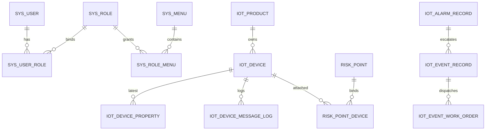

# 04 数据库设计与初始化数据

> 文档定位：数据库结构、初始化数据、升级脚本和命名兼容口径说明。
> 适用角色：后端、DBA、运维、测试、交付人员。
> 权威级别：一级权威。
> 上游来源：`sql/init.sql`、`sql/init-data.sql`、`sql/upgrade/*`、实体与 mapper 实现。
> 下游消费：环境初始化、历史库升级、帮助中心治理、验收核表。
> 变更触发条件：表结构变化、初始化样例变化、升级脚本新增、命名兼容变化。
> 更新时间：2026-03-25

本文件以 `sql/init.sql`、`sql/init-data.sql` 与 `sql/upgrade/*.sql` 为事实基础。

职责边界：
- 本文件只负责表结构、初始化数据、升级脚本、ER 入口和字段字典索引。
- 多租户、组织范围与数据权限口径以 [13-数据权限与多租户模型.md](./13-数据权限与多租户模型.md) 为准。
- 交付能力与验收判定以 [21-业务功能清单与验收标准.md](./21-业务功能清单与验收标准.md) 为准。

## 1. 库与初始化入口

- 目标业务库：`rm_iot`（MySQL）
- 目标时序库：`iot`（TDengine）
- 全量初始化：
  1. 执行 `sql/init.sql`
  2. 执行 `sql/init-data.sql`
- 历史库升级：按场景执行 `sql/upgrade/` 增量脚本。
- 时序兼容表初始化：`iot_device_telemetry_point` 由 `spring-boot-iot-telemetry` 在 TDengine `slave_1` 数据源上启动时执行 `CREATE TABLE IF NOT EXISTS` 自动补齐，不额外依赖 MySQL 初始化脚本；真实环境 legacy stable 继续由环境侧治理，代码不负责补 stable DDL。

## 2. 表结构分层

## 2.1 系统治理域

- `sys_tenant`
- `sys_user`
- `sys_role`
- `sys_user_role`
- `sys_menu`
- `sys_role_menu`
- `sys_organization`
- `sys_region`
- `sys_dict`
- `sys_dict_item`
- `sys_notification_channel`
- `sys_in_app_message`
- `sys_in_app_message_read`
- `sys_in_app_message_bridge_log`
- `sys_in_app_message_bridge_attempt_log`
- `sys_help_document`
- `sys_audit_log`

关键说明：
- `sys_menu` 同时保留历史兼容字段（如 `menu_type`、`route_path`、`permission`）。
- `sys_in_app_message` 当前使用 `target_type + target_role_codes + target_user_ids` 承载消息推送范围，优先保证站内消息可用闭环，后续再评估是否拆分独立发布明细表。
- `sys_in_app_message` 当前已新增 `dedup_key`、`idx_in_app_message_source (source_type, source_id)` 与 `idx_in_app_message_tenant_dedup (tenant_id, dedup_key, deleted)`，用于自动消息去重与治理检索。
- `sys_notification_channel.config.scenes` 当前统一承载 `system_error / observability_alert / in_app_unread_bridge` 三类自动场景；规则化运维告警继续复用 Redis 冷却键，不新增专用告警表。
- `sys_in_app_message.source_type` 当前统一收口为 `manual / system_error / event_dispatch / work_order / governance`；历史样例中的旧来源值会在升级脚本中回填。
- `sys_in_app_message_read` 以 `(tenant_id, message_id, user_id)` 唯一约束承载已读态，记录存在即代表已读。
- `sys_in_app_message_bridge_log` 以 `(tenant_id, message_id, channel_code, bridge_scene)` 唯一约束承载“每条消息 + 每个渠道”的最新桥接状态汇总。
- `sys_in_app_message_bridge_attempt_log` 承载逐次桥接尝试审计；唯一键为 `(bridge_log_id, attempt_no)`，并补有 `(bridge_log_id, attempt_time desc)`、`(message_id, channel_code, attempt_time desc)` 索引，便于治理页按桥接记录或消息维度回看失败重试链路。
- `sys_help_document` 当前使用 `visible_role_codes + related_paths` 承载帮助资料可见范围；后端会结合当前用户角色和已授权菜单路径做过滤。
- `sys_help_document` 当前定位为“帮助中心消费层资料”，正文建议保持短文档模板，不直接承载数据库结构、升级脚本、内网地址或历史路线图等内部资料。
- `sys_audit_log` 支持 `trace_id`、`device_code`、`product_key`、`error_code`、`exception_class` 扩展列。

### 2.2 IoT 接入域

- `iot_product`
- `iot_product_model`
- `iot_device`
- `iot_device_property`
- `iot_message_log`（兼容视图；物理表 `iot_device_message_log`）
- `iot_device_access_error_log`
- `iot_command_record`
- `iot_device_telemetry_point`（TDengine 兼容回退表）
- legacy TDengine stable（环境治理）

关键说明：
- `iot_product` 通过唯一索引 `uk_product_key_tenant (tenant_id, product_key)` 保证每个租户内的产品身份唯一。
- `iot_product` 承载产品身份、协议编码、节点类型、数据格式、厂商和生命周期状态，是设备建档与接入解析的前置主数据。
- `iot_product_model` 当前继续复用既有物理表，不做 schema migration；同一张表同时承接运行期消费和 `/api/device/product/{productId}/models` 设计器 CRUD。
- `iot_device` 需保留索引 `idx_device_deleted_product_stats (deleted, product_id, last_report_time, online_status)`，用于产品定义中心分页场景下快速聚合关联设备数、在线数、最近上报时间，以及产品详情页活跃设备数统计。
- `iot_device_property` 按 `(device_id, identifier)` 维护最新值。
- `iot_message_log` 作为消息日志主命名；当前物理写入仍落 `iot_device_message_log`。
- `iot_device_access_error_log` 持久化 MQTT / `$dp` 等接入前置校验失败时的失败阶段、接入契约和原始 payload 快照，便于与 `sys_audit_log`、`iot_message_log` 交叉排障。
- TDengine 当前默认 `legacy-compatible`：标准化 `properties` 会先按产品物模型 `specsJson.tdengineLegacy` 映射到既有 stable，再按设备 `metadataJson.tdengineLegacy` 派生 `device_sn / location / subTable`。
- `iot_device_telemetry_point` 继续保留为兼容回退表：legacy stable 未映射到的属性，才会按“一条标准化属性点一行”写入该表。
- `reply` / 文件载荷 / 空属性消息当前不写 TDengine。

#### 2.2.1 `iot_product` 字段口径

| 字段 | 库表含义 | 建议治理口径 |
|---|---|---|
| `product_key` | 产品唯一标识，长度 `64`，租户内唯一 | 作为机器侧接入身份，建议稳定、不可变、可读但不携带项目/站点等易变信息 |
| `product_name` | 产品展示名称，长度 `128` | 面向人读，建议采用“厂商 + 场景/用途 + 品类 [+ 版本]”命名 |
| `protocol_code` | 协议编码 | 标识设备接入协议族；如果协议族变化明显，应优先评估新建产品而不是直接沿用旧身份 |
| `node_type` | 节点类型，`1` 直连设备、`2` 网关设备、`3` 网关子设备 | 一个产品应保持统一节点角色，避免同一产品下既做直连又做网关子设备 |
| `data_format` | 数据格式，默认 `JSON` | 表示报文主体格式；如果格式切换导致解析契约变化，应评估拆分产品 |
| `manufacturer` | 厂商，长度 `128` | 只写厂商品牌/制造商，不混入项目名、设备品类或接入协议 |
| `status` | 状态 | 当前已参与治理校验：停用产品不能继续用于设备建档、设备上报接入和 MQTT 下行指令下发 |

补充说明：
- 产品表与设备表的关系是 `iot_product.id -> iot_device.product_id`，设备建档时通过 `productKey` 反查产品，再落库 `product_id`。
- `product_key` 同时会出现在 MQTT Topic、消息日志、命令记录和审计日志中，因此一旦投入使用就不应频繁调整。
- 如果同一厂商下新增的是“同品类但不同协议版本”的设备，建议新建产品并追加版本后缀，而不是复用旧产品后再改协议字段。
- 产品停用前会校验该产品下是否仍存在 `device_status=1` 的启用设备；产品下拉列表只返回 `status=1` 的产品。

#### 2.2.2 `iot_product_model` 运行期与设计器口径

- 当前设计器与运行链路都共用 `iot_product_model`，不新增 `iot_product_model_draft`、`iot_product_schema` 等平行表。
- 设计器首轮只治理既有字段：`model_type`、`identifier`、`model_name`、`data_type`、`specs_json`、`event_type`、`service_input_json`、`service_output_json`、`sort_no`、`required_flag`、`description`。
- `model_type` 当前只允许三类：
  - `property`：用于属性 latest、测点选项和 TDengine legacy 映射，核心字段为 `data_type`、`specs_json`
  - `event`：用于事件定义，核心字段为 `event_type`
  - `service`：用于服务/命令定义，核心字段为 `service_input_json`、`service_output_json`
- `data_type` 当前物理列仍为 `NOT NULL`；为兼容现有 schema，设计器在保存 `event` / `service` 时会写入占位值 `json`，而对外接口仍保持非 `property` 行的 `dataType=null`。
- 同一 `product_id` 下 `identifier` 必须唯一；更新 / 删除都要求 `modelId` 归属于当前产品。
- 设计器首轮继续复用 `iot:products:view` / `iot:products:update` 权限边界，不新增 `sys_menu` 按钮种子；因此 `sql/upgrade` 当前无需新增菜单脚本。

#### 2.2.3 产品详情活跃度统计口径

- 产品详情接口的活跃设备数直接基于 `iot_device` 聚合。
- `todayActiveCount / sevenDaysActiveCount / thirtyDaysActiveCount` 以 `last_report_time` 为准，分别统计今天、近 7 天起点、近 30 天起点之后有上报的设备数。
- `avgOnlineDuration / maxOnlineDuration` 基于 `iot_device_online_session` 聚合，统计近 30 天会话的平均/最大在线分钟数。
- `iot_device_online_session` 记录 `online_time / last_seen_time / offline_time / duration_minutes`；设备进入在线后首次上报会开启会话，长时间无上报时按 `last_report_time + iot.device.online-timeout-seconds` 推断离线并闭合会话。
- 当前不会回填上线前的历史会话，因此无会话明细的产品返回 `null` 在线时长。

#### 2.2.4 `iot_device_telemetry_point`（TDengine）字段口径

| 字段 | 含义 | 当前写入口径 |
|---|---|---|
| `ts` | 行键时间 | 以标准化 `timestamp` 为基准；同一报文多属性按属性序号追加毫秒偏移，避免 TDengine 同表同时间戳互相覆盖 |
| `reported_at` | 实际上报时间 | 保留标准化后的真实上报时间，缺失时回退到服务端当前时间 |
| `tenant_id` | 租户 ID | 取设备租户 |
| `device_id` | 设备 ID | 取 `iot_device.id` |
| `device_code` | 设备编码 | 取标准化后的目标设备编码 |
| `product_id` | 产品 ID | 取设备绑定产品 |
| `product_key` | 产品标识 | 取标准化报文 `productKey` |
| `protocol_code` | 协议编码 | 取标准化报文 `protocolCode` |
| `message_type` | 消息类型 | 取标准化报文 `messageType` |
| `mqtt_topic` | 原始 Topic | 取标准化后的 Topic；列名避开 TDengine 保留字 `topic` |
| `trace_id` | TraceId | 取当前主链路 TraceId |
| `metric_code` | 指标编码 | 对应属性 `identifier` |
| `metric_name` | 指标名称 | 优先取产品物模型 `modelName`，缺失时回退 `identifier` |
| `value_type` | 值类型 | 优先取产品物模型 `dataType`，缺失时按运行时值推断 |
| `value_text` | 文本值 | 所有类型统一保留字符串/JSON 文本快照 |
| `value_long` | 整数值 | 仅整数类属性写入 |
| `value_double` | 浮点值 | 仅浮点/小数类属性写入 |
| `value_bool` | 布尔值 | 仅布尔类属性写入 |

补充口径：
- `iot_device_telemetry_point` 当前定位为 TDengine 兼容回退表，不再是唯一正式时序结构。
- `/api/telemetry/latest` 在 `tdengine` 模式下会先读 legacy stable，再按 `device_id` 从本表补齐未映射指标；返回时间优先使用 `reported_at`。
- 基准站 `$dp` 一包多子设备拆分后，父设备与各子设备会分别按各自 `DeviceProcessingTarget` 写入本表。

#### 2.2.5 legacy TDengine stable 兼容口径

- 真实环境默认优先复用既有 legacy stable，例如 `s1_zt_1`、`l1_gp_1`、`l4_nw_1`、`l3_yl_1`、`l1_lf_1`、`l1_qj_1`、`l1_js_1`、`l1_sw_1`、`qn_qb_zt_1`、`hy_bsd_zt_1`。
- 产品物模型通过 `iot_product_model.specs_json` 中的 `tdengineLegacy` 块声明映射，固定结构为：`{"tdengineLegacy":{"enabled":true,"stable":"l1_qj_1","column":"angle"}}`。
- 设备扩展信息通过 `iot_device.metadata_json` 中的 `tdengineLegacy` 块声明 tag 与子表，固定结构为：`{"tdengineLegacy":{"deviceSn":"SN001","location":"A01","subTables":{"l1_qj_1":"tb_l1_qj_1_SN001"}}}`。
- legacy 行写入口径固定为：`ts=message.timestamp or now`、`rd=ts`、`id=IdWorker.getId()`；业务列类型由 `DESCRIBE <stable>` 的真实结果决定，不在 MySQL 侧重复维护 TDengine 列类型。
- legacy stable 当前只承接属性/状态类遥测；`hy_bsd_ack_1` 这类 reply/ack 表本轮仍由命令记录与消息日志承接，不并入 `TELEMETRY_PERSIST`。

### 2.3 风险处置域

- `iot_alarm_record`
- `iot_event_record`
- `iot_event_work_order`
- `risk_point`
- `risk_point_device`
- `rule_definition`
- `linkage_rule`
- `emergency_plan`

## 3. 视图与命名兼容

- 主命名：`iot_message_log`
- 物理来源：`SELECT ... FROM iot_device_message_log`

结论：
- 文档与新功能应优先使用 `iot_message_log` 作为统一命名。
- 物理写入仍发生在 `iot_device_message_log`。

## 4. 初始化数据基线（`init-data.sql`）

### 4.1 账号与权限

- 默认租户：`tenant_code=default`
- 初始化演示账号默认密码：`123456`（BCrypt）
- 默认角色：业务/管理/运维/开发/超级管理员
- `init-data.sql` 当前按“一人一角色”补齐 5 个可直接登录的演示账号：

| 用户名 | 角色名称 | 角色编码 | 默认关注工作台 | 典型用途 |
|---|---|---|---|---|
| `admin` | 超级管理员 | `SUPER_ADMIN` | `平台治理` + 全量菜单 | 平台全局配置、角色授权、菜单编排演示 |
| `biz_demo` | 业务人员 | `BUSINESS_STAFF` | `风险运营` | 实时监测、告警研判、事件处置演示 |
| `manager_demo` | 管理人员 | `MANAGEMENT_STAFF` | `风险运营` / `风险策略` / `平台治理` | 运营统筹、策略审批、治理配置演示 |
| `ops_demo` | 运维人员 | `OPS_STAFF` | `接入智维` | 设备接入、链路排障、运行维护演示 |
| `dev_demo` | 开发人员 | `DEVELOPER_STAFF` | `接入智维` / `风险策略` / `质量工场` | 协议联调、规则验证、自动化编排演示 |

- `sys_user_role` 在 `init-data.sql` 中按 `username` 和 `role_code` 动态查询真实主键后重建，避免历史库中用户/角色主键不一致时出现授权串位。
- 菜单与按钮权限：覆盖 `接入智维`、`风险运营`、`风险策略`、`平台治理`、`质量工场` 五个一级工作台

### 4.2 IoT 演示数据

- 产品：`accept-http-product-01`、`accept-mqtt-product-01`
- 设备：`accept-http-device-01`、`accept-mqtt-device-01`
- 物模型：温度/湿度/压力/振动等
- 消息日志、属性、命令记录：提供可复验样例

### 4.3 风险平台演示数据

- 风险点、风险点设备绑定
- 阈值规则、联动规则、应急预案
- 告警记录、事件记录、工单记录

### 4.4 系统治理演示数据

- 区域、组织、字典、通知渠道、审计日志样例
- 通知渠道样例：
  - `webhook-default` 当前默认示例已在 `scenes` 中同时包含 `system_error`、`observability_alert` 与 `in_app_unread_bridge`
  - 规则化运维告警与高优未读桥接都继续受运行配置开关控制；仅有场景名不代表默认就会触发
- 站内消息样例：系统事件、业务事件、错误事件、管理员定向待办
  - 来源类型示例：`manual`、`system_error`、`governance`
- 帮助文档样例：首批 `13` 篇，按 `5` 篇业务类、`4` 篇技术类、`4` 篇 FAQ 组织
  - 业务类：产品与设备建档、告警确认/抑制/关闭、事件派工闭环、风险策略配置、运营分析指标查看
  - 技术类：HTTP 上报、MQTT Topic 与 `mqtt-json / $dp`、TraceId 排障、真实环境启动与依赖检查
  - FAQ：产品与设备区别、页面/帮助可见性、通知中心与帮助中心使用方式、`401`/无权限/系统内容缺表提示

### 4.5 工作台菜单基线

- `init-data.sql` 当前直接落五个一级工作台菜单：`接入智维`、`风险运营`、`风险策略`、`平台治理`、`质量工场`
- `对象洞察台` 已挂入 `风险运营`
- `自动化工场` 已挂入 `质量工场`
- `产品定义中心` 当前补齐了四个按钮权限菜单：`iot:products:add`、`iot:products:update`、`iot:products:delete`、`iot:products:export`
- 产品物模型设计器当前继续复用 `iot:products:view` / `iot:products:update`，不新增独立菜单或按钮权限种子
- `设备资产中心` 当前补齐了六个按钮权限菜单：`iot:devices:add`、`iot:devices:update`、`iot:devices:delete`、`iot:devices:export`、`iot:devices:import`、`iot:devices:replace`
- `平台治理` 当前已补齐 `站内消息`、`帮助文档` 两个页面菜单，以及 `system:in-app-message:add/update/delete`、`system:help-doc:add/update/delete` 六个按钮权限
- 角色授权基线按 `role_code` 回填，避免历史环境中固定角色主键不一致导致菜单授权漂移
- 默认角色授权中，业务人员具备产品定义中心/设备资产中心查看导出，管理/运维/开发/超管具备产品定义中心/设备资产中心增删改、批量导入、设备更换、导出

## 5. 升级脚本说明（`sql/upgrade`）

1. `20260316_iot_message_log_view.sql`：补齐消息日志兼容视图。
2. `20260316_phase4_real_env_schema_alignment.sql`：Phase 4 真实环境结构对齐（幂等、非破坏为目标）。
3. `20260316_phase4_task3_risk_monitoring_schema_sync.sql`：风险监测相关表与字段补齐。
4. `20260316_phase4_task10_dynamic_menu_auth.sql`：动态菜单与授权基线补齐（旧三大分区版本）。
5. `20260317_phase4_menu_button_permission_backfill.sql`：菜单按钮权限回填。
6. `20260317_phase4_system_governance_paging_indexes.sql`：分页与检索性能索引补齐。
7. `20260317_phase5_automation_test_center_menu.sql`：自动化测试中心菜单补齐（旧挂载位置在系统治理下）。
8. `20260319_phase5_workspace_menu_refactor.sql`：把一级导航重构为 `接入智维 / 风险运营 / 风险策略 / 平台治理 / 质量工场`，并同步重建角色菜单范围与默认工作台基线。
9. `20260319_phase5_device_asset_center.sql`：补齐设备资产中心按钮菜单（新增/编辑/删除/导出/批量导入/设备更换）与角色授权，适用于五工作台已落地但 `/devices` 按钮权限仍缺失或未补齐第二轮能力的历史库。
10. `20260319_phase5_product_definition_center.sql`：补齐产品定义中心页面定位、按钮菜单（新增/编辑/删除/导出）与角色授权，适用于五工作台已落地但 `/products` 仍停留在旧产品工作台口径的历史库。
11. `20260319_phase5_demo_text_repair.sql`：修复历史共享库中演示账号、角色名称和新增按钮菜单标题被写成 `????` 的问题；脚本使用 `SET NAMES utf8mb4` 与 `CONVERT(0x... USING utf8mb4)` 幂等回写中文，规避 Windows 终端编码污染。
12. `20260320_phase5_product_stats_indexes.sql`：补齐 `iot_device` 上支撑产品定义中心统计聚合的索引，避免产品分页仍因设备统计走大范围扫描而变慢。
13. `20260321_phase5_in_app_message_help_docs.sql`：补齐站内消息、消息已读、帮助文档三张系统治理表，并同步写入首批帮助中心演示数据，供右上角 `通知中心 / 帮助中心` 后续直接切换真实后端数据源。
    - 当前脚本默认写入 `4` 条站内消息样例与 `13` 条帮助文档样例，帮助文档继续复用 `business / technical / faq` 三分类和 `visible_role_codes + related_paths` 过滤模型。
    - 当前脚本已兼容“历史库已建 `sys_in_app_message` 但缺 `dedup_key` 列”的场景，会在重跑时自动补齐该列并回填已有样例数据的去重键。
    - 若历史库未执行该脚本，`/api/system/help-doc/**` 与 `/api/system/in-app-message/**` 相关接口现在会明确返回“系统内容依赖表缺失，请先执行 sql/upgrade/20260321_phase5_in_app_message_help_docs.sql”，不再落成裸 `500`。
14. `20260322_phase5_notification_center_followup.sql`：补齐通知中心后续治理字段与索引，统一来源口径，并回填旧样例的去重键。
    - 当前脚本会补齐 `dedup_key` 列、`source_type/source_id` 检索索引、`tenant_id + dedup_key + deleted` 去重索引。
    - 当前脚本会把历史样例中的 `system_maintenance / daily_report / governance_task` 回填为 `manual / manual / governance`，并按“来源 + 目标范围 + 消息类型”重算 `dedup_key`。
15. `20260321_phase5_system_content_menu_governance.sql`：补齐平台治理下的 `站内消息 / 帮助文档` 页面菜单、按钮权限和管理/超管角色授权，供 `/in-app-message` 与 `/help-doc` 前端编排页直接挂载到真实菜单树。
    - 当前脚本已兼容历史库精简版 `sys_role_menu` 结构，仅依赖 `id / tenant_id / role_id / menu_id / create_time` 基础字段集执行角色授权回填。
16. `20260322_phase5_notification_channel_bridge.sql`：补齐“高优未读阈值后桥接通知渠道”所需的桥接日志表。
    - 当前脚本会新增 `sys_in_app_message_bridge_log`，用于记录“每条站内消息 + 每个渠道”的最新桥接状态、最近尝试时间、响应状态和尝试次数。
    - 该脚本不会主动修改既有渠道 `config`；如需启用桥接，仍需自行把目标渠道 `scenes` 补成包含 `in_app_unread_bridge`。
17. `20260322_phase5_notification_channel_bridge_attempt_log.sql`：补齐桥接逐次尝试明细表，供 `/in-app-message` 治理页查看桥接成功率和重试细节。
    - 当前脚本会新增 `sys_in_app_message_bridge_attempt_log`，字段固定为 `bridge_log_id`、`message_id`、`channel_code`、`bridge_scene`、`attempt_no`、`bridge_status`、`unread_count`、`recipient_snapshot`、`response_status_code`、`response_body`、`attempt_time` 等。
    - 该表不做历史回填，仅从脚本执行并发布新版本后开始积累桥接尝试明细。
18. `20260322_phase5_device_access_error_archive.sql`：补齐设备接入失败归档表 `iot_device_access_error_log`。
    - 用于承接 MQTT / `$dp` 前置校验失败时的 `failure_stage`、`deviceCode`、`productKey`、`protocolCode`、`clientId`、原始 payload 和异常摘要。
    - 历史环境也可直接执行 `python scripts/run-real-env-schema-sync.py`，该脚本已同步补齐本表。
19. `20260322_phase5_device_access_error_contract_snapshot.sql`：为设备接入失败归档补齐 `contract_snapshot` 列。
    - 当前固定写入 `routeType / expectedProtocolCode / actualProtocolCode / protocolSource / deviceProtocolCode / productProtocolCode / deviceProductId / resolvedProductId / productKey`。
    - 该列用于把“预期契约 vs 已知契约 vs 当前入口协议”一次性落库，减少 MQTT `$dp` 场景手工拼日志。

## 6. 关键关系模型（简化）

### 6.1 ER 图入口

说明：
- 这是当前主链路的最简 ER 入口，便于研发、测试和交付先定位“谁关联谁”。
- 更细的租户边界、角色范围和数据权限解释，请继续看 [13-数据权限与多租户模型.md](./13-数据权限与多租户模型.md)。

### 6.2 字段字典索引

| 主题 | 表 / 视图 | 关键字段 | 去哪里看详细口径 |
|---|---|---|---|
| 租户与权限 | `sys_tenant`、`sys_user`、`sys_role`、`sys_role_menu` | `tenant_id`、`role_code`、`permission` | [13-数据权限与多租户模型.md](./13-数据权限与多租户模型.md) |
| 组织与区域 | `sys_organization`、`sys_region` | `tenant_id`、层级字段、状态字段 | [13-数据权限与多租户模型.md](./13-数据权限与多租户模型.md) |
| 产品主数据 | `iot_product` | `product_key`、`protocol_code`、`node_type`、`data_format`、`status` | 本文 `2.2.1` 与 [02-业务功能与流程说明.md](./02-业务功能与流程说明.md) |
| 设备资产 | `iot_device` | `device_code`、`product_id`、`online_status`、`last_report_time` | 本文 `2.2` 与 [02-业务功能与流程说明.md](./02-业务功能与流程说明.md) |
| 运行日志 | `iot_message_log`（兼容视图；物理表 `iot_device_message_log`） | `trace_id`、`topic`、`message_type`、`tenant_id` | [03-接口规范与接口清单.md](./03-接口规范与接口清单.md)、[11-可观测性、日志追踪与消息通知治理.md](./11-可观测性、日志追踪与消息通知治理.md) |
| 历史时序 | legacy stable + `iot_device_telemetry_point`（TDengine） | legacy 宽表列 + `ts/rd/id/tag`；兼容表保留 `device_id`、`metric_code`、`trace_id`、`value_*` | 本文 `2.2.3`、`2.2.4`、[03-接口规范与接口清单.md](./03-接口规范与接口清单.md) |
| 风险处置 | `risk_point`、`risk_point_device`、`iot_alarm_record`、`iot_event_record` | `tenant_id`、业务主键、状态字段 | [02-业务功能与流程说明.md](./02-业务功能与流程说明.md)、[21-业务功能清单与验收标准.md](./21-业务功能清单与验收标准.md) |
| 系统内容 | `sys_in_app_message`、`sys_help_document` | `source_type`、`target_type`、`visible_role_codes`、`related_paths` | [11-可观测性、日志追踪与消息通知治理.md](./11-可观测性、日志追踪与消息通知治理.md)、[12-帮助文档与系统内容治理.md](./12-帮助文档与系统内容治理.md) |

1. `sys_user` N:N `sys_role`（通过 `sys_user_role`）。
2. `sys_role` N:N `sys_menu`（通过 `sys_role_menu`）。
3. `sys_in_app_message` 1:N `sys_in_app_message_read`。
4. `iot_product` 1:N `iot_product_model`。
5. `iot_product` 1:N `iot_device`。
6. `iot_device` 1:N `iot_message_log`（当前物理表为 `iot_device_message_log`）。
7. `iot_device` 1:N `iot_device_property`（按标识唯一）。
8. `risk_point` N:N `iot_device`（通过 `risk_point_device` 并细化到测点）。
9. `iot_alarm_record` -> `iot_event_record` -> `iot_event_work_order` 构成告警到处置闭环。

## 7. 已知风险与治理建议

- 共享环境可能存在 schema 漂移，风险监测接口常见阻塞点是 `risk_point_device` 缺失或字段不完整。
- 历史库若缺少审计增强列，需先执行 `20260316_phase4_real_env_schema_alignment.sql`。
- 历史库若缺少 `iot_device_online_session`，当前服务会自动降级跳过在线会话明细读写，避免阻断设备上报主链路；但产品详情的 `avgOnlineDuration / maxOnlineDuration` 会返回 `null`，建议仍尽快执行 `20260321_phase5_device_online_session.sql`。
- 历史库若 `/products` 列表在默认 10 条分页下仍出现明显变慢，应先确认是否已执行 `20260320_phase5_product_stats_indexes.sql`。
- 若 `sys_user.nickname`、`sys_user.real_name`、`sys_user.remark`、`sys_role.role_name`、`sys_role.description` 或用户/角色管理按钮菜单标题显示为 `????`，执行 `20260319_phase5_demo_text_repair.sql` 进行文本修复。
- `sys_audit_log.result_message` 当前按 `VARCHAR(500)` 口径治理，服务端会自动截断超长异常摘要；如需保留更长原文，应另行查 `response_result`、`request_params`、系统日志或外部日志平台。
- TDengine 数据源不可用时，`TELEMETRY_PERSIST` 会按非阻塞失败语义留痕；MySQL 消息日志、最新属性和在线状态不会回滚，应结合 `message-flow` 时间线与结构化日志排查。
- 当前是否存在跨租户真实生产数据混跑，继续在 [13-数据权限与多租户模型.md](./13-数据权限与多租户模型.md) 和 [08-变更记录与技术债清单.md](./08-变更记录与技术债清单.md) 中跟踪。
