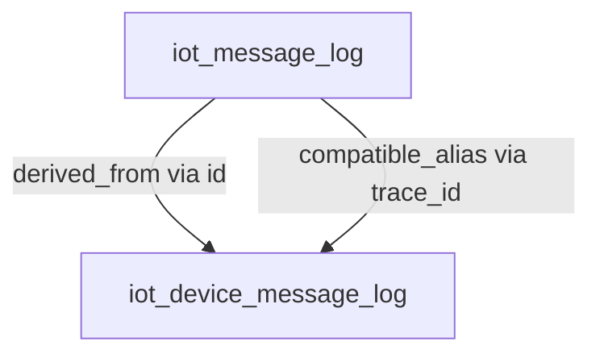

```mermaid
graph TD
  emergency_plan["emergency_plan"]
  sys_tenant["sys_tenant"]
  emergency_plan["emergency_plan"] -->|"belongs_to via tenant_id"| sys_tenant["sys_tenant"]
  iot_alarm_record["iot_alarm_record"]
  iot_device["iot_device"]
  iot_alarm_record["iot_alarm_record"] -->|"belongs_to via device_id"| iot_device["iot_device"]
  risk_point["risk_point"]
  iot_alarm_record["iot_alarm_record"] -->|"belongs_to via risk_point_id"| risk_point["risk_point"]
  iot_alarm_record["iot_alarm_record"] -->|"belongs_to via tenant_id"| sys_tenant["sys_tenant"]
  iot_event_record["iot_event_record"]
  iot_event_record["iot_event_record"] -->|"belongs_to via alarm_id"| iot_alarm_record["iot_alarm_record"]
  iot_event_record["iot_event_record"] -->|"belongs_to via risk_point_id"| risk_point["risk_point"]
  iot_event_record["iot_event_record"] -->|"belongs_to via tenant_id"| sys_tenant["sys_tenant"]
  iot_event_work_order["iot_event_work_order"]
  iot_event_work_order["iot_event_work_order"] -->|"belongs_to via event_id"| iot_event_record["iot_event_record"]
  iot_event_work_order["iot_event_work_order"] -->|"belongs_to via tenant_id"| sys_tenant["sys_tenant"]
  linkage_rule["linkage_rule"]
  linkage_rule["linkage_rule"] -->|"belongs_to via tenant_id"| sys_tenant["sys_tenant"]
  risk_metric_catalog["risk_metric_catalog"]
  iot_product["iot_product"]
  risk_metric_catalog["risk_metric_catalog"] -->|"belongs_to via product_id"| iot_product["iot_product"]
  iot_product_contract_release_batch["iot_product_contract_release_batch"]
  risk_metric_catalog["risk_metric_catalog"] -->|"belongs_to via release_batch_id"| iot_product_contract_release_batch["iot_product_contract_release_batch"]
  risk_metric_catalog["risk_metric_catalog"] -->|"belongs_to via tenant_id"| sys_tenant["sys_tenant"]
  risk_metric_emergency_plan_binding["risk_metric_emergency_plan_binding"]
  risk_metric_emergency_plan_binding["risk_metric_emergency_plan_binding"] -->|"belongs_to via risk_metric_id"| risk_metric_catalog["risk_metric_catalog"]
  risk_metric_emergency_plan_binding["risk_metric_emergency_plan_binding"] -->|"belongs_to via emergency_plan_id"| emergency_plan["emergency_plan"]
  risk_metric_emergency_plan_binding["risk_metric_emergency_plan_binding"] -->|"belongs_to via tenant_id"| sys_tenant["sys_tenant"]
  risk_metric_linkage_binding["risk_metric_linkage_binding"]
  risk_metric_linkage_binding["risk_metric_linkage_binding"] -->|"belongs_to via risk_metric_id"| risk_metric_catalog["risk_metric_catalog"]
  risk_metric_linkage_binding["risk_metric_linkage_binding"] -->|"belongs_to via linkage_rule_id"| linkage_rule["linkage_rule"]
  risk_metric_linkage_binding["risk_metric_linkage_binding"] -->|"belongs_to via tenant_id"| sys_tenant["sys_tenant"]
  sys_organization["sys_organization"]
  risk_point["risk_point"] -->|"belongs_to via org_id"| sys_organization["sys_organization"]
  sys_region["sys_region"]
  risk_point["risk_point"] -->|"belongs_to via region_id"| sys_region["sys_region"]
  risk_point["risk_point"] -->|"belongs_to via tenant_id"| sys_tenant["sys_tenant"]
  risk_point_device["risk_point_device"]
  risk_point_device["risk_point_device"] -->|"belongs_to via risk_point_id"| risk_point["risk_point"]
  risk_point_device["risk_point_device"] -->|"belongs_to via device_id"| iot_device["iot_device"]
  risk_point_device["risk_point_device"] -->|"belongs_to via tenant_id"| sys_tenant["sys_tenant"]
  risk_point_device_capability_binding["risk_point_device_capability_binding"]
  risk_point_device_capability_binding["risk_point_device_capability_binding"] -->|"belongs_to via risk_point_id"| risk_point["risk_point"]
  risk_point_device_capability_binding["risk_point_device_capability_binding"] -->|"belongs_to via device_id"| iot_device["iot_device"]
  risk_point_device_capability_binding["risk_point_device_capability_binding"] -->|"belongs_to via tenant_id"| sys_tenant["sys_tenant"]
  risk_point_device_pending_binding["risk_point_device_pending_binding"]
  risk_point_device_pending_binding["risk_point_device_pending_binding"] -->|"belongs_to via risk_point_id"| risk_point["risk_point"]
  risk_point_device_pending_binding["risk_point_device_pending_binding"] -->|"belongs_to via device_id"| iot_device["iot_device"]
  risk_point_device_pending_binding["risk_point_device_pending_binding"] -->|"belongs_to via metric_identifier"| risk_metric_catalog["risk_metric_catalog"]
  risk_point_device_pending_binding["risk_point_device_pending_binding"] -->|"belongs_to via tenant_id"| sys_tenant["sys_tenant"]
  risk_point_device_pending_promotion["risk_point_device_pending_promotion"]
  risk_point_device_pending_promotion["risk_point_device_pending_promotion"] -->|"belongs_to via pending_binding_id"| risk_point_device_pending_binding["risk_point_device_pending_binding"]
  risk_point_device_pending_promotion["risk_point_device_pending_promotion"] -->|"belongs_to via risk_point_device_id"| risk_point_device["risk_point_device"]
  risk_point_device_pending_promotion["risk_point_device_pending_promotion"] -->|"belongs_to via tenant_id"| sys_tenant["sys_tenant"]
  risk_point_highway_detail["risk_point_highway_detail"]
  risk_point_highway_detail["risk_point_highway_detail"] -->|"belongs_to via risk_point_id"| risk_point["risk_point"]
  risk_point_highway_detail["risk_point_highway_detail"] -->|"belongs_to via tenant_id"| sys_tenant["sys_tenant"]
  rule_definition["rule_definition"]
  rule_definition["rule_definition"] -->|"belongs_to via risk_metric_id"| risk_metric_catalog["risk_metric_catalog"]
  rule_definition["rule_definition"] -->|"belongs_to via tenant_id"| sys_tenant["sys_tenant"]
```

```mermaid
graph TD
  iot_command_record["iot_command_record"]
  iot_device["iot_device"]
  iot_command_record["iot_command_record"] -->|"belongs_to via device_id"| iot_device["iot_device"]
  iot_product["iot_product"]
  iot_command_record["iot_command_record"] -->|"belongs_to via product_key"| iot_product["iot_product"]
  sys_tenant["sys_tenant"]
  iot_command_record["iot_command_record"] -->|"belongs_to via tenant_id"| sys_tenant["sys_tenant"]
  iot_device["iot_device"] -->|"belongs_to via product_id"| iot_product["iot_product"]
  sys_organization["sys_organization"]
  iot_device["iot_device"] -->|"belongs_to via org_id"| sys_organization["sys_organization"]
  iot_device["iot_device"] -->|"belongs_to via tenant_id"| sys_tenant["sys_tenant"]
  iot_device_access_error_log["iot_device_access_error_log"]
  iot_device_access_error_log["iot_device_access_error_log"] -->|"belongs_to via device_code"| iot_device["iot_device"]
  iot_device_access_error_log["iot_device_access_error_log"] -->|"belongs_to via product_key"| iot_product["iot_product"]
  iot_device_access_error_log["iot_device_access_error_log"] -->|"belongs_to via tenant_id"| sys_tenant["sys_tenant"]
  iot_device_invalid_report_state["iot_device_invalid_report_state"]
  iot_device_invalid_report_state["iot_device_invalid_report_state"] -->|"belongs_to via product_key"| iot_product["iot_product"]
  iot_device_invalid_report_state["iot_device_invalid_report_state"] -->|"belongs_to via tenant_id"| sys_tenant["sys_tenant"]
  iot_device_message_log["iot_device_message_log"]
  iot_device_message_log["iot_device_message_log"] -->|"belongs_to via device_id"| iot_device["iot_device"]
  iot_device_message_log["iot_device_message_log"] -->|"belongs_to via product_id"| iot_product["iot_product"]
  iot_device_message_log["iot_device_message_log"] -->|"belongs_to via tenant_id"| sys_tenant["sys_tenant"]
  iot_device_metric_latest["iot_device_metric_latest"]
  iot_device_metric_latest["iot_device_metric_latest"] -->|"belongs_to via device_id"| iot_device["iot_device"]
  iot_device_metric_latest["iot_device_metric_latest"] -->|"belongs_to via product_id"| iot_product["iot_product"]
  iot_device_metric_latest["iot_device_metric_latest"] -->|"belongs_to via tenant_id"| sys_tenant["sys_tenant"]
  iot_device_onboarding_case["iot_device_onboarding_case"]
  iot_onboarding_template_pack["iot_onboarding_template_pack"]
  iot_device_onboarding_case["iot_device_onboarding_case"] -->|"belongs_to via template_pack_id"| iot_onboarding_template_pack["iot_onboarding_template_pack"]
  iot_device_onboarding_case["iot_device_onboarding_case"] -->|"belongs_to via product_id"| iot_product["iot_product"]
  iot_device_onboarding_case["iot_device_onboarding_case"] -->|"belongs_to via tenant_id"| sys_tenant["sys_tenant"]
  iot_device_online_session["iot_device_online_session"]
  iot_device_online_session["iot_device_online_session"] -->|"belongs_to via device_id"| iot_device["iot_device"]
  iot_device_online_session["iot_device_online_session"] -->|"belongs_to via tenant_id"| sys_tenant["sys_tenant"]
  iot_device_property["iot_device_property"]
  iot_device_property["iot_device_property"] -->|"belongs_to via device_id"| iot_device["iot_device"]
  iot_device_property["iot_device_property"] -->|"belongs_to via tenant_id"| sys_tenant["sys_tenant"]
  iot_device_relation["iot_device_relation"]
  iot_device_relation["iot_device_relation"] -->|"belongs_to via parent_device_id"| iot_device["iot_device"]
  iot_device_relation["iot_device_relation"] -->|"belongs_to via child_device_id"| iot_device["iot_device"]
  iot_device_relation["iot_device_relation"] -->|"belongs_to via tenant_id"| sys_tenant["sys_tenant"]
  iot_device_secret_rotation_log["iot_device_secret_rotation_log"]
  iot_device_secret_rotation_log["iot_device_secret_rotation_log"] -->|"belongs_to via device_id"| iot_device["iot_device"]
  iot_device_secret_rotation_log["iot_device_secret_rotation_log"] -->|"belongs_to via product_key"| iot_product["iot_product"]
  iot_device_secret_rotation_log["iot_device_secret_rotation_log"] -->|"belongs_to via tenant_id"| sys_tenant["sys_tenant"]
  iot_normative_metric_definition["iot_normative_metric_definition"]
  iot_normative_metric_definition["iot_normative_metric_definition"] -->|"belongs_to via tenant_id"| sys_tenant["sys_tenant"]
  iot_onboarding_template_pack["iot_onboarding_template_pack"] -->|"belongs_to via tenant_id"| sys_tenant["sys_tenant"]
  iot_product["iot_product"] -->|"belongs_to via tenant_id"| sys_tenant["sys_tenant"]
  iot_product_contract_release_batch["iot_product_contract_release_batch"]
  iot_product_contract_release_batch["iot_product_contract_release_batch"] -->|"belongs_to via product_id"| iot_product["iot_product"]
  sys_governance_approval_order["sys_governance_approval_order"]
  iot_product_contract_release_batch["iot_product_contract_release_batch"] -->|"belongs_to via approval_order_id"| sys_governance_approval_order["sys_governance_approval_order"]
  iot_product_contract_release_batch["iot_product_contract_release_batch"] -->|"belongs_to via tenant_id"| sys_tenant["sys_tenant"]
  iot_product_contract_release_snapshot["iot_product_contract_release_snapshot"]
  iot_product_contract_release_snapshot["iot_product_contract_release_snapshot"] -->|"belongs_to via batch_id"| iot_product_contract_release_batch["iot_product_contract_release_batch"]
  iot_product_contract_release_snapshot["iot_product_contract_release_snapshot"] -->|"belongs_to via product_id"| iot_product["iot_product"]
  iot_product_contract_release_snapshot["iot_product_contract_release_snapshot"] -->|"belongs_to via tenant_id"| sys_tenant["sys_tenant"]
  iot_product_metric_resolver_snapshot["iot_product_metric_resolver_snapshot"]
  iot_product_metric_resolver_snapshot["iot_product_metric_resolver_snapshot"] -->|"belongs_to via release_batch_id"| iot_product_contract_release_batch["iot_product_contract_release_batch"]
  iot_product_metric_resolver_snapshot["iot_product_metric_resolver_snapshot"] -->|"belongs_to via product_id"| iot_product["iot_product"]
  iot_product_metric_resolver_snapshot["iot_product_metric_resolver_snapshot"] -->|"belongs_to via tenant_id"| sys_tenant["sys_tenant"]
  iot_product_model["iot_product_model"]
  iot_product_model["iot_product_model"] -->|"belongs_to via product_id"| iot_product["iot_product"]
  iot_product_model["iot_product_model"] -->|"belongs_to via tenant_id"| sys_tenant["sys_tenant"]
  iot_vendor_metric_evidence["iot_vendor_metric_evidence"]
  iot_vendor_metric_evidence["iot_vendor_metric_evidence"] -->|"belongs_to via product_id"| iot_product["iot_product"]
  iot_vendor_metric_evidence["iot_vendor_metric_evidence"] -->|"belongs_to via tenant_id"| sys_tenant["sys_tenant"]
  iot_vendor_metric_mapping_rule["iot_vendor_metric_mapping_rule"]
  iot_vendor_metric_mapping_rule["iot_vendor_metric_mapping_rule"] -->|"belongs_to via product_id"| iot_product["iot_product"]
  iot_vendor_metric_mapping_rule["iot_vendor_metric_mapping_rule"] -->|"belongs_to via tenant_id"| sys_tenant["sys_tenant"]
  iot_vendor_metric_mapping_rule_snapshot["iot_vendor_metric_mapping_rule_snapshot"]
  iot_vendor_metric_mapping_rule_snapshot["iot_vendor_metric_mapping_rule_snapshot"] -->|"belongs_to via rule_id"| iot_vendor_metric_mapping_rule["iot_vendor_metric_mapping_rule"]
  iot_vendor_metric_mapping_rule_snapshot["iot_vendor_metric_mapping_rule_snapshot"] -->|"belongs_to via product_id"| iot_product["iot_product"]
  iot_vendor_metric_mapping_rule_snapshot["iot_vendor_metric_mapping_rule_snapshot"] -->|"belongs_to via approval_order_id"| sys_governance_approval_order["sys_governance_approval_order"]
  iot_vendor_metric_mapping_rule_snapshot["iot_vendor_metric_mapping_rule_snapshot"] -->|"belongs_to via tenant_id"| sys_tenant["sys_tenant"]
```

```mermaid
graph TD
  iot_agg_measure_hour["iot_agg_measure_hour"]
  iot_device["iot_device"]
  iot_agg_measure_hour["iot_agg_measure_hour"] -->|"belongs_to via device_id"| iot_device["iot_device"]
  iot_product["iot_product"]
  iot_agg_measure_hour["iot_agg_measure_hour"] -->|"belongs_to via product_id"| iot_product["iot_product"]
  risk_point["risk_point"]
  iot_agg_measure_hour["iot_agg_measure_hour"] -->|"belongs_to via risk_point_id"| risk_point["risk_point"]
  sys_tenant["sys_tenant"]
  iot_agg_measure_hour["iot_agg_measure_hour"] -->|"belongs_to via tenant_id"| sys_tenant["sys_tenant"]
  iot_raw_event_point["iot_raw_event_point"]
  iot_raw_event_point["iot_raw_event_point"] -->|"belongs_to via device_id"| iot_device["iot_device"]
  iot_raw_event_point["iot_raw_event_point"] -->|"belongs_to via product_id"| iot_product["iot_product"]
  iot_raw_event_point["iot_raw_event_point"] -->|"belongs_to via risk_point_id"| risk_point["risk_point"]
  iot_raw_event_point["iot_raw_event_point"] -->|"belongs_to via tenant_id"| sys_tenant["sys_tenant"]
  iot_raw_measure_point["iot_raw_measure_point"]
  iot_raw_measure_point["iot_raw_measure_point"] -->|"belongs_to via device_id"| iot_device["iot_device"]
  iot_raw_measure_point["iot_raw_measure_point"] -->|"belongs_to via product_id"| iot_product["iot_product"]
  iot_raw_measure_point["iot_raw_measure_point"] -->|"belongs_to via risk_point_id"| risk_point["risk_point"]
  iot_raw_measure_point["iot_raw_measure_point"] -->|"belongs_to via tenant_id"| sys_tenant["sys_tenant"]
  iot_raw_status_point["iot_raw_status_point"]
  iot_raw_status_point["iot_raw_status_point"] -->|"belongs_to via device_id"| iot_device["iot_device"]
  iot_raw_status_point["iot_raw_status_point"] -->|"belongs_to via product_id"| iot_product["iot_product"]
  iot_raw_status_point["iot_raw_status_point"] -->|"belongs_to via risk_point_id"| risk_point["risk_point"]
  iot_raw_status_point["iot_raw_status_point"] -->|"belongs_to via tenant_id"| sys_tenant["sys_tenant"]
  iot_device_telemetry_point["iot_device_telemetry_point"]
  iot_device_telemetry_point["iot_device_telemetry_point"] -->|"belongs_to via device_id"| iot_device["iot_device"]
  iot_device_telemetry_point["iot_device_telemetry_point"] -->|"belongs_to via product_id"| iot_product["iot_product"]
  iot_device_telemetry_point["iot_device_telemetry_point"] -->|"belongs_to via tenant_id"| sys_tenant["sys_tenant"]
```

# Database Schema Domain Governance Ledger

Generated from the schema and schema-governance registries. Do not edit by hand.

## Domain alarm

| Metric | Value |
| --- | --- |
| Objects | 15 |
| Relations | 39 |
| Owner Modules | spring-boot-iot-alarm(15) |
| Lineage Roles | binding_registry(4), catalog_registry(1), domain_master_data(8), transaction_record(2) |

| Lifecycle | Count |
| --- | --- |
| active | 14 |
| archived | 1 |
| pending_delete | 0 |

| Object | Storage | Lifecycle | In Init | In Schema Sync | Runtime Bootstrap | Owner Module | Comment |
| --- | --- | --- | --- | --- | --- | --- | --- |
| emergency_plan | mysql_table | active | yes | yes | schema_sync_managed | spring-boot-iot-alarm | 应急预案表 |
| iot_alarm_record | mysql_table | active | yes | yes | schema_sync_managed | spring-boot-iot-alarm | 告警记录表 |
| iot_event_record | mysql_table | active | yes | yes | schema_sync_managed | spring-boot-iot-alarm | 事件记录表 |
| iot_event_work_order | mysql_table | active | yes | yes | schema_sync_managed | spring-boot-iot-alarm | 事件工单表 |
| linkage_rule | mysql_table | active | yes | yes | schema_sync_managed | spring-boot-iot-alarm | 联动规则表 |
| risk_metric_catalog | mysql_table | active | yes | yes | schema_sync_managed | spring-boot-iot-alarm | 风险指标目录表 |
| risk_metric_emergency_plan_binding | mysql_table | active | yes | yes | schema_sync_managed | spring-boot-iot-alarm | 风险指标与应急预案绑定表 |
| risk_metric_linkage_binding | mysql_table | active | yes | yes | schema_sync_managed | spring-boot-iot-alarm | 风险指标与联动规则绑定表 |
| risk_point | mysql_table | active | yes | yes | schema_sync_managed | spring-boot-iot-alarm | 风险点表 |
| risk_point_device | mysql_table | active | yes | yes | schema_sync_managed | spring-boot-iot-alarm | 风险点设备绑定表 |
| risk_point_device_capability_binding | mysql_table | active | yes | yes | schema_sync_managed | spring-boot-iot-alarm | 风险点设备级正式绑定表 |
| risk_point_device_pending_binding | mysql_table | active | yes | yes | schema_sync_managed | spring-boot-iot-alarm | 风险点设备待治理导入表 |
| risk_point_device_pending_promotion | mysql_table | active | yes | yes | schema_sync_managed | spring-boot-iot-alarm | 风险点设备待治理转正明细表 |
| risk_point_highway_detail | mysql_table | archived | no | no | disabled | spring-boot-iot-alarm | 高速公路风险点扩展表 |
| rule_definition | mysql_table | active | yes | yes | schema_sync_managed | spring-boot-iot-alarm | 阈值规则表 |

| Governance Object | Stage | Seed Packages | Audit Profile | Deletion Prerequisites | Notes |
| --- | --- | --- | --- | --- | --- |
| risk_point_highway_detail | archived | highway_archived_risk_points_seed | mysql_archived_object_with_seed | no_active_capability_bindings seed_removed_from_init_data docs_and_registry_updated | 高速项目归档观察对象，不进入默认主链路。 |

| Object | Relations |
| --- | --- |
| emergency_plan | sys_tenant（belongs_to:tenant_id） |
| iot_alarm_record | iot_device（belongs_to:device_id） risk_point（belongs_to:risk_point_id） sys_tenant（belongs_to:tenant_id） |
| iot_event_record | iot_alarm_record（belongs_to:alarm_id） risk_point（belongs_to:risk_point_id） sys_tenant（belongs_to:tenant_id） |
| iot_event_work_order | iot_event_record（belongs_to:event_id） sys_tenant（belongs_to:tenant_id） |
| linkage_rule | sys_tenant（belongs_to:tenant_id） |
| risk_metric_catalog | iot_product（belongs_to:product_id） iot_product_contract_release_batch（belongs_to:release_batch_id） sys_tenant（belongs_to:tenant_id） |
| risk_metric_emergency_plan_binding | risk_metric_catalog（belongs_to:risk_metric_id） emergency_plan（belongs_to:emergency_plan_id） sys_tenant（belongs_to:tenant_id） |
| risk_metric_linkage_binding | risk_metric_catalog（belongs_to:risk_metric_id） linkage_rule（belongs_to:linkage_rule_id） sys_tenant（belongs_to:tenant_id） |
| risk_point | sys_organization（belongs_to:org_id） sys_region（belongs_to:region_id） sys_tenant（belongs_to:tenant_id） |
| risk_point_device | risk_point（belongs_to:risk_point_id） iot_device（belongs_to:device_id） sys_tenant（belongs_to:tenant_id） |
| risk_point_device_capability_binding | risk_point（belongs_to:risk_point_id） iot_device（belongs_to:device_id） sys_tenant（belongs_to:tenant_id） |
| risk_point_device_pending_binding | risk_point（belongs_to:risk_point_id） iot_device（belongs_to:device_id） risk_metric_catalog（belongs_to:metric_identifier） sys_tenant（belongs_to:tenant_id） |
| risk_point_device_pending_promotion | risk_point_device_pending_binding（belongs_to:pending_binding_id） risk_point_device（belongs_to:risk_point_device_id） sys_tenant（belongs_to:tenant_id） |
| risk_point_highway_detail | risk_point（belongs_to:risk_point_id） sys_tenant（belongs_to:tenant_id） |
| rule_definition | risk_metric_catalog（belongs_to:risk_metric_id） sys_tenant（belongs_to:tenant_id） |

当前域如有真实库审计结论，请查看 `docs/04` 对应对象条目；带日期的最近审计事实与阶段性决策请查看 `docs/08`。

## Domain device

| Metric | Value |
| --- | --- |
| Objects | 21 |
| Relations | 52 |
| Owner Modules | spring-boot-iot-device(21) |
| Lineage Roles | device_domain_state(7), domain_master_data(6), operation_log(3), relationship_mapping(1), snapshot_baseline(3), transaction_record(1) |

| Lifecycle | Count |
| --- | --- |
| active | 21 |
| archived | 0 |
| pending_delete | 0 |

| Object | Storage | Lifecycle | In Init | In Schema Sync | Runtime Bootstrap | Owner Module | Comment |
| --- | --- | --- | --- | --- | --- | --- | --- |
| iot_command_record | mysql_table | active | yes | yes | schema_sync_managed | spring-boot-iot-device | 设备命令记录表 |
| iot_device | mysql_table | active | yes | yes | schema_sync_managed | spring-boot-iot-device | 设备表 |
| iot_device_access_error_log | mysql_table | active | yes | yes | schema_sync_managed | spring-boot-iot-device | 设备接入失败归档表 |
| iot_device_invalid_report_state | mysql_table | active | yes | yes | schema_sync_managed | spring-boot-iot-device | 无效 MQTT 上报最新态表 |
| iot_device_message_log | mysql_table | active | yes | yes | schema_sync_managed | spring-boot-iot-device | 设备消息日志表 |
| iot_device_metric_latest | mysql_table | active | yes | yes | schema_sync_managed | spring-boot-iot-device | 时序最新值投影表 |
| iot_device_onboarding_case | mysql_table | active | yes | yes | schema_sync_managed | spring-boot-iot-device | 设备无代码接入案例表 |
| iot_device_online_session | mysql_table | active | yes | yes | schema_sync_managed | spring-boot-iot-device | 设备在线会话表 |
| iot_device_property | mysql_table | active | yes | yes | schema_sync_managed | spring-boot-iot-device | 设备最新属性表 |
| iot_device_relation | mysql_table | active | yes | yes | schema_sync_managed | spring-boot-iot-device | 设备逻辑通道关系表 |
| iot_device_secret_rotation_log | mysql_table | active | yes | yes | schema_sync_managed | spring-boot-iot-device | 设备密钥轮换日志表 |
| iot_normative_metric_definition | mysql_table | active | yes | yes | schema_sync_managed | spring-boot-iot-device | 规范字段定义表 |
| iot_onboarding_template_pack | mysql_table | active | yes | yes | schema_sync_managed | spring-boot-iot-device | 设备无代码接入模板包表 |
| iot_product | mysql_table | active | yes | yes | schema_sync_managed | spring-boot-iot-device | 产品表 |
| iot_product_contract_release_batch | mysql_table | active | yes | yes | schema_sync_managed | spring-boot-iot-device | 产品合同发布批次表 |
| iot_product_contract_release_snapshot | mysql_table | active | yes | yes | schema_sync_managed | spring-boot-iot-device | 产品合同发布快照表 |
| iot_product_metric_resolver_snapshot | mysql_table | active | yes | yes | schema_sync_managed | spring-boot-iot-device | 产品指标解析快照表 |
| iot_product_model | mysql_table | active | yes | yes | schema_sync_managed | spring-boot-iot-device | 产品物模型表 |
| iot_vendor_metric_evidence | mysql_table | active | yes | yes | schema_sync_managed | spring-boot-iot-device | 厂商字段证据表 |
| iot_vendor_metric_mapping_rule | mysql_table | active | yes | yes | schema_sync_managed | spring-boot-iot-device | 厂商字段映射规则表 |
| iot_vendor_metric_mapping_rule_snapshot | mysql_table | active | yes | yes | schema_sync_managed | spring-boot-iot-device | 厂商字段映射规则发布快照表 |

| Governance Object | Stage | Seed Packages | Audit Profile | Deletion Prerequisites | Notes |
| --- | --- | --- | --- | --- | --- |
| 当前无登记治理对象 | - | - | - | - | - |

| Object | Relations |
| --- | --- |
| iot_command_record | iot_device（belongs_to:device_id） iot_product（belongs_to:product_key） sys_tenant（belongs_to:tenant_id） |
| iot_device | iot_product（belongs_to:product_id） sys_organization（belongs_to:org_id） sys_tenant（belongs_to:tenant_id） |
| iot_device_access_error_log | iot_device（belongs_to:device_code） iot_product（belongs_to:product_key） sys_tenant（belongs_to:tenant_id） |
| iot_device_invalid_report_state | iot_product（belongs_to:product_key） sys_tenant（belongs_to:tenant_id） |
| iot_device_message_log | iot_device（belongs_to:device_id） iot_product（belongs_to:product_id） sys_tenant（belongs_to:tenant_id） |
| iot_device_metric_latest | iot_device（belongs_to:device_id） iot_product（belongs_to:product_id） sys_tenant（belongs_to:tenant_id） |
| iot_device_onboarding_case | iot_onboarding_template_pack（belongs_to:template_pack_id） iot_product（belongs_to:product_id） sys_tenant（belongs_to:tenant_id） |
| iot_device_online_session | iot_device（belongs_to:device_id） sys_tenant（belongs_to:tenant_id） |
| iot_device_property | iot_device（belongs_to:device_id） sys_tenant（belongs_to:tenant_id） |
| iot_device_relation | iot_device（belongs_to:parent_device_id） iot_device（belongs_to:child_device_id） sys_tenant（belongs_to:tenant_id） |
| iot_device_secret_rotation_log | iot_device（belongs_to:device_id） iot_product（belongs_to:product_key） sys_tenant（belongs_to:tenant_id） |
| iot_normative_metric_definition | sys_tenant（belongs_to:tenant_id） |
| iot_onboarding_template_pack | sys_tenant（belongs_to:tenant_id） |
| iot_product | sys_tenant（belongs_to:tenant_id） |
| iot_product_contract_release_batch | iot_product（belongs_to:product_id） sys_governance_approval_order（belongs_to:approval_order_id） sys_tenant（belongs_to:tenant_id） |
| iot_product_contract_release_snapshot | iot_product_contract_release_batch（belongs_to:batch_id） iot_product（belongs_to:product_id） sys_tenant（belongs_to:tenant_id） |
| iot_product_metric_resolver_snapshot | iot_product_contract_release_batch（belongs_to:release_batch_id） iot_product（belongs_to:product_id） sys_tenant（belongs_to:tenant_id） |
| iot_product_model | iot_product（belongs_to:product_id） sys_tenant（belongs_to:tenant_id） |
| iot_vendor_metric_evidence | iot_product（belongs_to:product_id） sys_tenant（belongs_to:tenant_id） |
| iot_vendor_metric_mapping_rule | iot_product（belongs_to:product_id） sys_tenant（belongs_to:tenant_id） |
| iot_vendor_metric_mapping_rule_snapshot | iot_vendor_metric_mapping_rule（belongs_to:rule_id） iot_product（belongs_to:product_id） sys_governance_approval_order（belongs_to:approval_order_id） sys_tenant（belongs_to:tenant_id） |

当前域如有真实库审计结论，请查看 `docs/04` 对应对象条目；带日期的最近审计事实与阶段性决策请查看 `docs/08`。

## Domain governance

| Metric | Value |
| --- | --- |
| Objects | 12 |
| Relations | 29 |
| Owner Modules | spring-boot-iot-alarm(2), spring-boot-iot-framework(6), spring-boot-iot-system(4) |
| Lineage Roles | domain_master_data(2), governance_master_data(10) |

| Lifecycle | Count |
| --- | --- |
| active | 12 |
| archived | 0 |
| pending_delete | 0 |

| Object | Storage | Lifecycle | In Init | In Schema Sync | Runtime Bootstrap | Owner Module | Comment |
| --- | --- | --- | --- | --- | --- | --- | --- |
| iot_governance_ops_alert | mysql_table | active | yes | yes | schema_sync_managed | spring-boot-iot-alarm | 治理运维告警表 |
| iot_governance_work_item | mysql_table | active | yes | yes | schema_sync_managed | spring-boot-iot-alarm | 治理与运营工作项表 |
| iot_protocol_decrypt_profile | mysql_table | active | yes | yes | schema_sync_managed | spring-boot-iot-framework | 协议解密档案治理主表 |
| iot_protocol_decrypt_profile_snapshot | mysql_table | active | yes | yes | schema_sync_managed | spring-boot-iot-framework | 协议解密档案发布快照表 |
| iot_protocol_family_definition | mysql_table | active | yes | yes | schema_sync_managed | spring-boot-iot-framework | 协议族定义治理主表 |
| iot_protocol_family_definition_snapshot | mysql_table | active | yes | yes | schema_sync_managed | spring-boot-iot-framework | 协议族定义发布快照表 |
| iot_protocol_template_definition | mysql_table | active | yes | yes | schema_sync_managed | spring-boot-iot-framework | 协议模板治理主表 |
| iot_protocol_template_definition_snapshot | mysql_table | active | yes | yes | schema_sync_managed | spring-boot-iot-framework | 协议模板发布快照表 |
| sys_governance_approval_order | mysql_table | active | yes | yes | schema_sync_managed | spring-boot-iot-system | 治理审批工单表 |
| sys_governance_approval_policy | mysql_table | active | yes | yes | schema_sync_managed | spring-boot-iot-system | 治理审批策略表 |
| sys_governance_approval_transition | mysql_table | active | yes | yes | schema_sync_managed | spring-boot-iot-system | 治理审批流转记录表 |
| sys_governance_replay_feedback | mysql_table | active | yes | yes | schema_sync_managed | spring-boot-iot-system | 治理复盘反馈表 |

| Governance Object | Stage | Seed Packages | Audit Profile | Deletion Prerequisites | Notes |
| --- | --- | --- | --- | --- | --- |
| 当前无登记治理对象 | - | - | - | - | - |

| Object | Relations |
| --- | --- |
| iot_governance_ops_alert | sys_tenant（belongs_to:tenant_id） |
| iot_governance_work_item | sys_governance_approval_order（belongs_to:approval_order_id） sys_tenant（belongs_to:tenant_id） |
| iot_protocol_decrypt_profile | sys_governance_approval_order（belongs_to:approval_order_id） sys_tenant（belongs_to:tenant_id） |
| iot_protocol_decrypt_profile_snapshot | iot_protocol_decrypt_profile（belongs_to:profile_id） sys_governance_approval_order（belongs_to:approval_order_id） sys_tenant（belongs_to:tenant_id） |
| iot_protocol_family_definition | sys_governance_approval_order（belongs_to:approval_order_id） sys_tenant（belongs_to:tenant_id） |
| iot_protocol_family_definition_snapshot | iot_protocol_family_definition（belongs_to:family_id） sys_governance_approval_order（belongs_to:approval_order_id） sys_tenant（belongs_to:tenant_id） |
| iot_protocol_template_definition | sys_governance_approval_order（belongs_to:approval_order_id） sys_tenant（belongs_to:tenant_id） |
| iot_protocol_template_definition_snapshot | iot_protocol_template_definition（belongs_to:template_id） sys_governance_approval_order（belongs_to:approval_order_id） sys_tenant（belongs_to:tenant_id） |
| sys_governance_approval_order | iot_governance_work_item（belongs_to:work_item_id） sys_user（belongs_to:operator_user_id） sys_user（belongs_to:approver_user_id） sys_tenant（belongs_to:tenant_id） |
| sys_governance_approval_policy | sys_tenant（belongs_to:tenant_id） |

```mermaid
graph TD
  iot_governance_ops_alert["iot_governance_ops_alert"]
  sys_tenant["sys_tenant"]
  iot_governance_ops_alert["iot_governance_ops_alert"] -->|"belongs_to via tenant_id"| sys_tenant["sys_tenant"]
  iot_governance_work_item["iot_governance_work_item"]
  sys_governance_approval_order["sys_governance_approval_order"]
  iot_governance_work_item["iot_governance_work_item"] -->|"belongs_to via approval_order_id"| sys_governance_approval_order["sys_governance_approval_order"]
  iot_governance_work_item["iot_governance_work_item"] -->|"belongs_to via tenant_id"| sys_tenant["sys_tenant"]
  iot_protocol_decrypt_profile["iot_protocol_decrypt_profile"]
  iot_protocol_decrypt_profile["iot_protocol_decrypt_profile"] -->|"belongs_to via approval_order_id"| sys_governance_approval_order["sys_governance_approval_order"]
  iot_protocol_decrypt_profile["iot_protocol_decrypt_profile"] -->|"belongs_to via tenant_id"| sys_tenant["sys_tenant"]
  iot_protocol_decrypt_profile_snapshot["iot_protocol_decrypt_profile_snapshot"]
  iot_protocol_decrypt_profile_snapshot["iot_protocol_decrypt_profile_snapshot"] -->|"belongs_to via profile_id"| iot_protocol_decrypt_profile["iot_protocol_decrypt_profile"]
  iot_protocol_decrypt_profile_snapshot["iot_protocol_decrypt_profile_snapshot"] -->|"belongs_to via approval_order_id"| sys_governance_approval_order["sys_governance_approval_order"]
  iot_protocol_decrypt_profile_snapshot["iot_protocol_decrypt_profile_snapshot"] -->|"belongs_to via tenant_id"| sys_tenant["sys_tenant"]
  iot_protocol_family_definition["iot_protocol_family_definition"]
  iot_protocol_family_definition["iot_protocol_family_definition"] -->|"belongs_to via approval_order_id"| sys_governance_approval_order["sys_governance_approval_order"]
  iot_protocol_family_definition["iot_protocol_family_definition"] -->|"belongs_to via tenant_id"| sys_tenant["sys_tenant"]
  iot_protocol_family_definition_snapshot["iot_protocol_family_definition_snapshot"]
  iot_protocol_family_definition_snapshot["iot_protocol_family_definition_snapshot"] -->|"belongs_to via family_id"| iot_protocol_family_definition["iot_protocol_family_definition"]
  iot_protocol_family_definition_snapshot["iot_protocol_family_definition_snapshot"] -->|"belongs_to via approval_order_id"| sys_governance_approval_order["sys_governance_approval_order"]
  iot_protocol_family_definition_snapshot["iot_protocol_family_definition_snapshot"] -->|"belongs_to via tenant_id"| sys_tenant["sys_tenant"]
  iot_protocol_template_definition["iot_protocol_template_definition"]
  iot_protocol_template_definition["iot_protocol_template_definition"] -->|"belongs_to via approval_order_id"| sys_governance_approval_order["sys_governance_approval_order"]
  iot_protocol_template_definition["iot_protocol_template_definition"] -->|"belongs_to via tenant_id"| sys_tenant["sys_tenant"]
  iot_protocol_template_definition_snapshot["iot_protocol_template_definition_snapshot"]
  iot_protocol_template_definition_snapshot["iot_protocol_template_definition_snapshot"] -->|"belongs_to via template_id"| iot_protocol_template_definition["iot_protocol_template_definition"]
  iot_protocol_template_definition_snapshot["iot_protocol_template_definition_snapshot"] -->|"belongs_to via approval_order_id"| sys_governance_approval_order["sys_governance_approval_order"]
  iot_protocol_template_definition_snapshot["iot_protocol_template_definition_snapshot"] -->|"belongs_to via tenant_id"| sys_tenant["sys_tenant"]
  sys_governance_approval_order["sys_governance_approval_order"] -->|"belongs_to via work_item_id"| iot_governance_work_item["iot_governance_work_item"]
  sys_user["sys_user"]
  sys_governance_approval_order["sys_governance_approval_order"] -->|"belongs_to via operator_user_id"| sys_user["sys_user"]
  sys_governance_approval_order["sys_governance_approval_order"] -->|"belongs_to via approver_user_id"| sys_user["sys_user"]
  sys_governance_approval_order["sys_governance_approval_order"] -->|"belongs_to via tenant_id"| sys_tenant["sys_tenant"]
  sys_governance_approval_policy["sys_governance_approval_policy"]
  sys_governance_approval_policy["sys_governance_approval_policy"] -->|"belongs_to via tenant_id"| sys_tenant["sys_tenant"]
  sys_governance_approval_transition["sys_governance_approval_transition"]
  sys_governance_approval_transition["sys_governance_approval_transition"] -->|"belongs_to via order_id"| sys_governance_approval_order["sys_governance_approval_order"]
  sys_governance_approval_transition["sys_governance_approval_transition"] -->|"belongs_to via actor_user_id"| sys_user["sys_user"]
  sys_governance_approval_transition["sys_governance_approval_transition"] -->|"belongs_to via tenant_id"| sys_tenant["sys_tenant"]
  sys_governance_replay_feedback["sys_governance_replay_feedback"]
  sys_governance_replay_feedback["sys_governance_replay_feedback"] -->|"belongs_to via work_item_id"| iot_governance_work_item["iot_governance_work_item"]
  iot_product_contract_release_batch["iot_product_contract_release_batch"]
  sys_governance_replay_feedback["sys_governance_replay_feedback"] -->|"belongs_to via release_batch_id"| iot_product_contract_release_batch["iot_product_contract_release_batch"]
  sys_governance_replay_feedback["sys_governance_replay_feedback"] -->|"belongs_to via tenant_id"| sys_tenant["sys_tenant"]
```

| sys_governance_approval_transition | sys_governance_approval_order（belongs_to:order_id） sys_user（belongs_to:actor_user_id） sys_tenant（belongs_to:tenant_id） |
| sys_governance_replay_feedback | iot_governance_work_item（belongs_to:work_item_id） iot_product_contract_release_batch（belongs_to:release_batch_id） sys_tenant（belongs_to:tenant_id） |

当前域如有真实库审计结论，请查看 `docs/04` 对应对象条目；带日期的最近审计事实与阶段性决策请查看 `docs/08`。

## Domain mysql-compatibility

| Metric | Value |
| --- | --- |
| Objects | 1 |
| Relations | 2 |
| Owner Modules | spring-boot-iot-device(1) |
| Lineage Roles | compatibility_projection(1) |

| Lifecycle | Count |
| --- | --- |
| active | 1 |
| archived | 0 |
| pending_delete | 0 |

| Object | Storage | Lifecycle | In Init | In Schema Sync | Runtime Bootstrap | Owner Module | Comment |
| --- | --- | --- | --- | --- | --- | --- | --- |
| iot_message_log | mysql_view | active | yes | yes | view_only | spring-boot-iot-device | 设备消息日志兼容视图 |

| Governance Object | Stage | Seed Packages | Audit Profile | Deletion Prerequisites | Notes |
| --- | --- | --- | --- | --- | --- |
| 当前无登记治理对象 | - | - | - | - | - |

| Object | Relations |
| --- | --- |
| iot_message_log | iot_device_message_log（derived_from:id） iot_device_message_log（compatible_alias:trace_id） |

当前域如有真实库审计结论，请查看 `docs/04` 对应对象条目；带日期的最近审计事实与阶段性决策请查看 `docs/08`。

## Domain system

| Metric | Value |
| --- | --- |
| Objects | 17 |
| Relations | 26 |
| Owner Modules | spring-boot-iot-system(17) |
| Lineage Roles | governance_master_data(17) |

| Lifecycle | Count |
| --- | --- |
| active | 17 |
| archived | 0 |
| pending_delete | 0 |

| Object | Storage | Lifecycle | In Init | In Schema Sync | Runtime Bootstrap | Owner Module | Comment |
| --- | --- | --- | --- | --- | --- | --- | --- |
| sys_audit_log | mysql_table | active | yes | yes | schema_sync_managed | spring-boot-iot-system | 审计日志表 |
| sys_dict | mysql_table | active | yes | yes | schema_sync_managed | spring-boot-iot-system | 字典表 |
| sys_dict_item | mysql_table | active | yes | yes | schema_sync_managed | spring-boot-iot-system | 字典项表 |
| sys_help_document | mysql_table | active | yes | yes | schema_sync_managed | spring-boot-iot-system | 帮助文档表 |
| sys_in_app_message | mysql_table | active | yes | yes | schema_sync_managed | spring-boot-iot-system | 站内消息表 |
| sys_in_app_message_bridge_attempt_log | mysql_table | active | yes | yes | schema_sync_managed | spring-boot-iot-system | 站内消息桥接尝试明细表 |
| sys_in_app_message_bridge_log | mysql_table | active | yes | yes | schema_sync_managed | spring-boot-iot-system | 站内消息未读桥接日志表 |
| sys_in_app_message_read | mysql_table | active | yes | yes | schema_sync_managed | spring-boot-iot-system | 站内消息已读表 |
| sys_menu | mysql_table | active | yes | yes | schema_sync_managed | spring-boot-iot-system | 菜单表 |
| sys_notification_channel | mysql_table | active | yes | yes | schema_sync_managed | spring-boot-iot-system | 通知渠道表 |
| sys_organization | mysql_table | active | yes | yes | schema_sync_managed | spring-boot-iot-system | 组织机构表 |
| sys_region | mysql_table | active | yes | yes | schema_sync_managed | spring-boot-iot-system | 区域表 |
| sys_role | mysql_table | active | yes | yes | schema_sync_managed | spring-boot-iot-system | 角色表 |
| sys_role_menu | mysql_table | active | yes | yes | schema_sync_managed | spring-boot-iot-system | 角色菜单关联表 |
| sys_tenant | mysql_table | active | yes | yes | schema_sync_managed | spring-boot-iot-system | 租户表 |
| sys_user | mysql_table | active | yes | yes | schema_sync_managed | spring-boot-iot-system | 系统用户表 |
| sys_user_role | mysql_table | active | yes | yes | schema_sync_managed | spring-boot-iot-system | 用户角色关联表 |

| Governance Object | Stage | Seed Packages | Audit Profile | Deletion Prerequisites | Notes |
| --- | --- | --- | --- | --- | --- |
| 当前无登记治理对象 | - | - | - | - | - |

| Object | Relations |
| --- | --- |
| sys_audit_log | sys_tenant（belongs_to:tenant_id） |
| sys_dict | sys_tenant（belongs_to:tenant_id） |
| sys_dict_item | sys_dict（belongs_to:dict_id） sys_tenant（belongs_to:tenant_id） |
| sys_help_document | sys_tenant（belongs_to:tenant_id） |
| sys_in_app_message | sys_tenant（belongs_to:tenant_id） |
| sys_in_app_message_bridge_attempt_log | sys_in_app_message_bridge_log（belongs_to:bridge_log_id） sys_tenant（belongs_to:tenant_id） |
| sys_in_app_message_bridge_log | sys_in_app_message（belongs_to:message_id） sys_notification_channel（belongs_to:channel_code） sys_tenant（belongs_to:tenant_id） |
| sys_in_app_message_read | sys_in_app_message（belongs_to:message_id） sys_user（belongs_to:user_id） sys_tenant（belongs_to:tenant_id） |
| sys_menu | sys_tenant（belongs_to:tenant_id） |
| sys_notification_channel | sys_tenant（belongs_to:tenant_id） |
| sys_organization | sys_tenant（belongs_to:tenant_id） |
| sys_region | sys_tenant（belongs_to:tenant_id） |
| sys_role | sys_tenant（belongs_to:tenant_id） |
| sys_role_menu | sys_role（belongs_to:role_id） sys_menu（belongs_to:menu_id） sys_tenant（belongs_to:tenant_id） |
| sys_tenant | - |
| sys_user | sys_tenant（belongs_to:tenant_id） |

```mermaid
graph TD
  sys_audit_log["sys_audit_log"]
  sys_tenant["sys_tenant"]
  sys_audit_log["sys_audit_log"] -->|"belongs_to via tenant_id"| sys_tenant["sys_tenant"]
  sys_dict["sys_dict"]
  sys_dict["sys_dict"] -->|"belongs_to via tenant_id"| sys_tenant["sys_tenant"]
  sys_dict_item["sys_dict_item"]
  sys_dict_item["sys_dict_item"] -->|"belongs_to via dict_id"| sys_dict["sys_dict"]
  sys_dict_item["sys_dict_item"] -->|"belongs_to via tenant_id"| sys_tenant["sys_tenant"]
  sys_help_document["sys_help_document"]
  sys_help_document["sys_help_document"] -->|"belongs_to via tenant_id"| sys_tenant["sys_tenant"]
  sys_in_app_message["sys_in_app_message"]
  sys_in_app_message["sys_in_app_message"] -->|"belongs_to via tenant_id"| sys_tenant["sys_tenant"]
  sys_in_app_message_bridge_attempt_log["sys_in_app_message_bridge_attempt_log"]
  sys_in_app_message_bridge_log["sys_in_app_message_bridge_log"]
  sys_in_app_message_bridge_attempt_log["sys_in_app_message_bridge_attempt_log"] -->|"belongs_to via bridge_log_id"| sys_in_app_message_bridge_log["sys_in_app_message_bridge_log"]
  sys_in_app_message_bridge_attempt_log["sys_in_app_message_bridge_attempt_log"] -->|"belongs_to via tenant_id"| sys_tenant["sys_tenant"]
  sys_in_app_message_bridge_log["sys_in_app_message_bridge_log"] -->|"belongs_to via message_id"| sys_in_app_message["sys_in_app_message"]
  sys_notification_channel["sys_notification_channel"]
  sys_in_app_message_bridge_log["sys_in_app_message_bridge_log"] -->|"belongs_to via channel_code"| sys_notification_channel["sys_notification_channel"]
  sys_in_app_message_bridge_log["sys_in_app_message_bridge_log"] -->|"belongs_to via tenant_id"| sys_tenant["sys_tenant"]
  sys_in_app_message_read["sys_in_app_message_read"]
  sys_in_app_message_read["sys_in_app_message_read"] -->|"belongs_to via message_id"| sys_in_app_message["sys_in_app_message"]
  sys_user["sys_user"]
  sys_in_app_message_read["sys_in_app_message_read"] -->|"belongs_to via user_id"| sys_user["sys_user"]
  sys_in_app_message_read["sys_in_app_message_read"] -->|"belongs_to via tenant_id"| sys_tenant["sys_tenant"]
  sys_menu["sys_menu"]
  sys_menu["sys_menu"] -->|"belongs_to via tenant_id"| sys_tenant["sys_tenant"]
  sys_notification_channel["sys_notification_channel"] -->|"belongs_to via tenant_id"| sys_tenant["sys_tenant"]
  sys_organization["sys_organization"]
  sys_organization["sys_organization"] -->|"belongs_to via tenant_id"| sys_tenant["sys_tenant"]
  sys_region["sys_region"]
  sys_region["sys_region"] -->|"belongs_to via tenant_id"| sys_tenant["sys_tenant"]
  sys_role["sys_role"]
  sys_role["sys_role"] -->|"belongs_to via tenant_id"| sys_tenant["sys_tenant"]
  sys_role_menu["sys_role_menu"]
  sys_role_menu["sys_role_menu"] -->|"belongs_to via role_id"| sys_role["sys_role"]
  sys_role_menu["sys_role_menu"] -->|"belongs_to via menu_id"| sys_menu["sys_menu"]
  sys_role_menu["sys_role_menu"] -->|"belongs_to via tenant_id"| sys_tenant["sys_tenant"]
  sys_user["sys_user"] -->|"belongs_to via tenant_id"| sys_tenant["sys_tenant"]
  sys_user_role["sys_user_role"]
  sys_user_role["sys_user_role"] -->|"belongs_to via user_id"| sys_user["sys_user"]
  sys_user_role["sys_user_role"] -->|"belongs_to via role_id"| sys_role["sys_role"]
  sys_user_role["sys_user_role"] -->|"belongs_to via tenant_id"| sys_tenant["sys_tenant"]
```

| sys_user_role | sys_user（belongs_to:user_id） sys_role（belongs_to:role_id） sys_tenant（belongs_to:tenant_id） |

当前域如有真实库审计结论，请查看 `docs/04` 对应对象条目；带日期的最近审计事实与阶段性决策请查看 `docs/08`。

## Domain telemetry

| Metric | Value |
| --- | --- |
| Objects | 5 |
| Relations | 19 |
| Owner Modules | spring-boot-iot-telemetry(5) |
| Lineage Roles | telemetry_compatibility_fallback(1), telemetry_hourly_aggregate(1), telemetry_raw_timeseries(3) |

| Lifecycle | Count |
| --- | --- |
| active | 5 |
| archived | 0 |
| pending_delete | 0 |

| Object | Storage | Lifecycle | In Init | In Schema Sync | Runtime Bootstrap | Owner Module | Comment |
| --- | --- | --- | --- | --- | --- | --- | --- |
| iot_agg_measure_hour | tdengine_stable | active | yes | no | manual_bootstrap_required | spring-boot-iot-telemetry | 数值点位小时聚合表 |
| iot_raw_event_point | tdengine_stable | active | yes | yes | auto_bootstrap | spring-boot-iot-telemetry | 原始事件点位表 |
| iot_raw_measure_point | tdengine_stable | active | yes | yes | auto_bootstrap | spring-boot-iot-telemetry | 原始数值点位表 |
| iot_raw_status_point | tdengine_stable | active | yes | yes | auto_bootstrap | spring-boot-iot-telemetry | 原始状态点位表 |
| iot_device_telemetry_point | tdengine_table | active | yes | yes | auto_bootstrap | spring-boot-iot-telemetry | 设备时序兼容点位表 |

| Governance Object | Stage | Seed Packages | Audit Profile | Deletion Prerequisites | Notes |
| --- | --- | --- | --- | --- | --- |
| 当前无登记治理对象 | - | - | - | - | - |

| Object | Relations |
| --- | --- |
| iot_agg_measure_hour | iot_device（belongs_to:device_id） iot_product（belongs_to:product_id） risk_point（belongs_to:risk_point_id） sys_tenant（belongs_to:tenant_id） |
| iot_raw_event_point | iot_device（belongs_to:device_id） iot_product（belongs_to:product_id） risk_point（belongs_to:risk_point_id） sys_tenant（belongs_to:tenant_id） |
| iot_raw_measure_point | iot_device（belongs_to:device_id） iot_product（belongs_to:product_id） risk_point（belongs_to:risk_point_id） sys_tenant（belongs_to:tenant_id） |
| iot_raw_status_point | iot_device（belongs_to:device_id） iot_product（belongs_to:product_id） risk_point（belongs_to:risk_point_id） sys_tenant（belongs_to:tenant_id） |
| iot_device_telemetry_point | iot_device（belongs_to:device_id） iot_product（belongs_to:product_id） sys_tenant（belongs_to:tenant_id） |

当前域如有真实库审计结论，请查看 `docs/04` 对应对象条目；带日期的最近审计事实与阶段性决策请查看 `docs/08`。
