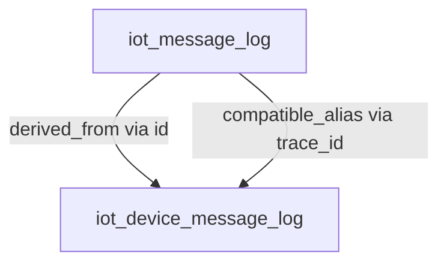

```mermaid
graph TD
  iot_agg_measure_hour["iot_agg_measure_hour"]
  iot_device["iot_device"]
  iot_agg_measure_hour["iot_agg_measure_hour"] -->|"belongs_to via device_id"| iot_device["iot_device"]
  iot_product["iot_product"]
  iot_agg_measure_hour["iot_agg_measure_hour"] -->|"belongs_to via product_id"| iot_product["iot_product"]
  risk_point["risk_point"]
  iot_agg_measure_hour["iot_agg_measure_hour"] -->|"belongs_to via risk_point_id"| risk_point["risk_point"]
  sys_tenant["sys_tenant"]
  iot_agg_measure_hour["iot_agg_measure_hour"] -->|"belongs_to via tenant_id"| sys_tenant["sys_tenant"]
  iot_raw_event_point["iot_raw_event_point"]
  iot_raw_event_point["iot_raw_event_point"] -->|"belongs_to via device_id"| iot_device["iot_device"]
  iot_raw_event_point["iot_raw_event_point"] -->|"belongs_to via product_id"| iot_product["iot_product"]
  iot_raw_event_point["iot_raw_event_point"] -->|"belongs_to via risk_point_id"| risk_point["risk_point"]
  iot_raw_event_point["iot_raw_event_point"] -->|"belongs_to via tenant_id"| sys_tenant["sys_tenant"]
  iot_raw_measure_point["iot_raw_measure_point"]
  iot_raw_measure_point["iot_raw_measure_point"] -->|"belongs_to via device_id"| iot_device["iot_device"]
  iot_raw_measure_point["iot_raw_measure_point"] -->|"belongs_to via product_id"| iot_product["iot_product"]
  iot_raw_measure_point["iot_raw_measure_point"] -->|"belongs_to via risk_point_id"| risk_point["risk_point"]
  iot_raw_measure_point["iot_raw_measure_point"] -->|"belongs_to via tenant_id"| sys_tenant["sys_tenant"]
  iot_raw_status_point["iot_raw_status_point"]
  iot_raw_status_point["iot_raw_status_point"] -->|"belongs_to via device_id"| iot_device["iot_device"]
  iot_raw_status_point["iot_raw_status_point"] -->|"belongs_to via product_id"| iot_product["iot_product"]
  iot_raw_status_point["iot_raw_status_point"] -->|"belongs_to via risk_point_id"| risk_point["risk_point"]
  iot_raw_status_point["iot_raw_status_point"] -->|"belongs_to via tenant_id"| sys_tenant["sys_tenant"]
  iot_device_telemetry_point["iot_device_telemetry_point"]
  iot_device_telemetry_point["iot_device_telemetry_point"] -->|"belongs_to via device_id"| iot_device["iot_device"]
  iot_device_telemetry_point["iot_device_telemetry_point"] -->|"belongs_to via product_id"| iot_product["iot_product"]
  iot_device_telemetry_point["iot_device_telemetry_point"] -->|"belongs_to via tenant_id"| sys_tenant["sys_tenant"]
```

# Database Schema Lineage Catalog

Generated from the schema registry. Do not edit by hand.

| Domain | Objects | Relations | Roles |
| --- | --- | --- | --- |
| alarm | 15 | 39 | binding_registry / catalog_registry / domain_master_data / transaction_record |
| device | 20 | 50 | device_domain_state / domain_master_data / operation_log / relationship_mapping / snapshot_baseline / transaction_record |
| governance | 12 | 29 | domain_master_data / governance_master_data |
| mysql-compatibility | 1 | 2 | compatibility_projection |
| system | 17 | 26 | governance_master_data |
| telemetry | 5 | 19 | telemetry_compatibility_fallback / telemetry_hourly_aggregate / telemetry_raw_timeseries |

## Domain alarm

| Object | Lineage Role | Relations | Business Boundary |
| --- | --- | --- | --- |
| emergency_plan | domain_master_data | sys_tenant（belongs_to:tenant_id） | 用于应急预案表的数据持久化与查询，归属告警域并服务真实环境基线。 |
| iot_alarm_record | transaction_record | iot_device（belongs_to:device_id） risk_point（belongs_to:risk_point_id） sys_tenant（belongs_to:tenant_id） | 用于告警记录表的数据持久化与查询，归属告警域并服务真实环境基线。 |
| iot_event_record | transaction_record | iot_alarm_record（belongs_to:alarm_id） risk_point（belongs_to:risk_point_id） sys_tenant（belongs_to:tenant_id） | 用于事件记录表的数据持久化与查询，归属告警域并服务真实环境基线。 |
| iot_event_work_order | domain_master_data | iot_event_record（belongs_to:event_id） sys_tenant（belongs_to:tenant_id） | 用于事件工单表的数据持久化与查询，归属告警域并服务真实环境基线。 |
| linkage_rule | domain_master_data | sys_tenant（belongs_to:tenant_id） | 用于联动规则表的数据持久化与查询，归属告警域并服务真实环境基线。 |
| risk_metric_catalog | catalog_registry | iot_product（belongs_to:product_id） iot_product_contract_release_batch（belongs_to:release_batch_id） sys_tenant（belongs_to:tenant_id） | 用于风险指标目录表的数据持久化与查询，归属告警域并服务真实环境基线。 |
| risk_metric_emergency_plan_binding | binding_registry | risk_metric_catalog（belongs_to:risk_metric_id） emergency_plan（belongs_to:emergency_plan_id） sys_tenant（belongs_to:tenant_id） | 用于风险指标与应急预案绑定表的数据持久化与查询，归属告警域并服务真实环境基线。 |
| risk_metric_linkage_binding | binding_registry | risk_metric_catalog（belongs_to:risk_metric_id） linkage_rule（belongs_to:linkage_rule_id） sys_tenant（belongs_to:tenant_id） | 用于风险指标与联动规则绑定表的数据持久化与查询，归属告警域并服务真实环境基线。 |
| risk_point | domain_master_data | sys_organization（belongs_to:org_id） sys_region（belongs_to:region_id） sys_tenant（belongs_to:tenant_id） | 用于风险点表的数据持久化与查询，归属告警域并服务真实环境基线。 |
| risk_point_device | domain_master_data | risk_point（belongs_to:risk_point_id） iot_device（belongs_to:device_id） sys_tenant（belongs_to:tenant_id） | 用于风险点设备绑定表的数据持久化与查询，归属告警域并服务真实环境基线。 |
| risk_point_device_capability_binding | binding_registry | risk_point（belongs_to:risk_point_id） iot_device（belongs_to:device_id） sys_tenant（belongs_to:tenant_id） | 用于风险点设备级正式绑定表的数据持久化与查询，归属告警域并服务真实环境基线。 |
| risk_point_device_pending_binding | binding_registry | risk_point（belongs_to:risk_point_id） iot_device（belongs_to:device_id） risk_metric_catalog（belongs_to:metric_identifier） sys_tenant（belongs_to:tenant_id） | 用于风险点设备待治理导入表的数据持久化与查询，归属告警域并服务真实环境基线。 |
| risk_point_device_pending_promotion | domain_master_data | risk_point_device_pending_binding（belongs_to:pending_binding_id） risk_point_device（belongs_to:risk_point_device_id） sys_tenant（belongs_to:tenant_id） | 用于风险点设备待治理转正明细表的数据持久化与查询，归属告警域并服务真实环境基线。 |
| risk_point_highway_detail | domain_master_data | risk_point（belongs_to:risk_point_id） sys_tenant（belongs_to:tenant_id） | 用于高速公路风险点扩展表的数据持久化与查询，归属告警域并服务真实环境基线。 |
| rule_definition | domain_master_data | risk_metric_catalog（belongs_to:risk_metric_id） sys_tenant（belongs_to:tenant_id） | 用于阈值规则表的数据持久化与查询，归属告警域并服务真实环境基线。 |

```mermaid
graph TD
  emergency_plan["emergency_plan"]
  sys_tenant["sys_tenant"]
  emergency_plan["emergency_plan"] -->|"belongs_to via tenant_id"| sys_tenant["sys_tenant"]
  iot_alarm_record["iot_alarm_record"]
  iot_device["iot_device"]
  iot_alarm_record["iot_alarm_record"] -->|"belongs_to via device_id"| iot_device["iot_device"]
  risk_point["risk_point"]
  iot_alarm_record["iot_alarm_record"] -->|"belongs_to via risk_point_id"| risk_point["risk_point"]
  iot_alarm_record["iot_alarm_record"] -->|"belongs_to via tenant_id"| sys_tenant["sys_tenant"]
  iot_event_record["iot_event_record"]
  iot_event_record["iot_event_record"] -->|"belongs_to via alarm_id"| iot_alarm_record["iot_alarm_record"]
  iot_event_record["iot_event_record"] -->|"belongs_to via risk_point_id"| risk_point["risk_point"]
  iot_event_record["iot_event_record"] -->|"belongs_to via tenant_id"| sys_tenant["sys_tenant"]
  iot_event_work_order["iot_event_work_order"]
  iot_event_work_order["iot_event_work_order"] -->|"belongs_to via event_id"| iot_event_record["iot_event_record"]
  iot_event_work_order["iot_event_work_order"] -->|"belongs_to via tenant_id"| sys_tenant["sys_tenant"]
  linkage_rule["linkage_rule"]
  linkage_rule["linkage_rule"] -->|"belongs_to via tenant_id"| sys_tenant["sys_tenant"]
  risk_metric_catalog["risk_metric_catalog"]
  iot_product["iot_product"]
  risk_metric_catalog["risk_metric_catalog"] -->|"belongs_to via product_id"| iot_product["iot_product"]
  iot_product_contract_release_batch["iot_product_contract_release_batch"]
  risk_metric_catalog["risk_metric_catalog"] -->|"belongs_to via release_batch_id"| iot_product_contract_release_batch["iot_product_contract_release_batch"]
  risk_metric_catalog["risk_metric_catalog"] -->|"belongs_to via tenant_id"| sys_tenant["sys_tenant"]
  risk_metric_emergency_plan_binding["risk_metric_emergency_plan_binding"]
  risk_metric_emergency_plan_binding["risk_metric_emergency_plan_binding"] -->|"belongs_to via risk_metric_id"| risk_metric_catalog["risk_metric_catalog"]
  risk_metric_emergency_plan_binding["risk_metric_emergency_plan_binding"] -->|"belongs_to via emergency_plan_id"| emergency_plan["emergency_plan"]
  risk_metric_emergency_plan_binding["risk_metric_emergency_plan_binding"] -->|"belongs_to via tenant_id"| sys_tenant["sys_tenant"]
  risk_metric_linkage_binding["risk_metric_linkage_binding"]
  risk_metric_linkage_binding["risk_metric_linkage_binding"] -->|"belongs_to via risk_metric_id"| risk_metric_catalog["risk_metric_catalog"]
  risk_metric_linkage_binding["risk_metric_linkage_binding"] -->|"belongs_to via linkage_rule_id"| linkage_rule["linkage_rule"]
  risk_metric_linkage_binding["risk_metric_linkage_binding"] -->|"belongs_to via tenant_id"| sys_tenant["sys_tenant"]
  sys_organization["sys_organization"]
  risk_point["risk_point"] -->|"belongs_to via org_id"| sys_organization["sys_organization"]
  sys_region["sys_region"]
  risk_point["risk_point"] -->|"belongs_to via region_id"| sys_region["sys_region"]
  risk_point["risk_point"] -->|"belongs_to via tenant_id"| sys_tenant["sys_tenant"]
  risk_point_device["risk_point_device"]
  risk_point_device["risk_point_device"] -->|"belongs_to via risk_point_id"| risk_point["risk_point"]
  risk_point_device["risk_point_device"] -->|"belongs_to via device_id"| iot_device["iot_device"]
  risk_point_device["risk_point_device"] -->|"belongs_to via tenant_id"| sys_tenant["sys_tenant"]
  risk_point_device_capability_binding["risk_point_device_capability_binding"]
  risk_point_device_capability_binding["risk_point_device_capability_binding"] -->|"belongs_to via risk_point_id"| risk_point["risk_point"]
  risk_point_device_capability_binding["risk_point_device_capability_binding"] -->|"belongs_to via device_id"| iot_device["iot_device"]
  risk_point_device_capability_binding["risk_point_device_capability_binding"] -->|"belongs_to via tenant_id"| sys_tenant["sys_tenant"]
  risk_point_device_pending_binding["risk_point_device_pending_binding"]
  risk_point_device_pending_binding["risk_point_device_pending_binding"] -->|"belongs_to via risk_point_id"| risk_point["risk_point"]
  risk_point_device_pending_binding["risk_point_device_pending_binding"] -->|"belongs_to via device_id"| iot_device["iot_device"]
  risk_point_device_pending_binding["risk_point_device_pending_binding"] -->|"belongs_to via metric_identifier"| risk_metric_catalog["risk_metric_catalog"]
  risk_point_device_pending_binding["risk_point_device_pending_binding"] -->|"belongs_to via tenant_id"| sys_tenant["sys_tenant"]
  risk_point_device_pending_promotion["risk_point_device_pending_promotion"]
  risk_point_device_pending_promotion["risk_point_device_pending_promotion"] -->|"belongs_to via pending_binding_id"| risk_point_device_pending_binding["risk_point_device_pending_binding"]
  risk_point_device_pending_promotion["risk_point_device_pending_promotion"] -->|"belongs_to via risk_point_device_id"| risk_point_device["risk_point_device"]
  risk_point_device_pending_promotion["risk_point_device_pending_promotion"] -->|"belongs_to via tenant_id"| sys_tenant["sys_tenant"]
  risk_point_highway_detail["risk_point_highway_detail"]
  risk_point_highway_detail["risk_point_highway_detail"] -->|"belongs_to via risk_point_id"| risk_point["risk_point"]
  risk_point_highway_detail["risk_point_highway_detail"] -->|"belongs_to via tenant_id"| sys_tenant["sys_tenant"]
  rule_definition["rule_definition"]
  rule_definition["rule_definition"] -->|"belongs_to via risk_metric_id"| risk_metric_catalog["risk_metric_catalog"]
  rule_definition["rule_definition"] -->|"belongs_to via tenant_id"| sys_tenant["sys_tenant"]
```

## Domain device

| Object | Lineage Role | Relations | Business Boundary |
| --- | --- | --- | --- |
| iot_command_record | transaction_record | iot_device（belongs_to:device_id） iot_product（belongs_to:product_key） sys_tenant（belongs_to:tenant_id） | 用于设备命令记录表的数据持久化与查询，归属设备域并服务真实环境基线。 |
| iot_device | device_domain_state | iot_product（belongs_to:product_id） sys_organization（belongs_to:org_id） sys_tenant（belongs_to:tenant_id） | 用于设备表的数据持久化与查询，归属设备域并服务真实环境基线。 |
| iot_device_access_error_log | operation_log | iot_device（belongs_to:device_code） iot_product（belongs_to:product_key） sys_tenant（belongs_to:tenant_id） | 用于设备接入失败归档表的数据持久化与查询，归属设备域并服务真实环境基线。 |
| iot_device_invalid_report_state | device_domain_state | iot_product（belongs_to:product_key） sys_tenant（belongs_to:tenant_id） | 用于无效 MQTT 上报最新态表的数据持久化与查询，归属设备域并服务真实环境基线。 |
| iot_device_message_log | operation_log | iot_device（belongs_to:device_id） iot_product（belongs_to:product_id） sys_tenant（belongs_to:tenant_id） | 用于设备消息日志表的数据持久化与查询，归属设备域并服务真实环境基线。 |
| iot_device_metric_latest | device_domain_state | iot_device（belongs_to:device_id） iot_product（belongs_to:product_id） sys_tenant（belongs_to:tenant_id） | 用于时序最新值投影表的数据持久化与查询，归属设备域并服务真实环境基线。 |
| iot_device_onboarding_case | device_domain_state | iot_product（belongs_to:product_id） sys_tenant（belongs_to:tenant_id） | 用于无代码接入案例的流程编排、步骤状态和阻塞摘要持久化，不承载协议或合同正式真相。 |
| iot_device_online_session | device_domain_state | iot_device（belongs_to:device_id） sys_tenant（belongs_to:tenant_id） | 用于设备在线会话表的数据持久化与查询，归属设备域并服务真实环境基线。 |
| iot_device_property | device_domain_state | iot_device（belongs_to:device_id） sys_tenant（belongs_to:tenant_id） | 用于设备最新属性表的数据持久化与查询，归属设备域并服务真实环境基线。 |
| iot_device_relation | relationship_mapping | iot_device（belongs_to:parent_device_id） iot_device（belongs_to:child_device_id） sys_tenant（belongs_to:tenant_id） | 用于设备逻辑通道关系表的数据持久化与查询，归属设备域并服务真实环境基线。 |
| iot_device_secret_rotation_log | operation_log | iot_device（belongs_to:device_id） iot_product（belongs_to:product_key） sys_tenant（belongs_to:tenant_id） | 用于设备密钥轮换日志表的数据持久化与查询，归属设备域并服务真实环境基线。 |
| iot_normative_metric_definition | domain_master_data | sys_tenant（belongs_to:tenant_id） | 用于规范字段定义表的数据持久化与查询，归属设备域并服务真实环境基线。 |
| iot_product | domain_master_data | sys_tenant（belongs_to:tenant_id） | 用于产品表的数据持久化与查询，归属设备域并服务真实环境基线。 |
| iot_product_contract_release_batch | domain_master_data | iot_product（belongs_to:product_id） sys_governance_approval_order（belongs_to:approval_order_id） sys_tenant（belongs_to:tenant_id） | 用于产品合同发布批次表的数据持久化与查询，归属设备域并服务真实环境基线。 |
| iot_product_contract_release_snapshot | snapshot_baseline | iot_product_contract_release_batch（belongs_to:batch_id） iot_product（belongs_to:product_id） sys_tenant（belongs_to:tenant_id） | 用于产品合同发布快照表的数据持久化与查询，归属设备域并服务真实环境基线。 |
| iot_product_metric_resolver_snapshot | snapshot_baseline | iot_product_contract_release_batch（belongs_to:release_batch_id） iot_product（belongs_to:product_id） sys_tenant（belongs_to:tenant_id） | 用于产品指标解析快照表的数据持久化与查询，归属设备域并服务真实环境基线。 |
| iot_product_model | domain_master_data | iot_product（belongs_to:product_id） sys_tenant（belongs_to:tenant_id） | 用于产品物模型表的数据持久化与查询，归属设备域并服务真实环境基线。 |
| iot_vendor_metric_evidence | domain_master_data | iot_product（belongs_to:product_id） sys_tenant（belongs_to:tenant_id） | 用于厂商字段证据表的数据持久化与查询，归属设备域并服务真实环境基线。 |
| iot_vendor_metric_mapping_rule | domain_master_data | iot_product（belongs_to:product_id） sys_tenant（belongs_to:tenant_id） | 用于厂商字段映射规则表的数据持久化与查询，归属设备域并服务真实环境基线。 |
| iot_vendor_metric_mapping_rule_snapshot | snapshot_baseline | iot_vendor_metric_mapping_rule（belongs_to:rule_id） iot_product（belongs_to:product_id） sys_governance_approval_order（belongs_to:approval_order_id） sys_tenant（belongs_to:tenant_id） | 用于厂商字段映射规则正式发布后的快照真相持久化，支撑审批后读取与运行时回放。 |

```mermaid
graph TD
  iot_command_record["iot_command_record"]
  iot_device["iot_device"]
  iot_command_record["iot_command_record"] -->|"belongs_to via device_id"| iot_device["iot_device"]
  iot_product["iot_product"]
  iot_command_record["iot_command_record"] -->|"belongs_to via product_key"| iot_product["iot_product"]
  sys_tenant["sys_tenant"]
  iot_command_record["iot_command_record"] -->|"belongs_to via tenant_id"| sys_tenant["sys_tenant"]
  iot_device["iot_device"] -->|"belongs_to via product_id"| iot_product["iot_product"]
  sys_organization["sys_organization"]
  iot_device["iot_device"] -->|"belongs_to via org_id"| sys_organization["sys_organization"]
  iot_device["iot_device"] -->|"belongs_to via tenant_id"| sys_tenant["sys_tenant"]
  iot_device_access_error_log["iot_device_access_error_log"]
  iot_device_access_error_log["iot_device_access_error_log"] -->|"belongs_to via device_code"| iot_device["iot_device"]
  iot_device_access_error_log["iot_device_access_error_log"] -->|"belongs_to via product_key"| iot_product["iot_product"]
  iot_device_access_error_log["iot_device_access_error_log"] -->|"belongs_to via tenant_id"| sys_tenant["sys_tenant"]
  iot_device_invalid_report_state["iot_device_invalid_report_state"]
  iot_device_invalid_report_state["iot_device_invalid_report_state"] -->|"belongs_to via product_key"| iot_product["iot_product"]
  iot_device_invalid_report_state["iot_device_invalid_report_state"] -->|"belongs_to via tenant_id"| sys_tenant["sys_tenant"]
  iot_device_message_log["iot_device_message_log"]
  iot_device_message_log["iot_device_message_log"] -->|"belongs_to via device_id"| iot_device["iot_device"]
  iot_device_message_log["iot_device_message_log"] -->|"belongs_to via product_id"| iot_product["iot_product"]
  iot_device_message_log["iot_device_message_log"] -->|"belongs_to via tenant_id"| sys_tenant["sys_tenant"]
  iot_device_metric_latest["iot_device_metric_latest"]
  iot_device_metric_latest["iot_device_metric_latest"] -->|"belongs_to via device_id"| iot_device["iot_device"]
  iot_device_metric_latest["iot_device_metric_latest"] -->|"belongs_to via product_id"| iot_product["iot_product"]
  iot_device_metric_latest["iot_device_metric_latest"] -->|"belongs_to via tenant_id"| sys_tenant["sys_tenant"]
  iot_device_onboarding_case["iot_device_onboarding_case"]
  iot_device_onboarding_case["iot_device_onboarding_case"] -->|"belongs_to via product_id"| iot_product["iot_product"]
  iot_device_onboarding_case["iot_device_onboarding_case"] -->|"belongs_to via tenant_id"| sys_tenant["sys_tenant"]
  iot_device_online_session["iot_device_online_session"]
  iot_device_online_session["iot_device_online_session"] -->|"belongs_to via device_id"| iot_device["iot_device"]
  iot_device_online_session["iot_device_online_session"] -->|"belongs_to via tenant_id"| sys_tenant["sys_tenant"]
  iot_device_property["iot_device_property"]
  iot_device_property["iot_device_property"] -->|"belongs_to via device_id"| iot_device["iot_device"]
  iot_device_property["iot_device_property"] -->|"belongs_to via tenant_id"| sys_tenant["sys_tenant"]
  iot_device_relation["iot_device_relation"]
  iot_device_relation["iot_device_relation"] -->|"belongs_to via parent_device_id"| iot_device["iot_device"]
  iot_device_relation["iot_device_relation"] -->|"belongs_to via child_device_id"| iot_device["iot_device"]
  iot_device_relation["iot_device_relation"] -->|"belongs_to via tenant_id"| sys_tenant["sys_tenant"]
  iot_device_secret_rotation_log["iot_device_secret_rotation_log"]
  iot_device_secret_rotation_log["iot_device_secret_rotation_log"] -->|"belongs_to via device_id"| iot_device["iot_device"]
  iot_device_secret_rotation_log["iot_device_secret_rotation_log"] -->|"belongs_to via product_key"| iot_product["iot_product"]
  iot_device_secret_rotation_log["iot_device_secret_rotation_log"] -->|"belongs_to via tenant_id"| sys_tenant["sys_tenant"]
  iot_normative_metric_definition["iot_normative_metric_definition"]
  iot_normative_metric_definition["iot_normative_metric_definition"] -->|"belongs_to via tenant_id"| sys_tenant["sys_tenant"]
  iot_product["iot_product"] -->|"belongs_to via tenant_id"| sys_tenant["sys_tenant"]
  iot_product_contract_release_batch["iot_product_contract_release_batch"]
  iot_product_contract_release_batch["iot_product_contract_release_batch"] -->|"belongs_to via product_id"| iot_product["iot_product"]
  sys_governance_approval_order["sys_governance_approval_order"]
  iot_product_contract_release_batch["iot_product_contract_release_batch"] -->|"belongs_to via approval_order_id"| sys_governance_approval_order["sys_governance_approval_order"]
  iot_product_contract_release_batch["iot_product_contract_release_batch"] -->|"belongs_to via tenant_id"| sys_tenant["sys_tenant"]
  iot_product_contract_release_snapshot["iot_product_contract_release_snapshot"]
  iot_product_contract_release_snapshot["iot_product_contract_release_snapshot"] -->|"belongs_to via batch_id"| iot_product_contract_release_batch["iot_product_contract_release_batch"]
  iot_product_contract_release_snapshot["iot_product_contract_release_snapshot"] -->|"belongs_to via product_id"| iot_product["iot_product"]
  iot_product_contract_release_snapshot["iot_product_contract_release_snapshot"] -->|"belongs_to via tenant_id"| sys_tenant["sys_tenant"]
  iot_product_metric_resolver_snapshot["iot_product_metric_resolver_snapshot"]
  iot_product_metric_resolver_snapshot["iot_product_metric_resolver_snapshot"] -->|"belongs_to via release_batch_id"| iot_product_contract_release_batch["iot_product_contract_release_batch"]
  iot_product_metric_resolver_snapshot["iot_product_metric_resolver_snapshot"] -->|"belongs_to via product_id"| iot_product["iot_product"]
  iot_product_metric_resolver_snapshot["iot_product_metric_resolver_snapshot"] -->|"belongs_to via tenant_id"| sys_tenant["sys_tenant"]
  iot_product_model["iot_product_model"]
  iot_product_model["iot_product_model"] -->|"belongs_to via product_id"| iot_product["iot_product"]
  iot_product_model["iot_product_model"] -->|"belongs_to via tenant_id"| sys_tenant["sys_tenant"]
  iot_vendor_metric_evidence["iot_vendor_metric_evidence"]
  iot_vendor_metric_evidence["iot_vendor_metric_evidence"] -->|"belongs_to via product_id"| iot_product["iot_product"]
  iot_vendor_metric_evidence["iot_vendor_metric_evidence"] -->|"belongs_to via tenant_id"| sys_tenant["sys_tenant"]
  iot_vendor_metric_mapping_rule["iot_vendor_metric_mapping_rule"]
  iot_vendor_metric_mapping_rule["iot_vendor_metric_mapping_rule"] -->|"belongs_to via product_id"| iot_product["iot_product"]
  iot_vendor_metric_mapping_rule["iot_vendor_metric_mapping_rule"] -->|"belongs_to via tenant_id"| sys_tenant["sys_tenant"]
  iot_vendor_metric_mapping_rule_snapshot["iot_vendor_metric_mapping_rule_snapshot"]
  iot_vendor_metric_mapping_rule_snapshot["iot_vendor_metric_mapping_rule_snapshot"] -->|"belongs_to via rule_id"| iot_vendor_metric_mapping_rule["iot_vendor_metric_mapping_rule"]
  iot_vendor_metric_mapping_rule_snapshot["iot_vendor_metric_mapping_rule_snapshot"] -->|"belongs_to via product_id"| iot_product["iot_product"]
  iot_vendor_metric_mapping_rule_snapshot["iot_vendor_metric_mapping_rule_snapshot"] -->|"belongs_to via approval_order_id"| sys_governance_approval_order["sys_governance_approval_order"]
  iot_vendor_metric_mapping_rule_snapshot["iot_vendor_metric_mapping_rule_snapshot"] -->|"belongs_to via tenant_id"| sys_tenant["sys_tenant"]
```

## Domain governance

| Object | Lineage Role | Relations | Business Boundary |
| --- | --- | --- | --- |
| iot_governance_ops_alert | domain_master_data | sys_tenant（belongs_to:tenant_id） | 用于治理运维告警表的数据持久化与查询，归属治理域并服务真实环境基线。 |
| iot_governance_work_item | domain_master_data | sys_governance_approval_order（belongs_to:approval_order_id） sys_tenant（belongs_to:tenant_id） | 用于治理与运营工作项表的数据持久化与查询，归属治理域并服务真实环境基线。 |
| iot_protocol_decrypt_profile | governance_master_data | sys_governance_approval_order（belongs_to:approval_order_id） sys_tenant（belongs_to:tenant_id） | 用于协议解密档案草稿、发布与回滚治理的真实环境持久化。 |
| iot_protocol_decrypt_profile_snapshot | governance_master_data | iot_protocol_decrypt_profile（belongs_to:profile_id） sys_governance_approval_order（belongs_to:approval_order_id） sys_tenant（belongs_to:tenant_id） | 用于协议解密档案正式发布真相快照的真实环境持久化。 |
| iot_protocol_family_definition | governance_master_data | sys_governance_approval_order（belongs_to:approval_order_id） sys_tenant（belongs_to:tenant_id） | 用于协议族定义草稿、发布与回滚治理的真实环境持久化。 |
| iot_protocol_family_definition_snapshot | governance_master_data | iot_protocol_family_definition（belongs_to:family_id） sys_governance_approval_order（belongs_to:approval_order_id） sys_tenant（belongs_to:tenant_id） | 用于协议族定义正式发布真相快照的真实环境持久化。 |
| iot_protocol_template_definition | governance_master_data | sys_governance_approval_order（belongs_to:approval_order_id） sys_tenant（belongs_to:tenant_id） | 用于协议模板草稿、直接发布快照与回放治理的真实环境持久化。 |
| iot_protocol_template_definition_snapshot | governance_master_data | iot_protocol_template_definition（belongs_to:template_id） sys_governance_approval_order（belongs_to:approval_order_id） sys_tenant（belongs_to:tenant_id） | 用于协议模板正式发布真相快照的真实环境持久化。 |
| sys_governance_approval_order | governance_master_data | iot_governance_work_item（belongs_to:work_item_id） sys_user（belongs_to:operator_user_id） sys_user（belongs_to:approver_user_id） sys_tenant（belongs_to:tenant_id） | 用于治理审批工单表的数据持久化与查询，归属治理域并服务真实环境基线。 |
| sys_governance_approval_policy | governance_master_data | sys_tenant（belongs_to:tenant_id） | 用于治理审批策略表的数据持久化与查询，归属治理域并服务真实环境基线。 |

```mermaid
graph TD
  iot_governance_ops_alert["iot_governance_ops_alert"]
  sys_tenant["sys_tenant"]
  iot_governance_ops_alert["iot_governance_ops_alert"] -->|"belongs_to via tenant_id"| sys_tenant["sys_tenant"]
  iot_governance_work_item["iot_governance_work_item"]
  sys_governance_approval_order["sys_governance_approval_order"]
  iot_governance_work_item["iot_governance_work_item"] -->|"belongs_to via approval_order_id"| sys_governance_approval_order["sys_governance_approval_order"]
  iot_governance_work_item["iot_governance_work_item"] -->|"belongs_to via tenant_id"| sys_tenant["sys_tenant"]
  iot_protocol_decrypt_profile["iot_protocol_decrypt_profile"]
  iot_protocol_decrypt_profile["iot_protocol_decrypt_profile"] -->|"belongs_to via approval_order_id"| sys_governance_approval_order["sys_governance_approval_order"]
  iot_protocol_decrypt_profile["iot_protocol_decrypt_profile"] -->|"belongs_to via tenant_id"| sys_tenant["sys_tenant"]
  iot_protocol_decrypt_profile_snapshot["iot_protocol_decrypt_profile_snapshot"]
  iot_protocol_decrypt_profile_snapshot["iot_protocol_decrypt_profile_snapshot"] -->|"belongs_to via profile_id"| iot_protocol_decrypt_profile["iot_protocol_decrypt_profile"]
  iot_protocol_decrypt_profile_snapshot["iot_protocol_decrypt_profile_snapshot"] -->|"belongs_to via approval_order_id"| sys_governance_approval_order["sys_governance_approval_order"]
  iot_protocol_decrypt_profile_snapshot["iot_protocol_decrypt_profile_snapshot"] -->|"belongs_to via tenant_id"| sys_tenant["sys_tenant"]
  iot_protocol_family_definition["iot_protocol_family_definition"]
  iot_protocol_family_definition["iot_protocol_family_definition"] -->|"belongs_to via approval_order_id"| sys_governance_approval_order["sys_governance_approval_order"]
  iot_protocol_family_definition["iot_protocol_family_definition"] -->|"belongs_to via tenant_id"| sys_tenant["sys_tenant"]
  iot_protocol_family_definition_snapshot["iot_protocol_family_definition_snapshot"]
  iot_protocol_family_definition_snapshot["iot_protocol_family_definition_snapshot"] -->|"belongs_to via family_id"| iot_protocol_family_definition["iot_protocol_family_definition"]
  iot_protocol_family_definition_snapshot["iot_protocol_family_definition_snapshot"] -->|"belongs_to via approval_order_id"| sys_governance_approval_order["sys_governance_approval_order"]
  iot_protocol_family_definition_snapshot["iot_protocol_family_definition_snapshot"] -->|"belongs_to via tenant_id"| sys_tenant["sys_tenant"]
  iot_protocol_template_definition["iot_protocol_template_definition"]
  iot_protocol_template_definition["iot_protocol_template_definition"] -->|"belongs_to via approval_order_id"| sys_governance_approval_order["sys_governance_approval_order"]
  iot_protocol_template_definition["iot_protocol_template_definition"] -->|"belongs_to via tenant_id"| sys_tenant["sys_tenant"]
  iot_protocol_template_definition_snapshot["iot_protocol_template_definition_snapshot"]
  iot_protocol_template_definition_snapshot["iot_protocol_template_definition_snapshot"] -->|"belongs_to via template_id"| iot_protocol_template_definition["iot_protocol_template_definition"]
  iot_protocol_template_definition_snapshot["iot_protocol_template_definition_snapshot"] -->|"belongs_to via approval_order_id"| sys_governance_approval_order["sys_governance_approval_order"]
  iot_protocol_template_definition_snapshot["iot_protocol_template_definition_snapshot"] -->|"belongs_to via tenant_id"| sys_tenant["sys_tenant"]
  sys_governance_approval_order["sys_governance_approval_order"] -->|"belongs_to via work_item_id"| iot_governance_work_item["iot_governance_work_item"]
  sys_user["sys_user"]
  sys_governance_approval_order["sys_governance_approval_order"] -->|"belongs_to via operator_user_id"| sys_user["sys_user"]
  sys_governance_approval_order["sys_governance_approval_order"] -->|"belongs_to via approver_user_id"| sys_user["sys_user"]
  sys_governance_approval_order["sys_governance_approval_order"] -->|"belongs_to via tenant_id"| sys_tenant["sys_tenant"]
  sys_governance_approval_policy["sys_governance_approval_policy"]
  sys_governance_approval_policy["sys_governance_approval_policy"] -->|"belongs_to via tenant_id"| sys_tenant["sys_tenant"]
  sys_governance_approval_transition["sys_governance_approval_transition"]
  sys_governance_approval_transition["sys_governance_approval_transition"] -->|"belongs_to via order_id"| sys_governance_approval_order["sys_governance_approval_order"]
  sys_governance_approval_transition["sys_governance_approval_transition"] -->|"belongs_to via actor_user_id"| sys_user["sys_user"]
  sys_governance_approval_transition["sys_governance_approval_transition"] -->|"belongs_to via tenant_id"| sys_tenant["sys_tenant"]
  sys_governance_replay_feedback["sys_governance_replay_feedback"]
  sys_governance_replay_feedback["sys_governance_replay_feedback"] -->|"belongs_to via work_item_id"| iot_governance_work_item["iot_governance_work_item"]
  iot_product_contract_release_batch["iot_product_contract_release_batch"]
  sys_governance_replay_feedback["sys_governance_replay_feedback"] -->|"belongs_to via release_batch_id"| iot_product_contract_release_batch["iot_product_contract_release_batch"]
  sys_governance_replay_feedback["sys_governance_replay_feedback"] -->|"belongs_to via tenant_id"| sys_tenant["sys_tenant"]
```

| sys_governance_approval_transition | governance_master_data | sys_governance_approval_order（belongs_to:order_id） sys_user（belongs_to:actor_user_id） sys_tenant（belongs_to:tenant_id） | 用于治理审批流转记录表的数据持久化与查询，归属治理域并服务真实环境基线。 |
| sys_governance_replay_feedback | governance_master_data | iot_governance_work_item（belongs_to:work_item_id） iot_product_contract_release_batch（belongs_to:release_batch_id） sys_tenant（belongs_to:tenant_id） | 用于治理复盘反馈表的数据持久化与查询，归属治理域并服务真实环境基线。 |

## Domain mysql-compatibility

| Object | Lineage Role | Relations | Business Boundary |
| --- | --- | --- | --- |
| iot_message_log | compatibility_projection | iot_device_message_log（derived_from:id） iot_device_message_log（compatible_alias:trace_id） | 提供历史兼容读取入口，统一暴露设备消息日志字段，真实写入边界仍归属设备消息日志表。 |

## Domain system

| Object | Lineage Role | Relations | Business Boundary |
| --- | --- | --- | --- |
| sys_audit_log | governance_master_data | sys_tenant（belongs_to:tenant_id） | 用于审计日志表的数据持久化与查询，归属系统治理域并服务真实环境基线。 |
| sys_dict | governance_master_data | sys_tenant（belongs_to:tenant_id） | 用于字典表的数据持久化与查询，归属系统治理域并服务真实环境基线。 |
| sys_dict_item | governance_master_data | sys_dict（belongs_to:dict_id） sys_tenant（belongs_to:tenant_id） | 用于字典项表的数据持久化与查询，归属系统治理域并服务真实环境基线。 |
| sys_help_document | governance_master_data | sys_tenant（belongs_to:tenant_id） | 用于帮助文档表的数据持久化与查询，归属系统治理域并服务真实环境基线。 |
| sys_in_app_message | governance_master_data | sys_tenant（belongs_to:tenant_id） | 用于站内消息表的数据持久化与查询，归属系统治理域并服务真实环境基线。 |
| sys_in_app_message_bridge_attempt_log | governance_master_data | sys_in_app_message_bridge_log（belongs_to:bridge_log_id） sys_tenant（belongs_to:tenant_id） | 用于站内消息桥接尝试明细表的数据持久化与查询，归属系统治理域并服务真实环境基线。 |
| sys_in_app_message_bridge_log | governance_master_data | sys_in_app_message（belongs_to:message_id） sys_notification_channel（belongs_to:channel_code） sys_tenant（belongs_to:tenant_id） | 用于站内消息未读桥接日志表的数据持久化与查询，归属系统治理域并服务真实环境基线。 |
| sys_in_app_message_read | governance_master_data | sys_in_app_message（belongs_to:message_id） sys_user（belongs_to:user_id） sys_tenant（belongs_to:tenant_id） | 用于站内消息已读表的数据持久化与查询，归属系统治理域并服务真实环境基线。 |
| sys_menu | governance_master_data | sys_tenant（belongs_to:tenant_id） | 用于菜单表的数据持久化与查询，归属系统治理域并服务真实环境基线。 |
| sys_notification_channel | governance_master_data | sys_tenant（belongs_to:tenant_id） | 用于通知渠道表的数据持久化与查询，归属系统治理域并服务真实环境基线。 |
| sys_organization | governance_master_data | sys_tenant（belongs_to:tenant_id） | 用于组织机构表的数据持久化与查询，归属系统治理域并服务真实环境基线。 |
| sys_region | governance_master_data | sys_tenant（belongs_to:tenant_id） | 用于区域表的数据持久化与查询，归属系统治理域并服务真实环境基线。 |
| sys_role | governance_master_data | sys_tenant（belongs_to:tenant_id） | 用于角色表的数据持久化与查询，归属系统治理域并服务真实环境基线。 |
| sys_role_menu | governance_master_data | sys_role（belongs_to:role_id） sys_menu（belongs_to:menu_id） sys_tenant（belongs_to:tenant_id） | 用于角色菜单关联表的数据持久化与查询，归属系统治理域并服务真实环境基线。 |
| sys_tenant | governance_master_data | - | 用于租户表的数据持久化与查询，归属系统治理域并服务真实环境基线。 |
| sys_user | governance_master_data | sys_tenant（belongs_to:tenant_id） | 用于系统用户表的数据持久化与查询，归属系统治理域并服务真实环境基线。 |

```mermaid
graph TD
  sys_audit_log["sys_audit_log"]
  sys_tenant["sys_tenant"]
  sys_audit_log["sys_audit_log"] -->|"belongs_to via tenant_id"| sys_tenant["sys_tenant"]
  sys_dict["sys_dict"]
  sys_dict["sys_dict"] -->|"belongs_to via tenant_id"| sys_tenant["sys_tenant"]
  sys_dict_item["sys_dict_item"]
  sys_dict_item["sys_dict_item"] -->|"belongs_to via dict_id"| sys_dict["sys_dict"]
  sys_dict_item["sys_dict_item"] -->|"belongs_to via tenant_id"| sys_tenant["sys_tenant"]
  sys_help_document["sys_help_document"]
  sys_help_document["sys_help_document"] -->|"belongs_to via tenant_id"| sys_tenant["sys_tenant"]
  sys_in_app_message["sys_in_app_message"]
  sys_in_app_message["sys_in_app_message"] -->|"belongs_to via tenant_id"| sys_tenant["sys_tenant"]
  sys_in_app_message_bridge_attempt_log["sys_in_app_message_bridge_attempt_log"]
  sys_in_app_message_bridge_log["sys_in_app_message_bridge_log"]
  sys_in_app_message_bridge_attempt_log["sys_in_app_message_bridge_attempt_log"] -->|"belongs_to via bridge_log_id"| sys_in_app_message_bridge_log["sys_in_app_message_bridge_log"]
  sys_in_app_message_bridge_attempt_log["sys_in_app_message_bridge_attempt_log"] -->|"belongs_to via tenant_id"| sys_tenant["sys_tenant"]
  sys_in_app_message_bridge_log["sys_in_app_message_bridge_log"] -->|"belongs_to via message_id"| sys_in_app_message["sys_in_app_message"]
  sys_notification_channel["sys_notification_channel"]
  sys_in_app_message_bridge_log["sys_in_app_message_bridge_log"] -->|"belongs_to via channel_code"| sys_notification_channel["sys_notification_channel"]
  sys_in_app_message_bridge_log["sys_in_app_message_bridge_log"] -->|"belongs_to via tenant_id"| sys_tenant["sys_tenant"]
  sys_in_app_message_read["sys_in_app_message_read"]
  sys_in_app_message_read["sys_in_app_message_read"] -->|"belongs_to via message_id"| sys_in_app_message["sys_in_app_message"]
  sys_user["sys_user"]
  sys_in_app_message_read["sys_in_app_message_read"] -->|"belongs_to via user_id"| sys_user["sys_user"]
  sys_in_app_message_read["sys_in_app_message_read"] -->|"belongs_to via tenant_id"| sys_tenant["sys_tenant"]
  sys_menu["sys_menu"]
  sys_menu["sys_menu"] -->|"belongs_to via tenant_id"| sys_tenant["sys_tenant"]
  sys_notification_channel["sys_notification_channel"] -->|"belongs_to via tenant_id"| sys_tenant["sys_tenant"]
  sys_organization["sys_organization"]
  sys_organization["sys_organization"] -->|"belongs_to via tenant_id"| sys_tenant["sys_tenant"]
  sys_region["sys_region"]
  sys_region["sys_region"] -->|"belongs_to via tenant_id"| sys_tenant["sys_tenant"]
  sys_role["sys_role"]
  sys_role["sys_role"] -->|"belongs_to via tenant_id"| sys_tenant["sys_tenant"]
  sys_role_menu["sys_role_menu"]
  sys_role_menu["sys_role_menu"] -->|"belongs_to via role_id"| sys_role["sys_role"]
  sys_role_menu["sys_role_menu"] -->|"belongs_to via menu_id"| sys_menu["sys_menu"]
  sys_role_menu["sys_role_menu"] -->|"belongs_to via tenant_id"| sys_tenant["sys_tenant"]
  sys_user["sys_user"] -->|"belongs_to via tenant_id"| sys_tenant["sys_tenant"]
  sys_user_role["sys_user_role"]
  sys_user_role["sys_user_role"] -->|"belongs_to via user_id"| sys_user["sys_user"]
  sys_user_role["sys_user_role"] -->|"belongs_to via role_id"| sys_role["sys_role"]
  sys_user_role["sys_user_role"] -->|"belongs_to via tenant_id"| sys_tenant["sys_tenant"]
```

| sys_user_role | governance_master_data | sys_user（belongs_to:user_id） sys_role（belongs_to:role_id） sys_tenant（belongs_to:tenant_id） | 用于用户角色关联表的数据持久化与查询，归属系统治理域并服务真实环境基线。 |

## Domain telemetry

| Object | Lineage Role | Relations | Business Boundary |
| --- | --- | --- | --- |
| iot_agg_measure_hour | telemetry_hourly_aggregate | iot_device（belongs_to:device_id） iot_product（belongs_to:product_id） risk_point（belongs_to:risk_point_id） sys_tenant（belongs_to:tenant_id） | 用于数值点位小时聚合表的数据持久化与查询，归属时序域并服务真实环境基线。 |
| iot_raw_event_point | telemetry_raw_timeseries | iot_device（belongs_to:device_id） iot_product（belongs_to:product_id） risk_point（belongs_to:risk_point_id） sys_tenant（belongs_to:tenant_id） | 用于原始事件点位表的数据持久化与查询，归属时序域并服务真实环境基线。 |
| iot_raw_measure_point | telemetry_raw_timeseries | iot_device（belongs_to:device_id） iot_product（belongs_to:product_id） risk_point（belongs_to:risk_point_id） sys_tenant（belongs_to:tenant_id） | 用于原始数值点位表的数据持久化与查询，归属时序域并服务真实环境基线。 |
| iot_raw_status_point | telemetry_raw_timeseries | iot_device（belongs_to:device_id） iot_product（belongs_to:product_id） risk_point（belongs_to:risk_point_id） sys_tenant（belongs_to:tenant_id） | 用于原始状态点位表的数据持久化与查询，归属时序域并服务真实环境基线。 |
| iot_device_telemetry_point | telemetry_compatibility_fallback | iot_device（belongs_to:device_id） iot_product（belongs_to:product_id） sys_tenant（belongs_to:tenant_id） | 用于设备时序兼容点位表的数据持久化与查询，归属时序域并服务真实环境基线。 |

