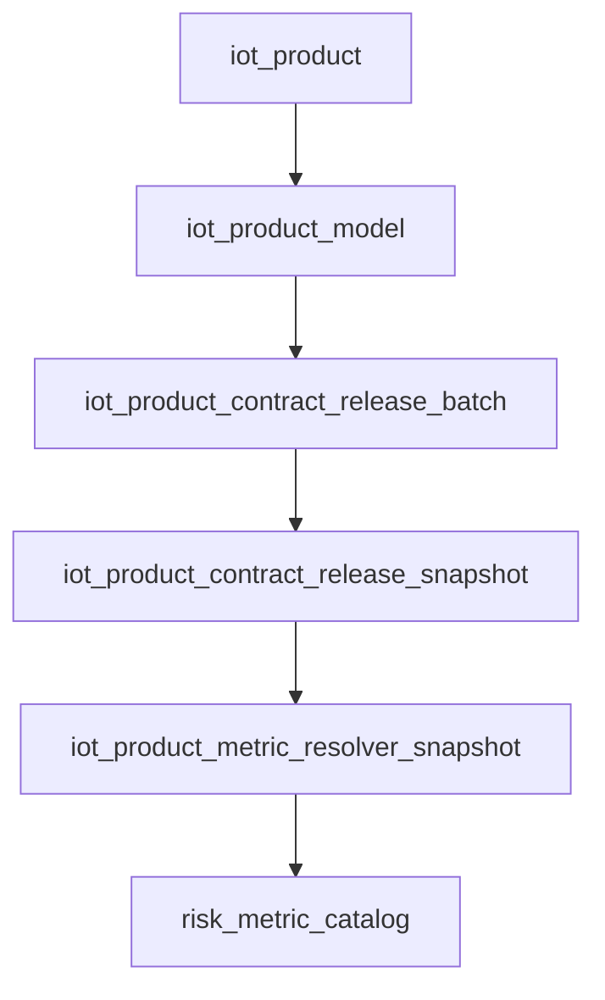

# Database Schema Governance Implementation Plan

> **For agentic workers:** REQUIRED SUB-SKILL: Use superpowers:subagent-driven-development (recommended) or superpowers:executing-plans to implement this plan task-by-task. Steps use checkbox (`- [ ]`) syntax for tracking.

**Goal:** 为 MySQL 与 TDengine 建立统一 schema baseline registry，把初始化 SQL、真实环境 schema sync、运行时安全补齐、中文注释治理、生命周期分级和表关系/血缘文档全部收口到同一套真相源。

**Architecture:** 先用 JSON registry 固化当前 `56` 张 MySQL 表、`1` 个兼容视图与 `5` 个 TDengine 对象的结构、中文注释、生命周期和关系元数据，再由 Python 工具统一渲染 `sql/init.sql`、`sql/init-tdengine.sql`、schema sync manifest、运行时 bootstrap manifest 与数据库目录附录。随后把 `scripts/run-real-env-schema-sync.py` 和 Spring Boot 启动期 schema bootstrap 改为消费生成后的 manifest，同时保留现有 seed/backfill 逻辑，不把初始化样例数据带入运行时。

**Tech Stack:** Python 3 标准库 + `unittest`、MySQL DDL、TDengine DDL、Spring Boot 4、Java 17、JdbcTemplate、Jackson、Markdown

---

## File Structure

- Create: `schema/mysql/system-domain.json`  
  Responsibility: 收口 `sys_tenant`、`sys_user`、`sys_role`、`sys_user_role`、`sys_menu`、`sys_role_menu`、`sys_organization`、`sys_region`、`sys_dict`、`sys_dict_item`、`sys_notification_channel`、`sys_in_app_message`、`sys_in_app_message_read`、`sys_in_app_message_bridge_log`、`sys_in_app_message_bridge_attempt_log`、`sys_help_document`、`sys_audit_log` 的结构、中文注释、生命周期和关系。
- Create: `schema/mysql/governance-domain.json`  
  Responsibility: 收口 `sys_governance_approval_order`、`sys_governance_approval_transition`、`sys_governance_approval_policy`、`sys_governance_replay_feedback`、`iot_governance_work_item`、`iot_governance_ops_alert` 的治理审批/控制面 schema。
- Create: `schema/mysql/device-domain.json`  
  Responsibility: 收口 `iot_product`、`iot_product_model`、`iot_normative_metric_definition`、`iot_vendor_metric_evidence`、`iot_vendor_metric_mapping_rule`、`iot_product_contract_release_batch`、`iot_product_contract_release_snapshot`、`iot_product_metric_resolver_snapshot`、`iot_device`、`iot_device_relation`、`iot_device_online_session`、`iot_device_property`、`iot_device_metric_latest`、`iot_device_message_log`、`iot_device_access_error_log`、`iot_device_invalid_report_state`、`iot_command_record`、`iot_device_secret_rotation_log` 的 schema 与血缘元数据。
- Create: `schema/mysql/alarm-domain.json`  
  Responsibility: 收口 `iot_alarm_record`、`iot_event_record`、`iot_event_work_order`、`risk_point`、`risk_point_highway_detail`、`risk_metric_catalog`、`risk_metric_linkage_binding`、`risk_metric_emergency_plan_binding`、`risk_point_device`、`risk_point_device_capability_binding`、`risk_point_device_pending_binding`、`risk_point_device_pending_promotion`、`rule_definition`、`linkage_rule`、`emergency_plan` 的 schema；其中把 `risk_point_highway_detail` 首轮标记为 `archived`。
- Create: `schema/views/mysql-compatibility.json`  
  Responsibility: 收口 `iot_message_log` 兼容视图定义与来源说明。
- Create: `schema/tdengine/telemetry-domain.json`  
  Responsibility: 收口 `iot_device_telemetry_point`、`iot_raw_measure_point`、`iot_raw_status_point`、`iot_raw_event_point`、`iot_agg_measure_hour` 的 TDengine 对象定义、块级中文字段字典与运行时 bootstrap 策略；其中 `iot_agg_measure_hour` 固定为 `manual_bootstrap_required`。
- Create: `schema/generated/mysql-schema-sync.json`  
  Responsibility: 由 renderer 生成，供 `scripts/run-real-env-schema-sync.py` 读取的 MySQL 结构 manifest，包含建表、补列、补索引、补视图所需信息。
- Create: `scripts/schema/load_registry.py`  
  Responsibility: 加载并校验 registry 文件，输出统一对象模型，检查对象唯一性、生命周期合法性、中文注释完整度和跨对象关系引用。
- Create: `scripts/schema/render_artifacts.py`  
  Responsibility: 由 registry 统一生成 `sql/init.sql`、`sql/init-tdengine.sql`、`schema/generated/mysql-schema-sync.json`、运行时 bootstrap manifest 和数据库附录；同时提供 `--write` / `--check` 模式。
- Create: `scripts/schema/check_schema_registry.py`  
  Responsibility: 一次性执行 registry 语义校验与生成产物漂移校验，作为后续新增表/字段的标准入口。
- Create: `scripts/tests/test_schema_registry.py`  
  Responsibility: 锁定对象数量、生命周期分级、中文注释完整度、`risk_point_highway_detail` 归档分类与 TDengine 手动 bootstrap 边界。
- Create: `scripts/tests/test_schema_artifact_generation.py`  
  Responsibility: 锁定生成后的 `init.sql`、`init-tdengine.sql`、schema sync manifest、运行时 manifest 与数据库附录。
- Modify: `scripts/tests/test_run_real_env_schema_sync.py`  
  Responsibility: 改为验证 schema sync 脚本从生成 manifest 取结构对象，而不是继续手写 `CREATE_TABLE_SQL / COLUMNS_TO_ADD / INDEXES_TO_ADD / VIEW_SQL`。
- Modify: `scripts/tests/test_sql_utf8_integrity.py`  
  Responsibility: 把 UTF-8 / 乱码门禁扩展到 `sql/init-tdengine.sql`、`schema/**/*.json` 与生成后的数据库附录。
- Modify: `sql/init.sql`  
  Responsibility: 只保留 registry 渲染出的 `active` MySQL 表与兼容视图，所有表注释和字段注释统一为中文。
- Modify: `sql/init-tdengine.sql`  
  Responsibility: 由 registry 渲染 TDengine 初始化脚本，统一块级中文说明与字段字典。
- Create: `docs/appendix/database-schema-object-catalog.generated.md`  
  Responsibility: 由 registry 生成对象目录、生命周期、业务域、模块归属、bootstrap 策略与主要关系摘要。
- Modify: `docs/04-数据库设计与初始化数据.md`  
  Responsibility: 固化“数据库对象总览 / 业务域边界 / 表关系与血缘 / 归档与待删对象清单”四个权威章节，并引用附录。
- Modify: `docs/08-变更记录与技术债清单.md`  
  Responsibility: 记录数据库治理真相源切换、首批 archived 对象与后续技术债边界。
- Modify: `README.md`  
  Responsibility: 在项目入口文档中说明 schema registry、产物生成命令和启动期安全 bootstrap 基线。
- Modify: `AGENTS.md`  
  Responsibility: 把“新增表/字段必须先改 registry，再生成脚本与文档”写成新的协作硬约束。
- Create: `spring-boot-iot-framework/src/main/java/com/ghlzm/iot/framework/schema/SchemaBootstrapProperties.java`  
  Responsibility: 定义 MySQL / TDengine 启动期 schema bootstrap 配置。
- Create: `spring-boot-iot-framework/src/main/java/com/ghlzm/iot/framework/schema/SchemaManifestLoader.java`  
  Responsibility: 从 classpath 读取生成后的 runtime bootstrap manifest。
- Create: `spring-boot-iot-framework/src/main/java/com/ghlzm/iot/framework/schema/MySqlActiveSchemaBootstrapRunner.java`  
  Responsibility: 启动期按 manifest 幂等补齐 active MySQL 表、列、索引与视图，不处理 seed 数据和 archived 对象。
- Create: `spring-boot-iot-framework/src/test/java/com/ghlzm/iot/framework/schema/MySqlActiveSchemaBootstrapRunnerTest.java`  
  Responsibility: 锁定“只补 active、跳过 archived、只做结构不做 seed”的启动期行为。
- Create: `spring-boot-iot-framework/src/main/resources/schema/runtime-bootstrap/mysql-active-schema.json`  
  Responsibility: 由 renderer 生成的 MySQL active runtime manifest。
- Create: `spring-boot-iot-telemetry/src/main/resources/schema/runtime-bootstrap/tdengine-active-schema.json`  
  Responsibility: 由 renderer 生成的 TDengine runtime manifest。
- Create: `spring-boot-iot-telemetry/src/main/java/com/ghlzm/iot/telemetry/service/impl/TdengineSchemaManifestSupport.java`  
  Responsibility: 读取 TDengine runtime manifest，区分自动 bootstrap 对象与 `manual_bootstrap_required` 对象。
- Modify: `spring-boot-iot-telemetry/src/main/java/com/ghlzm/iot/telemetry/service/impl/TdengineTelemetrySchemaInitializer.java`  
  Responsibility: 启动时统一走 manifest-driven TDengine bootstrap 入口。
- Modify: `spring-boot-iot-telemetry/src/main/java/com/ghlzm/iot/telemetry/service/impl/TdengineTelemetrySchemaSupport.java`  
  Responsibility: 改为从 manifest 获取 `iot_device_telemetry_point` 兼容表定义，不再内嵌整段 DDL。
- Modify: `spring-boot-iot-telemetry/src/main/java/com/ghlzm/iot/telemetry/service/impl/TelemetryV2SchemaSupport.java`  
  Responsibility: 改为从 manifest 获取 raw stable 建表 SQL，child table 仍在运行时按设备派生。
- Modify: `spring-boot-iot-telemetry/src/main/java/com/ghlzm/iot/telemetry/service/impl/TelemetryAggregateSchemaSupport.java`  
  Responsibility: 明确 `iot_agg_measure_hour` 只做存在性校验，不把它自动加入启动期创建集合。
- Create: `spring-boot-iot-telemetry/src/test/java/com/ghlzm/iot/telemetry/service/impl/TdengineSchemaManifestSupportTest.java`  
  Responsibility: 锁定 TDengine manifest 中 `iot_agg_measure_hour` 为手动 bootstrap，其余四个对象为自动 bootstrap。

### Task 1: 建立 registry 契约并锁定对象覆盖

**Files:**
- Create: `schema/mysql/system-domain.json`
- Create: `schema/mysql/governance-domain.json`
- Create: `schema/mysql/device-domain.json`
- Create: `schema/mysql/alarm-domain.json`
- Create: `schema/views/mysql-compatibility.json`
- Create: `schema/tdengine/telemetry-domain.json`
- Create: `scripts/schema/load_registry.py`
- Create: `scripts/tests/test_schema_registry.py`

- [ ] **Step 1: 先写 registry 覆盖与中文注释失败测试**

```python
import pathlib
import unittest

from scripts.schema.load_registry import load_registry

REPO_ROOT = pathlib.Path(__file__).resolve().parents[2]


class SchemaRegistryCoverageTest(unittest.TestCase):
    def test_registry_covers_current_mysql_and_tdengine_baseline(self):
        registry = load_registry(REPO_ROOT / "schema")
        self.assertEqual(len(registry.mysql_objects), 56)
        self.assertEqual(registry.mysql["risk_point_highway_detail"].lifecycle, "archived")
        self.assertEqual(registry.mysql["risk_point_device_capability_binding"].lifecycle, "active")
        self.assertEqual(
            sorted(registry.tdengine.keys()),
            [
                "iot_agg_measure_hour",
                "iot_device_telemetry_point",
                "iot_raw_event_point",
                "iot_raw_measure_point",
                "iot_raw_status_point",
            ],
        )
        self.assertEqual(
            registry.tdengine["iot_agg_measure_hour"].runtime_bootstrap_mode,
            "manual_bootstrap_required",
        )

    def test_all_mysql_comments_are_present_and_chinese(self):
        registry = load_registry(REPO_ROOT / "schema")
        self.assertEqual(registry.find_missing_comments(), [])
        self.assertEqual(registry.find_english_only_comments(), [])
```

- [ ] **Step 2: 运行测试，确认当前仓库先红灯**

Run:

```powershell
python -m unittest scripts.tests.test_schema_registry -v
```

Expected: FAIL，因为 `scripts/schema/load_registry.py` 和 `schema/` 目录还不存在。

- [ ] **Step 3: 创建 registry 文件并把对象按业务域拆分**

按下面的结构创建 6 个 registry 文件，并把对象元信息、字段、索引、生命周期、中文注释、关系和边界一次性补齐：

```json
{
  "domain": "alarm",
  "objects": [
    {
      "name": "risk_point_highway_detail",
      "storageType": "mysql_table",
      "lifecycle": "archived",
      "ownerModule": "spring-boot-iot-alarm",
      "includedInInit": false,
      "includedInSchemaSync": false,
      "runtimeBootstrapMode": "disabled",
      "tableCommentZh": "高速风险点扩展明细归档表",
      "lineageRole": "archive_detail",
      "businessBoundary": "保留历史高速项目扩展字段，不再作为当前风险主链路的运行时真相表。",
      "fields": [
        { "name": "id", "type": "BIGINT NOT NULL AUTO_INCREMENT", "commentZh": "主键" },
        { "name": "risk_point_id", "type": "BIGINT NOT NULL", "commentZh": "风险点主键" }
      ],
      "indexes": [
        { "name": "idx_highway_detail_risk_point", "kind": "index", "columns": ["risk_point_id"] }
      ],
      "relations": [
        { "type": "belongs_to", "target": "risk_point", "by": "risk_point_id" }
      ]
    }
  ]
}
```

`schema/mysql/*.json` 中必须完整覆盖以下对象：

```text
system-domain.json:
sys_tenant, sys_user, sys_role, sys_user_role, sys_menu, sys_role_menu, sys_organization, sys_region,
sys_dict, sys_dict_item, sys_notification_channel, sys_in_app_message, sys_in_app_message_read,
sys_in_app_message_bridge_log, sys_in_app_message_bridge_attempt_log, sys_help_document, sys_audit_log

governance-domain.json:
sys_governance_approval_order, sys_governance_approval_transition, sys_governance_approval_policy,
sys_governance_replay_feedback, iot_governance_work_item, iot_governance_ops_alert

device-domain.json:
iot_product, iot_product_model, iot_normative_metric_definition, iot_vendor_metric_evidence,
iot_vendor_metric_mapping_rule, iot_product_contract_release_batch, iot_product_contract_release_snapshot,
iot_product_metric_resolver_snapshot, iot_device, iot_device_relation, iot_device_online_session,
iot_device_property, iot_device_metric_latest, iot_device_message_log, iot_device_access_error_log,
iot_device_invalid_report_state, iot_command_record, iot_device_secret_rotation_log

alarm-domain.json:
iot_alarm_record, iot_event_record, iot_event_work_order, risk_point, risk_point_highway_detail,
risk_metric_catalog, risk_metric_linkage_binding, risk_metric_emergency_plan_binding, risk_point_device,
risk_point_device_capability_binding, risk_point_device_pending_binding, risk_point_device_pending_promotion,
rule_definition, linkage_rule, emergency_plan
```

TDengine registry 先按下面的策略建模：

```json
{
  "domain": "telemetry",
  "objects": [
    {
      "name": "iot_raw_measure_point",
      "storageType": "tdengine_stable",
      "lifecycle": "active",
      "ownerModule": "spring-boot-iot-telemetry",
      "includedInInit": true,
      "includedInSchemaSync": true,
      "runtimeBootstrapMode": "auto",
      "tableCommentZh": "遥测 v2 原始数值点位 stable",
      "fieldDictionaryZh": [
        { "name": "ts", "commentZh": "时序行键" },
        { "name": "reported_at", "commentZh": "设备上报时间" }
      ]
    },
    {
      "name": "iot_agg_measure_hour",
      "storageType": "tdengine_stable",
      "lifecycle": "active",
      "ownerModule": "spring-boot-iot-telemetry",
      "includedInInit": true,
      "includedInSchemaSync": false,
      "runtimeBootstrapMode": "manual_bootstrap_required",
      "tableCommentZh": "MEASURE 小时聚合 stable"
    }
  ]
}
```

- [ ] **Step 4: 实现 loader 与 registry 语义校验**

```python
from dataclasses import dataclass
from pathlib import Path
import json
import re

CHINESE_RE = re.compile(r"[\u4e00-\u9fff]")


@dataclass(frozen=True)
class RegistryObject:
    name: str
    storage_type: str
    lifecycle: str
    owner_module: str
    included_in_init: bool
    included_in_schema_sync: bool
    runtime_bootstrap_mode: str
    table_comment_zh: str
    payload: dict


class SchemaRegistry:
    def __init__(self, objects: list[RegistryObject]):
        self.objects = objects
        self.mysql = {item.name: item for item in objects if item.storage_type.startswith("mysql")}
        self.tdengine = {item.name: item for item in objects if item.storage_type.startswith("tdengine")}
        self.mysql_objects = list(self.mysql.values())

    def find_missing_comments(self):
        missing = []
        for item in self.mysql_objects:
            if not item.table_comment_zh.strip():
                missing.append(item.name)
            for field in item.payload.get("fields", []):
                if not str(field.get("commentZh", "")).strip():
                    missing.append(f"{item.name}.{field.get('name')}")
        return missing

    def find_english_only_comments(self):
        offenders = []
        for item in self.mysql_objects:
            if not CHINESE_RE.search(item.table_comment_zh):
                offenders.append(item.name)
            for field in item.payload.get("fields", []):
                comment = str(field.get("commentZh", ""))
                if comment and not CHINESE_RE.search(comment):
                    offenders.append(f"{item.name}.{field.get('name')}")
        return offenders


def load_registry(root: Path) -> SchemaRegistry:
    files = sorted((root / "mysql").glob("*.json")) + sorted((root / "views").glob("*.json")) + sorted((root / "tdengine").glob("*.json"))
    objects: list[RegistryObject] = []
    seen: set[str] = set()
    for file in files:
        data = json.loads(file.read_text(encoding="utf-8"))
        for raw in data.get("objects", []):
            name = raw["name"]
            if name in seen:
                raise ValueError(f"duplicate schema object: {name}")
            seen.add(name)
            objects.append(
                RegistryObject(
                    name=name,
                    storage_type=raw["storageType"],
                    lifecycle=raw["lifecycle"],
                    owner_module=raw["ownerModule"],
                    included_in_init=bool(raw["includedInInit"]),
                    included_in_schema_sync=bool(raw["includedInSchemaSync"]),
                    runtime_bootstrap_mode=raw["runtimeBootstrapMode"],
                    table_comment_zh=raw.get("tableCommentZh", ""),
                    payload=raw,
                )
            )
    return SchemaRegistry(objects)
```

- [ ] **Step 5: 重新运行 registry 测试**

Run:

```powershell
python -m unittest scripts.tests.test_schema_registry -v
```

Expected: PASS，确认当前对象数量、生命周期和中文注释治理都已经进入 registry。

- [ ] **Step 6: 提交 registry 基线**

```bash
git add schema/mysql schema/views schema/tdengine scripts/schema/load_registry.py scripts/tests/test_schema_registry.py
git commit -m "feat: add database schema registry baseline"
```

### Task 2: 生成初始化脚本、sync manifest 与数据库目录附录

**Files:**
- Create: `schema/generated/mysql-schema-sync.json`
- Create: `scripts/schema/render_artifacts.py`
- Create: `scripts/schema/check_schema_registry.py`
- Create: `scripts/tests/test_schema_artifact_generation.py`
- Modify: `scripts/tests/test_sql_utf8_integrity.py`
- Modify: `sql/init.sql`
- Modify: `sql/init-tdengine.sql`
- Create: `docs/appendix/database-schema-object-catalog.generated.md`
- Create: `spring-boot-iot-framework/src/main/resources/schema/runtime-bootstrap/mysql-active-schema.json`
- Create: `spring-boot-iot-telemetry/src/main/resources/schema/runtime-bootstrap/tdengine-active-schema.json`

- [ ] **Step 1: 先写 renderer 失败测试**

```python
import pathlib
import unittest

from scripts.schema.render_artifacts import render_artifacts

REPO_ROOT = pathlib.Path(__file__).resolve().parents[2]


class SchemaArtifactGenerationTest(unittest.TestCase):
    def test_render_artifacts_follow_registry_lifecycle_and_comments(self):
        bundle = render_artifacts(REPO_ROOT / "schema")
        self.assertIn("CREATE TABLE sys_tenant", bundle.mysql_init_sql)
        self.assertIn("COMMENT '治理审批策略表'", bundle.mysql_init_sql)
        self.assertNotIn("CREATE TABLE risk_point_highway_detail", bundle.mysql_init_sql)
        self.assertIn("CREATE STABLE IF NOT EXISTS iot_raw_measure_point", bundle.tdengine_init_sql)
        self.assertIn("MEASURE 小时聚合 stable", bundle.tdengine_init_sql)
        self.assertIn("risk_point_highway_detail", bundle.catalog_markdown)
        self.assertIn('"runtimeBootstrapMode": "manual_bootstrap_required"', bundle.tdengine_runtime_manifest)
        self.assertIn("iot_message_log", bundle.mysql_schema_sync_manifest)
```

- [ ] **Step 2: 运行测试，确认 renderer 尚未实现**

Run:

```powershell
python -m unittest scripts.tests.test_schema_artifact_generation -v
```

Expected: FAIL，因为 `render_artifacts.py` 和生成产物还不存在。

- [ ] **Step 3: 实现 renderer 与 drift-check 入口**

```python
from dataclasses import dataclass
from pathlib import Path
import json

from scripts.schema.load_registry import load_registry


@dataclass(frozen=True)
class RenderBundle:
    mysql_init_sql: str
    tdengine_init_sql: str
    mysql_schema_sync_manifest: str
    mysql_runtime_manifest: str
    tdengine_runtime_manifest: str
    catalog_markdown: str


def render_artifacts(schema_root: Path) -> RenderBundle:
    registry = load_registry(schema_root)
    return RenderBundle(
        mysql_init_sql=render_mysql_init_sql(registry),
        tdengine_init_sql=render_tdengine_init_sql(registry),
        mysql_schema_sync_manifest=json.dumps(render_mysql_schema_sync_manifest(registry), ensure_ascii=False, indent=2),
        mysql_runtime_manifest=json.dumps(render_mysql_runtime_manifest(registry), ensure_ascii=False, indent=2),
        tdengine_runtime_manifest=json.dumps(render_tdengine_runtime_manifest(registry), ensure_ascii=False, indent=2),
        catalog_markdown=render_catalog_markdown(registry),
    )


OUTPUTS = {
    "sql/init.sql": "mysql_init_sql",
    "sql/init-tdengine.sql": "tdengine_init_sql",
    "schema/generated/mysql-schema-sync.json": "mysql_schema_sync_manifest",
    "spring-boot-iot-framework/src/main/resources/schema/runtime-bootstrap/mysql-active-schema.json": "mysql_runtime_manifest",
    "spring-boot-iot-telemetry/src/main/resources/schema/runtime-bootstrap/tdengine-active-schema.json": "tdengine_runtime_manifest",
    "docs/appendix/database-schema-object-catalog.generated.md": "catalog_markdown",
}
```

`scripts/schema/check_schema_registry.py` 只做两件事：

```python
from pathlib import Path

from scripts.schema.load_registry import load_registry
from scripts.schema.render_artifacts import check_rendered_outputs

REPO_ROOT = Path(__file__).resolve().parents[2]

load_registry(REPO_ROOT / "schema")
check_rendered_outputs(REPO_ROOT)
print("schema registry check passed")
```

- [ ] **Step 4: 用 renderer 回写正式产物**

Run:

```powershell
python scripts/schema/render_artifacts.py --write
```

Expected: 生成并覆盖以下文件：

```text
sql/init.sql
sql/init-tdengine.sql
schema/generated/mysql-schema-sync.json
spring-boot-iot-framework/src/main/resources/schema/runtime-bootstrap/mysql-active-schema.json
spring-boot-iot-telemetry/src/main/resources/schema/runtime-bootstrap/tdengine-active-schema.json
docs/appendix/database-schema-object-catalog.generated.md
```

- [ ] **Step 5: 把 UTF-8 / 乱码门禁扩展到新增 registry 与 TDengine 脚本**

```python
SQL_FILES = [
    REPO_ROOT / "sql" / "init.sql",
    REPO_ROOT / "sql" / "init-data.sql",
    REPO_ROOT / "sql" / "init-tdengine.sql",
]

TEXT_FILES = list((REPO_ROOT / "schema").rglob("*.json")) + [
    REPO_ROOT / "docs" / "appendix" / "database-schema-object-catalog.generated.md",
]


class SqlUtf8IntegrityTest(unittest.TestCase):
    def test_schema_text_files_are_utf8_and_free_of_known_mojibake_markers(self):
        for path in SQL_FILES + TEXT_FILES:
            with self.subTest(path=path.name):
                content = path.read_text(encoding="utf-8")
                for marker in MOJIBAKE_MARKERS:
                    self.assertNotIn(marker, content, msg=f"{path.name} still contains mojibake marker: {marker}")
```

- [ ] **Step 6: 运行 renderer 与编码门禁**

Run:

```powershell
python -m unittest scripts.tests.test_schema_artifact_generation scripts.tests.test_sql_utf8_integrity -v
python scripts/schema/render_artifacts.py --check
python scripts/schema/check_schema_registry.py
```

Expected: PASS，且 `--check` 不再报告生成产物漂移。

- [ ] **Step 7: 提交产物生成与门禁**

```bash
git add schema/generated scripts/schema/render_artifacts.py scripts/schema/check_schema_registry.py scripts/tests/test_schema_artifact_generation.py scripts/tests/test_sql_utf8_integrity.py sql/init.sql sql/init-tdengine.sql docs/appendix/database-schema-object-catalog.generated.md spring-boot-iot-framework/src/main/resources/schema/runtime-bootstrap/mysql-active-schema.json spring-boot-iot-telemetry/src/main/resources/schema/runtime-bootstrap/tdengine-active-schema.json
git commit -m "feat: generate schema artifacts from registry"
```

### Task 3: 让真实环境 schema sync 改为消费生成 manifest

**Files:**
- Modify: `scripts/run-real-env-schema-sync.py`
- Modify: `scripts/tests/test_run_real_env_schema_sync.py`

- [ ] **Step 1: 先为 manifest-driven sync 写失败测试**

```python
class GeneratedSchemaManifestTest(unittest.TestCase):
    def test_schema_sync_reads_generated_manifest_for_structural_objects(self):
        manifest = schema_sync.load_schema_sync_manifest()
        self.assertIn("sys_governance_approval_policy", manifest["createTableSql"])
        self.assertIn("iot_device_relation", manifest["createTableSql"])
        self.assertNotIn("risk_point_highway_detail", manifest["createTableSql"])
        self.assertIn("iot_message_log", manifest["viewSql"])
        self.assertEqual(
            manifest["tableLifecycle"]["risk_point_highway_detail"],
            "archived",
        )

    def test_module_level_maps_are_derived_from_generated_manifest(self):
        manifest = schema_sync.load_schema_sync_manifest()
        self.assertEqual(schema_sync.CREATE_TABLE_SQL, manifest["createTableSql"])
        self.assertEqual(schema_sync.VIEW_SQL, manifest["viewSql"])
```

- [ ] **Step 2: 运行 sync 定向测试，确认当前脚本仍是手工结构**

Run:

```powershell
python -m unittest scripts.tests.test_run_real_env_schema_sync -v
```

Expected: FAIL，因为脚本里还是直接维护 `CREATE_TABLE_SQL / COLUMNS_TO_ADD / INDEXES_TO_ADD / VIEW_SQL`。

- [ ] **Step 3: 给 schema sync 增加 manifest 加载入口，并保留 seed/backfill 函数**

```python
from pathlib import Path

REPO_ROOT = Path(__file__).resolve().parents[1]
SCHEMA_SYNC_MANIFEST_PATH = REPO_ROOT / "schema" / "generated" / "mysql-schema-sync.json"


def load_schema_sync_manifest():
    with SCHEMA_SYNC_MANIFEST_PATH.open("r", encoding="utf-8") as handle:
        return json.load(handle)


_SCHEMA_SYNC_MANIFEST = load_schema_sync_manifest()
CREATE_TABLE_SQL = _SCHEMA_SYNC_MANIFEST["createTableSql"]
COLUMNS_TO_ADD = {
    table: [(item["name"], item["definition"]) for item in columns]
    for table, columns in _SCHEMA_SYNC_MANIFEST["columnsToAdd"].items()
}
INDEXES_TO_ADD = {
    table: [(item["name"], item["sql"]) for item in indexes]
    for table, indexes in _SCHEMA_SYNC_MANIFEST["indexesToAdd"].items()
}
VIEW_SQL = _SCHEMA_SYNC_MANIFEST["viewSql"]
```

保留下面这些既有函数，不把它们并进 registry：

```text
ensure_dict_defaults
ensure_level_dicts
ensure_system_governance_dicts
ensure_governance_approval_policy_defaults
ensure_collector_child_dev_baseline
ensure_device_relation_integrity
```

这些函数继续承担“真实环境 seed/backfill”职责，但结构性 DDL 不再散落在脚本顶部手写字典中。

- [ ] **Step 4: 重新运行 schema sync 测试**

Run:

```powershell
python -m unittest scripts.tests.test_run_real_env_schema_sync -v
```

Expected: PASS，且已有测试继续覆盖治理审批、绑定索引、collector-child seed 等非结构逻辑。

- [ ] **Step 5: 提交 schema sync 收口**

```bash
git add scripts/run-real-env-schema-sync.py scripts/tests/test_run_real_env_schema_sync.py
git commit -m "refactor: drive schema sync from generated manifest"
```

### Task 4: 增加 MySQL active schema 启动期安全补齐

**Files:**
- Create: `spring-boot-iot-framework/src/main/java/com/ghlzm/iot/framework/schema/SchemaBootstrapProperties.java`
- Create: `spring-boot-iot-framework/src/main/java/com/ghlzm/iot/framework/schema/SchemaManifestLoader.java`
- Create: `spring-boot-iot-framework/src/main/java/com/ghlzm/iot/framework/schema/MySqlActiveSchemaBootstrapRunner.java`
- Create: `spring-boot-iot-framework/src/test/java/com/ghlzm/iot/framework/schema/MySqlActiveSchemaBootstrapRunnerTest.java`

- [ ] **Step 1: 先写 MySQL runtime bootstrap 失败测试**

```java
@Test
void runShouldCreateMissingActiveObjectsButSkipArchivedOnes() throws Exception {
    SchemaBootstrapProperties properties = new SchemaBootstrapProperties();
    properties.setMysqlEnabled(true);

    JdbcTemplate jdbcTemplate = mock(JdbcTemplate.class);
    when(jdbcTemplate.queryForObject(anyString(), eq(Integer.class), eq("iot_device_relation"))).thenReturn(0);
    when(jdbcTemplate.queryForObject(anyString(), eq(Integer.class), eq("risk_point_highway_detail"))).thenReturn(0);

    MySqlActiveSchemaBootstrapRunner runner = new MySqlActiveSchemaBootstrapRunner(
            properties,
            jdbcTemplate,
            SchemaManifestLoader.forClasspath("schema/runtime-bootstrap/mysql-active-schema.json")
    );

    runner.run(new DefaultApplicationArguments(new String[0]));

    verify(jdbcTemplate).execute(startsWith("CREATE TABLE iot_device_relation"));
    verify(jdbcTemplate, never()).execute(contains("risk_point_highway_detail"));
}
```

- [ ] **Step 2: 运行 framework 定向测试，确认 runner 尚未存在**

Run:

```powershell
mvn -pl spring-boot-iot-framework -DskipTests=false "-Dsurefire.failIfNoSpecifiedTests=false" "-Dtest=MySqlActiveSchemaBootstrapRunnerTest" test
```

Expected: FAIL，因为 `schema` 包和 runner 还不存在。

- [ ] **Step 3: 实现 properties、manifest loader 与 MySQL runner**

```java
@ConfigurationProperties(prefix = "iot.schema.bootstrap")
public class SchemaBootstrapProperties {
    private boolean mysqlEnabled = true;
    private boolean tdengineEnabled = true;
    private boolean failFast = false;
}
```

```java
@Component
@EnableConfigurationProperties(SchemaBootstrapProperties.class)
public class MySqlActiveSchemaBootstrapRunner implements ApplicationRunner {

    private final SchemaBootstrapProperties properties;
    private final JdbcTemplate jdbcTemplate;
    private final SchemaManifestLoader manifestLoader;

    @Override
    public void run(ApplicationArguments args) {
        if (!properties.isMysqlEnabled()) {
            return;
        }
        MySqlRuntimeManifest manifest = manifestLoader.loadMySql();
        for (MySqlTableManifest table : manifest.tables()) {
            if (!tableExists(table.name())) {
                jdbcTemplate.execute(table.createSql());
                continue;
            }
            for (MySqlColumnManifest column : table.columns()) {
                if (!columnExists(table.name(), column.name())) {
                    jdbcTemplate.execute(column.addSql());
                }
            }
            for (MySqlIndexManifest index : table.indexes()) {
                if (!indexExists(table.name(), index.name())) {
                    jdbcTemplate.execute(index.addSql());
                }
            }
        }
        for (MySqlViewManifest view : manifest.views()) {
            jdbcTemplate.execute(view.createOrReplaceSql());
        }
    }
}
```

实现时固定以下边界：

```text
只消费 mysql-active-schema.json 里的 active 对象
只做 create table / add column / add index / create or replace view
不执行 init-data.sql
不处理 archived / pending_delete
默认异常只记录日志；failFast=true 时再抛出
```

- [ ] **Step 4: 重新运行 framework 定向测试**

Run:

```powershell
mvn -pl spring-boot-iot-framework -DskipTests=false "-Dsurefire.failIfNoSpecifiedTests=false" "-Dtest=MySqlActiveSchemaBootstrapRunnerTest" test
```

Expected: PASS，确认启动期只对 active MySQL 结构执行幂等补齐。

- [ ] **Step 5: 提交 MySQL bootstrap**

```bash
git add spring-boot-iot-framework/src/main/java/com/ghlzm/iot/framework/schema spring-boot-iot-framework/src/test/java/com/ghlzm/iot/framework/schema/MySqlActiveSchemaBootstrapRunnerTest.java
git commit -m "feat: add mysql active schema bootstrap runner"
```

### Task 5: 把 TDengine 启动入口改为 manifest-driven，并保留聚合 stable 手动边界

**Files:**
- Create: `spring-boot-iot-telemetry/src/main/java/com/ghlzm/iot/telemetry/service/impl/TdengineSchemaManifestSupport.java`
- Create: `spring-boot-iot-telemetry/src/test/java/com/ghlzm/iot/telemetry/service/impl/TdengineSchemaManifestSupportTest.java`
- Modify: `spring-boot-iot-telemetry/src/main/java/com/ghlzm/iot/telemetry/service/impl/TdengineTelemetrySchemaInitializer.java`
- Modify: `spring-boot-iot-telemetry/src/main/java/com/ghlzm/iot/telemetry/service/impl/TdengineTelemetrySchemaSupport.java`
- Modify: `spring-boot-iot-telemetry/src/main/java/com/ghlzm/iot/telemetry/service/impl/TelemetryV2SchemaSupport.java`
- Modify: `spring-boot-iot-telemetry/src/main/java/com/ghlzm/iot/telemetry/service/impl/TelemetryAggregateSchemaSupport.java`

- [ ] **Step 1: 先写 TDengine manifest 边界测试**

```java
@Test
void autoBootstrapObjectsShouldExcludeHourlyAggregateStable() {
    TdengineSchemaManifestSupport support =
            new TdengineSchemaManifestSupport(new ObjectMapper(), "schema/runtime-bootstrap/tdengine-active-schema.json");

    List<String> autoObjects = support.autoBootstrapObjects().stream()
            .map(TdengineSchemaObject::name)
            .toList();

    assertEquals(
            List.of(
                    "iot_device_telemetry_point",
                    "iot_raw_measure_point",
                    "iot_raw_status_point",
                    "iot_raw_event_point"
            ),
            autoObjects
    );
    assertEquals(
            "manual_bootstrap_required",
            support.requireObject("iot_agg_measure_hour").runtimeBootstrapMode()
    );
}
```

- [ ] **Step 2: 运行 telemetry 定向测试，确认 manifest support 还不存在**

Run:

```powershell
mvn -pl spring-boot-iot-telemetry -DskipTests=false "-Dsurefire.failIfNoSpecifiedTests=false" "-Dtest=TdengineSchemaManifestSupportTest" test
```

Expected: FAIL，因为 TDengine manifest support 类和测试目标还不存在。

- [ ] **Step 3: 实现 manifest support，并把现有支持类改成读 manifest**

```java
public class TdengineSchemaManifestSupport {

    public TdengineSchemaObject requireObject(String name) {
        return manifest.objects().stream()
                .filter(item -> item.name().equals(name))
                .findFirst()
                .orElseThrow(() -> new IllegalArgumentException("missing tdengine schema object: " + name));
    }

    public List<TdengineSchemaObject> autoBootstrapObjects() {
        return manifest.objects().stream()
                .filter(item -> "auto".equals(item.runtimeBootstrapMode()))
                .toList();
    }
}
```

`TdengineTelemetrySchemaInitializer` 改成：

```java
@Override
public void run(ApplicationArguments args) {
    if (iotProperties.getTelemetry() == null
            || iotProperties.getTelemetry().getStorageType() == null
            || !"tdengine".equalsIgnoreCase(iotProperties.getTelemetry().getStorageType())) {
        return;
    }
    tdengineTelemetrySchemaSupport.ensureTable();
    telemetryV2SchemaSupport.ensureTables();
}
```

`TdengineTelemetrySchemaSupport` 改成从 manifest 获取兼容表建表 SQL，`TelemetryV2SchemaSupport` 改成从 manifest 获取 raw stable SQL；`TelemetryAggregateSchemaSupport` 继续只做：

```text
SHOW STABLES LIKE 'iot_agg_measure_hour'
不存在时抛出明确错误
不自动创建该 stable
child table 仍按运行时报文派生
```

- [ ] **Step 4: 重新运行 telemetry 定向测试**

Run:

```powershell
mvn -pl spring-boot-iot-telemetry -DskipTests=false "-Dsurefire.failIfNoSpecifiedTests=false" "-Dtest=TdengineSchemaManifestSupportTest" test
```

Expected: PASS，确认 TDengine 自动 bootstrap 仍只覆盖 4 个低风险对象。

- [ ] **Step 5: 提交 TDengine bootstrap 收口**

```bash
git add spring-boot-iot-telemetry/src/main/java/com/ghlzm/iot/telemetry/service/impl spring-boot-iot-telemetry/src/test/java/com/ghlzm/iot/telemetry/service/impl/TdengineSchemaManifestSupportTest.java
git commit -m "refactor: drive tdengine bootstrap from generated manifest"
```

### Task 6: 更新权威文档并完成验证闭环

**Files:**
- Modify: `docs/04-数据库设计与初始化数据.md`
- Modify: `docs/08-变更记录与技术债清单.md`
- Modify: `README.md`
- Modify: `AGENTS.md`

- [ ] **Step 1: 在 `docs/04` 固化对象总览、业务边界和生命周期清单**

把 `docs/04-数据库设计与初始化数据.md` 调整为固定包含以下信息：

```md
## 2. 数据库对象总览
| 对象 | 存储类型 | 业务域 | 生命周期 | 所属模块 | init | schema sync | 运行时补齐 | 备注 |
| --- | --- | --- | --- | --- | --- | --- | --- | --- |
| iot_product_contract_release_batch | mysql_table | device | active | spring-boot-iot-device | 是 | 是 | 是 | 产品合同发布批次真相 |
| risk_point_highway_detail | mysql_table | alarm | archived | spring-boot-iot-alarm | 否 | 否 | 否 | 高速项目历史归档观察对象 |
| iot_agg_measure_hour | tdengine_stable | telemetry | active | spring-boot-iot-telemetry | 是 | 否 | 手动 | 共享环境需手工初始化 stable |
```

- [ ] **Step 2: 在 `docs/04` 增加 5 条主血缘链与业务边界说明**



同时补齐文字说明：

```text
主真相 / 快照 / 投影 / 桥接 / 历史归档 五类角色定义
哪些表允许继续扩字段
哪些表只允许通过 registry 收口
哪些对象处于 archived 观察名单
pending_delete 首轮为空时也必须显式写“当前暂无已确认待删对象”
```

- [ ] **Step 3: 更新 `docs/08`、`README.md` 与 `AGENTS.md` 的协作规则**

在三个文档中补入以下口径：

```md
- 数据库结构真相源改为 `schema/` registry，禁止直接手改 `sql/init.sql`、`sql/init-tdengine.sql`、`scripts/run-real-env-schema-sync.py` 顶部结构字典而不回写 registry。
- 新增表、扩字段、改注释的标准流程固定为：更新 registry -> 运行 `python scripts/schema/render_artifacts.py --write` -> 运行 `python scripts/schema/check_schema_registry.py` -> 同步 `docs/04`。
- `sql/init-data.sql` 继续只承载演示数据、权限基线和共享环境 seed，不并入运行时 bootstrap，也不由 MySQL active schema runner 自动执行。
- `risk_point_highway_detail` 首轮降级为 archived 观察对象，不进入默认 init / schema sync / runtime bootstrap。
```

- [ ] **Step 4: 运行脚本、单测和构建验证**

Run:

```powershell
python -m unittest scripts.tests.test_schema_registry scripts.tests.test_schema_artifact_generation scripts.tests.test_run_real_env_schema_sync scripts.tests.test_sql_utf8_integrity -v
python scripts/schema/render_artifacts.py --check
python scripts/schema/check_schema_registry.py
mvn -pl spring-boot-iot-framework -DskipTests=false "-Dsurefire.failIfNoSpecifiedTests=false" "-Dtest=MySqlActiveSchemaBootstrapRunnerTest" test
mvn -pl spring-boot-iot-telemetry -DskipTests=false "-Dsurefire.failIfNoSpecifiedTests=false" "-Dtest=TdengineSchemaManifestSupportTest" test
mvn -pl spring-boot-iot-admin -am clean package -DskipTests
git diff --check
```

Expected: PASS，且 `git diff --check` 无空白错误。

- [ ] **Step 5: 用真实环境 dev 配置做一次启动级冒烟**

Run:

```powershell
mvn -s .mvn/settings.xml -pl spring-boot-iot-admin spring-boot:run "-Dspring-boot.run.profiles=dev"
```

Expected:

```text
MySQL active schema bootstrap 日志显示 active 对象补齐完成或已存在
TDengine 启动只自动保证 iot_device_telemetry_point 与 3 个 raw stable
若共享环境缺少 iot_agg_measure_hour，则明确报出“需要手工初始化 stable”，而不是静默自动创建
若真实环境不可达，则按 AGENTS.md 明确报告环境阻塞，不回退 H2
```

- [ ] **Step 6: 提交文档与收尾验证**

```bash
git add docs/04-数据库设计与初始化数据.md docs/08-变更记录与技术债清单.md README.md AGENTS.md
git commit -m "docs: record schema governance workflow and lineage"
```
