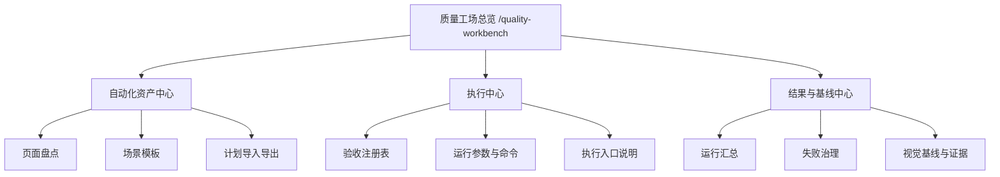

# 质量工场工作台拆分与职责收口设计

> 日期：2026-04-02
> 范围：`spring-boot-iot-ui`、`sql/init-data.sql`、`docs/02`、`docs/05`、`docs/08`、`docs/21`
> 主题：把当前“自动化工场”从单页大聚合重构为“质量工场总览 + 多专项页”的清晰工作台
> 状态：设计已确认，已完成自检，待用户审阅

## 1. 背景

当前 `质量工场` 只有一个专项页面 `自动化工场`，入口与事实如下：

1. 一级工作台首页为 `/quality-workbench`，当前通过 `SectionLandingView.vue` 承接。
2. 唯一专项页为 `/automation-test`，当前由 `AutomationTestCenterView.vue` 承接。
3. `/automation-test` 目前同时承担以下职责：
   - 计划概况与能力边界说明
   - 执行配置与命令预览
   - 验收注册表摘要
   - 统一运行结果导入
   - 页面盘点与脚手架生成
   - 场景模板编排
   - 场景预览与 JSON 导出
   - 测试建议与覆盖分析

问题不在于能力不足，而在于职责被过度堆叠在同一页面，已经出现明显的工作台臃肿：

1. 用户进入页面后，需要同时理解“资产编排、执行配置、结果分析”三类不同任务，认知负担过高。
2. 页面没有唯一主任务，编辑、执行、分析彼此竞争注意力。
3. 后续若继续新增视觉基线治理、失败归因、AI 补全、flaky 治理等能力，当前页面会进一步失控。
4. 现有代码虽已拆出部分组件，但 `view + composable + utils` 仍以“大聚合”组织，扩展风险高。

本轮目标不是继续给 `AutomationTestCenterView.vue` 加面板，而是重构工作台职责边界。

## 2. 目标

1. 把 `质量工场` 明确收口为“总览负责导航，专项页负责专业操作”的双层结构。
2. 把当前单个“大而全页面”拆为多个职责单一的专项页。
3. 保持现有前端共享页壳、工作台风格和路由组织方式，不引入额外复杂框架。
4. 保留与现有 `acceptance-registry`、`scripts/auto`、本地 `localStorage` 资产的兼容性。
5. 为后续继续补齐视觉基线、问题归档、失败归因和 AI 辅助能力预留稳定结构。

## 3. 非目标

1. 本轮不引入新的后端自动化服务或任务调度中心。
2. 本轮不推翻现有 `acceptance-registry` 驱动模式。
3. 本轮不把前端升级为直接执行真实环境脚本的浏览器终端。
4. 本轮不新建与共享页壳冲突的页面语法、Hero 页头或私有工作区视觉。
5. 本轮不立即重写全部自动化工具函数或切换到全局 Pinia store。

## 4. 用户已确认方向

对话中已经确认以下关键结论：

1. 当前痛点是“页面太臃肿，职能不够清晰”，而不是优先补新能力。
2. 用户更希望采用“总览 + 多个专项页”的结构，而不是单一路由下的多 Tab 大页面。
3. 拆分方案优先采用平衡拆分，而不是最轻微拆分或一次性深度平台化。
4. 当前最适合的结构是：
   - `质量工场总览`
   - `自动化资产中心`
   - `执行中心`
   - `结果与基线中心`

## 5. 方案对比与决策

讨论过三类方案：

### 5.1 轻拆分

结构：

- 总览
- 资产编排
- 执行结果

问题：

- 页面盘点、模板、基线仍会混在一起；
- 只能短期缓解拥挤，无法根治职责混乱。

### 5.2 平衡拆分

结构：

- 总览
- 自动化资产中心
- 执行中心
- 结果与基线中心

优势：

1. 最符合当前用户任务流：先沉淀资产，再执行，再看结果。
2. 与现有 `SectionLandingView + 单页工作台` 架构兼容性最高。
3. 拆分粒度适中，不会把质量工场拆成学习成本过高的过细平台。

### 5.3 深度工厂化

结构：

- 总览
- 页面盘点
- 场景模板
- 注册表执行
- 结果分析
- 视觉基线
- 问题归档

问题：

- 第一轮改造过深，超出当前“先解决臃肿和职责不清”的目标；
- 容易把设计直接推向平台化，增加迁移成本。

### 5.4 最终决策

采用 **平衡拆分方案**：

1. 第一层为 `质量工场总览`；
2. 第二层拆为 `自动化资产中心 / 执行中心 / 结果与基线中心`；
3. 旧 `/automation-test` 保留兼容入口，分阶段迁移。

## 6. 信息架构

目标信息架构如下：

### 6.1 质量工场总览

只负责导航与判断，不再放重操作。

应承接：

1. 质量工场摘要。
2. 最近运行摘要。
3. 待治理缺口摘要。
4. 三个专项入口卡片。
5. 推荐动作与最近使用。

不再承接：

1. 场景编排。
2. 页面盘点表格。
3. 执行配置表单。
4. 运行结果导入 textarea。

### 6.2 自动化资产中心

主任务是“沉淀什么可以跑”。

应承接：

1. 页面盘点与覆盖缺口。
2. 场景模板编排。
3. 场景步骤编辑。
4. 计划导入。
5. JSON 导出。
6. 场景预览与覆盖分析。

### 6.3 执行中心

主任务是“这次怎么跑”。

应承接：

1. 验收注册表摘要。
2. 执行配置。
3. 命令预览。
4. 阻断范围和依赖关系说明。
5. 与 CLI 的对应关系。

### 6.4 结果与基线中心

主任务是“跑完怎么看、怎么治理”。

应承接：

1. 统一运行结果导入。
2. 通过/失败摘要。
3. 失败场景清单。
4. 测试建议。
5. 视觉基线、diff、证据与问题归档入口。

## 7. 路由与导航设计

### 7.1 路由方案

遵循当前仓库一级平铺路由风格，新增以下页面：

1. `/quality-workbench`
   - 保留为质量工场总览页。
2. `/automation-assets`
   - 新增自动化资产中心。
3. `/automation-execution`
   - 新增执行中心。
4. `/automation-results`
   - 新增结果与基线中心。
5. `/automation-test`
   - 第一轮保留兼容入口。

### 7.2 为什么不采用嵌套路由工作区

不采用“一个路由下再嵌多个重量 Tab”方案，原因如下：

1. 用户已经明确更偏向“总览 + 多专项页”。
2. 当前真实问题是职责混在一个页面里，继续用单页 Tab 只是换一种形式保留臃肿。
3. 现有仓库大多数业务页以平铺路由组织，保持同风格更稳妥。

### 7.3 质量工场总览落地

继续复用 `SectionLandingView.vue` 语法，不另起一套工作台框架。

`sectionWorkspaces.ts` 中 `质量工场` 卡片由当前 1 张扩为 3 张：

1. `自动化资产中心`
2. `执行中心`
3. `结果与基线中心`

## 8. 页面职责拆分

### 8.1 现有面板归位原则

每个专项页只允许存在一个主任务，避免再次出现大聚合页面。

### 8.2 当前 `/automation-test` 面板的归位建议

#### 保留在自动化资产中心

1. `AutomationPageDiscoveryPanel`
2. `AutomationScenarioEditor`
3. `AutomationPlanImportDrawer`
4. `AutomationManualPageDrawer`
5. 场景预览
6. 计划 JSON 导出
7. 计划概况指标

#### 保留在执行中心

1. `AutomationExecutionConfigPanel`
2. 命令预览
3. `AutomationRegistryPanel`
4. 执行边界说明

#### 保留在结果与基线中心

1. `AutomationResultImportPanel`
2. `AutomationSuggestionPanel`
3. 失败场景摘要
4. 后续视觉基线与 diff 区域

#### 从首页移出

1. 能力边界说明大卡片
2. 场景编排器
3. 页面盘点表格
4. 结果导入控件

## 9. 代码结构设计

### 9.1 视图拆分

建议新增或替换为以下视图：

1. `QualityWorkbenchOverviewView.vue`
2. `AutomationAssetsView.vue`
3. `AutomationExecutionView.vue`
4. `AutomationResultsView.vue`

### 9.2 composable 拆分

当前 `useAutomationPlanBuilder` 负责计划、盘点、导入导出、命令预览等多类状态，职责偏重。

建议演进为：

1. `useAutomationAssetsWorkbench`
   - 页面盘点
   - 场景编排
   - 计划导入导出
2. `useAutomationExecutionWorkbench`
   - 执行目标
   - 执行范围
   - 命令预览
   - 注册表摘要
3. `useAutomationResultsWorkbench`
   - 运行结果导入
   - 失败汇总
   - 测试建议
   - 视觉基线状态

### 9.3 工具层拆分

`automationPlan.ts` 当前同时承担：

1. 页面静态种子；
2. 计划规范化；
3. 场景模板生成；
4. 建议生成；
5. 命令拼接；
6. 本地持久化。

后续建议按职责拆分为：

1. `automationAssets.ts`
2. `automationExecution.ts`
3. `automationResults.ts`
4. `automationShared.ts`

### 9.4 状态管理原则

第一轮不引入新的全局 Pinia store。

原因：

1. 当前模块仍属于工作台工具，不需要额外的全局状态复杂度。
2. 页面级 composable 更符合现有仓库风格。
3. 先把职责边界划清，比先做状态平台化更重要。

## 10. 迁移与兼容策略

### 10.1 路由兼容

第一轮不直接删除 `/automation-test`。

建议过渡方式：

1. 新增三张专项页；
2. `/automation-test` 第一轮直接兼容到 `自动化资产中心`，不再保留独立的大聚合实现；
3. 新流量由 `/quality-workbench` 导向新专项页；
4. 旧文档和旧收藏在过渡期内仍可继续工作。

### 10.2 菜单与权限兼容

当前只存在 `system:automation-test` 子菜单。

建议在 `质量工场` 下新增：

1. `system:automation-assets`
2. `system:automation-execution`
3. `system:automation-results`

旧 `system:automation-test` 在过渡周期保留，避免角色授权和旧入口立刻失效。

### 10.3 本地数据兼容

当前存在两个稳定本地 key：

1. `spring-boot-iot.automation-plan`
2. `spring-boot-iot.automation-page-inventory`

第一轮建议继续沿用，不立即拆 key。

原因：

1. 拆页后仍需恢复原有计划和页面盘点；
2. 避免用户进入新页面后发现资产丢失；
3. 先做页面职责拆分，再考虑数据 key 精细化。

### 10.4 壳层推荐入口迁移

当前 `shellPanelContent` 与相关测试仍把 `/automation-test` 当作质量工场代表入口。

建议迁移为：

1. 壳层优先推荐 `/quality-workbench`；
2. 总览页再推荐 `自动化资产 / 执行中心 / 结果与基线`；
3. 不再把旧的大聚合页继续当作质量工场默认入口。

## 11. 验收标准

### 11.1 页面级标准

1. `/quality-workbench` 只承担总览和导航，不再出现重型编排器或结果导入控件。
2. `自动化资产中心` 不展示运行结果汇总。
3. `执行中心` 不承载场景逐步编辑。
4. `结果与基线中心` 不承载执行计划编辑。

### 11.2 状态与交互标准

1. 原有本地计划和页面盘点在拆页后仍可恢复。
2. 老入口 `/automation-test` 在过渡期内可访问，不出现死链或空白页。
3. 用户能从质量工场总览一跳进入任一专项页。

### 11.3 防回退标准

1. 不允许把“资产编辑 + 执行参数 + 结果导入”重新塞回同一个 view。
2. 不允许新增第二套与 `acceptance-registry` 脱节的执行模型。
3. 不允许质量工场总览页再次膨胀成带完整业务正文的伪专项页。

## 12. 验证策略

实施时至少补齐以下验证：

1. 路由测试：
   - `/quality-workbench`
   - `/automation-assets`
   - `/automation-execution`
   - `/automation-results`
   - `/automation-test` 兼容行为
2. 工作台配置测试：
   - `sectionWorkspaces`
   - `shellPanelContent`
3. 共享页壳与共享组件回归：
   - `StandardPageShell`
   - `StandardWorkbenchPanel`
   - 共享列表/动作列治理
4. 手工验收：
   - 总览到专项页路径是否顺畅
   - 老入口是否兼容
   - 本地资产是否恢复
   - 结果导入是否仍可正常使用

## 13. 文档影响

如果后续按本设计实施，至少应同步更新以下文档：

1. `docs/02-业务功能与流程说明.md`
   - 更新质量工场的页面职责与入口结构。
2. `docs/05-自动化测试与质量保障.md`
   - 更新自动化工场/质量工场的执行与结果查看口径。
3. `docs/08-变更记录与技术债清单.md`
   - 记录本轮工作台拆分与治理原因。
4. `docs/21-业务功能清单与验收标准.md`
   - 更新质量工场入口矩阵与页面级验收口径。
5. `README.md`
   - 若工作台描述或模块摘要发生变化，需要同步更新。
6. `AGENTS.md`
   - 若工作台入口、文档更新触发矩阵或实施规则发生变化，需要同步更新。

## 14. 推荐实施顺序

建议按以下顺序推进：

1. 新增三张专项页和新路由。
2. 改造 `sectionWorkspaces.ts` 与质量工场总览入口。
3. 从旧 `/automation-test` 中迁出资产编辑能力。
4. 迁出执行配置和注册表能力。
5. 迁出结果导入与建议能力。
6. 把 `/automation-test` 收口成兼容入口。
7. 补齐路由、工作台配置和页面行为测试。
8. 原位更新 `02 / 05 / 08 / 21`，视影响同步 `README.md` 与 `AGENTS.md`。

## 15. 结论

本轮不建议继续在 `AutomationTestCenterView.vue` 上叠加功能。

正确方向是把质量工场从“单页大聚合工具”升级为“总览 + 多专项页”的清晰工作台：

1. 总览负责判断与导航；
2. 自动化资产中心负责沉淀资产；
3. 执行中心负责组织运行；
4. 结果与基线中心负责消费结果与治理。

这样既能解决当前页面臃肿和职责不清的问题，也能为后续继续完善自动化工程留出稳定的演进空间。
