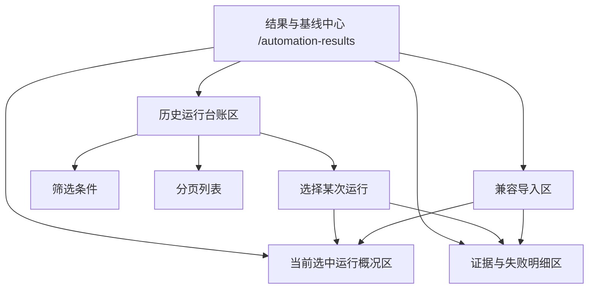

# 结果与基线中心历史运行台账设计

> 日期：2026-04-03
> 范围：`spring-boot-iot-report`、`spring-boot-iot-ui`、`docs/03`、`docs/05`、`docs/08`、`docs/21`
> 主题：在现有结果与基线中心基础上，补齐面向研发/测试/验收协作的历史运行台账能力
> 状态：设计已确认，已完成自检，待用户审阅

## 1. 背景

`结果与基线中心` 当前已经完成第一轮拆分与收口：

1. 前端页面 `spring-boot-iot-ui/src/views/AutomationResultsView.vue` 已支持读取最近运行结果。
2. 后端 `spring-boot-iot-report/src/main/java/com/ghlzm/iot/report/controller/AutomationResultController.java` 已提供：
   - `GET /api/report/automation-results/recent`
   - `GET /api/report/automation-results/{runId}`
   - `GET /api/report/automation-results/{runId}/evidence`
   - `GET /api/report/automation-results/{runId}/evidence/content`
3. 当前链路已经支持：
   - 最近运行读取
   - 当前运行详情查看
   - 当前运行证据清单与文本预览
   - 手工粘贴 `registry-run-*.json` 做兼容导入

这一步解决了“结果中心从 0 到 1”的问题，但团队常态使用仍存在明显缺口：

1. 当前后端只提供“最近运行”读取，无法把结果中心当成历史台账使用。
2. 用户进入结果中心后，仍然缺少“按时间、状态、执行器、关键字检索某次运行”的能力。
3. 当前“最近运行面板”更像快捷入口，而不是正式台账；一旦运行次数增加，结果中心就会回到“只看最近一次”的窄视角。
4. 当前后台结果检索仍完全依赖本机 `logs/acceptance/registry-run-*.json` 文件，但这层只读文件基线本身是可用的，适合先扩展成历史台账，再决定是否升级到数据库归档。

因此，本轮目标不是重做执行模型，也不是直接引入数据库归档，而是在不打破现有模块边界的前提下，把结果中心提升为“基于本机只读产物的历史运行台账页”。

## 2. 目标

1. 让 `/automation-results` 从“最近运行页”升级为“历史运行台账页”。
2. 允许用户按时间、状态、执行器和关键字检索历史运行。
3. 让用户从台账页进入单次运行的概况、失败场景与证据详情。
4. 保持现有 `logs/acceptance/registry-run-*.json` 产物格式不变。
5. 保持 `spring-boot-iot-report` 只读查询职责，不新增写库、不引入新调度、不创建数据库表。

## 3. 非目标

1. 本轮不做数据库归档台账。
2. 本轮不做跨环境结果聚合、CI 产物分发或对象存储索引。
3. 本轮不支持图片、压缩包、二进制文件的在线预览。
4. 本轮不改变执行中心、研发工场或 CLI 产物生成方式。
5. 本轮不新增第二个结果中心路由，仍只保留 `/automation-results` 作为唯一结果入口。

## 4. 用户已确认边界

对话中已经明确确认以下结论：

1. 优先继续增强 `结果与基线中心`，而不是继续扩展研发工场编排页。
2. 历史能力第一阶段选择“历史运行台账优先”，而不是证据检索优先或运行对比优先。
3. 数据边界采用“只读文件台账”，继续基于 `logs/acceptance`，不直接升级数据库归档。
4. 页面不新增新路由，只增强现有 `/automation-results`。
5. 手工粘贴导入继续保留，但降级为兼容入口，不再与主台账竞争主流程。

## 5. 方案对比与决策

### 5.1 A 方案：只读文件台账

结构：

1. 后端继续扫描 `logs/acceptance/registry-run-*.json`
2. 新增分页查询接口
3. 前端把“最近运行结果”升级为正式历史台账

优势：

1. 落地快，风险低。
2. 不改数据库，不破坏现有报告模块边界。
3. 与当前真实环境和验收证据基线完全一致。
4. 可以复用现有详情与证据读取能力。

不足：

1. 仍依赖单机日志目录。
2. 不是最终团队级归档体系。

### 5.2 B 方案：数据库归档台账

结构：

1. 新增运行结果归档表
2. CLI 运行后写入数据库
3. 结果中心改查数据库

优势：

1. 更适合长期团队化沉淀。
2. 更容易做跨环境、跨机器统一查询。

问题：

1. 改动重，涉及 schema、写入链路、兼容迁移。
2. 超出“先把历史台账补齐”的当前目标。
3. 会把本轮从 UI/查询增强升级为新平台能力建设。

### 5.3 C 方案：文件索引 + 轻量中间层

结构：

1. 先扫描文件
2. 再写一层轻量索引缓存或本地中间表
3. 前端查索引

优势：

1. 兼顾一定扩展性。

问题：

1. 当前阶段会引入额外复杂度。
2. 既没有数据库归档的长期收益，也比直接扫文件更重。

### 5.4 最终决策

采用 **A 方案：只读文件台账**。

也就是：

1. 保持当前结果产物仍落在 `logs/acceptance`
2. 新增历史运行分页查询接口
3. 把结果中心重心从“最近一次”改为“历史台账 + 选中运行详情”
4. 为后续数据库归档保留升级空间，但本轮不实现

## 6. 目标信息架构

结果与基线中心的目标结构如下：

### 6.1 历史运行台账区

这是页面新的第一主区块，只回答：

1. 有哪些历史运行结果
2. 哪一条需要进一步查看
3. 当前检索范围内的结果规模

它负责：

1. 筛选条件
2. 分页表格
3. 当前选中运行切换
4. 刷新历史台账

它不负责：

1. 证据预览
2. 失败场景正文
3. 手工导入结果编辑

### 6.2 当前选中运行概况区

继续保留现有：

1. 指标卡
2. 当前判断
3. 统一汇总快照

它只回答：

1. 这次运行总量如何
2. 是否存在 blocker
3. 是否已达到基线归档条件

### 6.3 证据与失败明细区

继续保留现有：

1. 证据清单
2. 证据原文预览
3. 失败场景明细表

它只消费当前选中的运行结果，不再承担“挑哪次运行”的职责。

### 6.4 兼容导入区

保留当前手工导入面板，但降级为兼容能力：

1. 主要用于临时打开外部提供的 `registry-run JSON`
2. 只影响当前页临时视图
3. 不写回后台
4. 不进入历史台账分页结果

## 7. 页面设计

### 7.1 页面职责

`spring-boot-iot-ui/src/views/AutomationResultsView.vue` 保持为唯一入口，但职责调整为：

1. 页面打开后先展示历史台账
2. 再展示当前选中运行的概况与证据
3. 最后保留兼容导入入口

页面默认主流程从：

1. 读取最近一次运行

调整为：

1. 查历史台账
2. 选中某次运行
3. 查看概况与证据

### 7.2 共享前端合同

历史台账区必须复用现有共享模式，不新增私有列表结构：

1. `StandardListFilterHeader`
2. `StandardTableToolbar`
3. `StandardPagination`
4. `useServerPagination`
5. `StandardWorkbenchPanel`
6. `StandardTableTextColumn`

也就是说，结果中心的历史台账表现形式要与平台治理、风险策略、接入智维的标准列表页保持一致，而不是再造一套“自动化专用台账壳”。

### 7.3 组件拆分

建议在现有基础上做以下演进：

1. 将 `spring-boot-iot-ui/src/components/AutomationRecentRunsPanel.vue` 升级为“历史运行台账面板”
2. 继续由 `spring-boot-iot-ui/src/composables/useAutomationResultsWorkbench.ts` 统一编排：
   - 台账筛选
   - 分页状态
   - 当前选中运行
   - 详情联动
   - 兼容导入覆盖视图

## 8. 后端设计

### 8.1 接口

保留现有接口不变：

1. `GET /api/report/automation-results/recent`
2. `GET /api/report/automation-results/{runId}`
3. `GET /api/report/automation-results/{runId}/evidence`
4. `GET /api/report/automation-results/{runId}/evidence/content?path=...`

新增台账接口：

1. `GET /api/report/automation-results/page`

### 8.2 分页查询参数

`/page` 支持以下参数：

1. `pageNum`
2. `pageSize`
3. `keyword`
4. `status`
5. `runnerType`
6. `dateFrom`
7. `dateTo`

说明：

1. `keyword` 匹配 `runId / reportPath / scenarioId / runnerType`
2. `status` 第一阶段只支持 `passed / failed`
3. `runnerType` 取值基于统一注册表结果中的 `browserPlan / apiSmoke / messageFlow / riskDrill`
4. `dateFrom / dateTo` 以运行文件的修改时间为基准

### 8.3 返回结构

分页记录可在现有 `AutomationResultRunSummaryVO` 基础上扩展，至少包括：

1. `runId`
2. `reportPath`
3. `updatedAt`
4. `summary`
5. `failedScenarioIds`
6. `relatedEvidenceFiles`
7. `runnerTypes`
8. `status`

其中：

1. `runnerTypes` 为当前运行结果中出现过的执行器类型去重集合
2. `status` 为聚合态：
   - 只要存在失败场景，则为 `failed`
   - 否则为 `passed`

### 8.4 数据来源

继续只读取：

1. `logs/acceptance/registry-run-*.json`

不会直接把这些文件作为独立台账项：

1. `business-browser-*`
2. `config-browser-*`
3. `risk-drill-*`
4. `message-flow-*`

这些文件继续只作为某次 `registry-run` 的关联证据存在。

### 8.5 排序与容错

统一规则：

1. 按 `updatedAt` 倒序
2. 单个文件解析失败时跳过并记日志
3. 不因某个坏文件导致整个 `/page` 失败
4. `logs/acceptance` 不存在时返回空页

### 8.6 安全边界

现有证据安全规则保持不变：

1. 只能读取当前运行显式引用的证据
2. 只能读取 `logs/acceptance` 目录下文件
3. 禁止通过 `..` 或绝对路径越权访问

## 9. 前端交互设计

### 9.1 首次进入

页面打开后行为如下：

1. 请求 `/api/report/automation-results/page?pageNum=1&pageSize=10`
2. 若有结果，默认选中第一页第一条
3. 自动联动请求：
   - `GET /api/report/automation-results/{runId}`
   - `GET /api/report/automation-results/{runId}/evidence`
4. 若无结果，则展示历史台账空态，并清空详情区

### 9.2 查询与分页

筛选行为：

1. 修改筛选条件并点击查询后，统一回到第 1 页
2. 切换页码、每页条数时重新请求 `/page`
3. 工具栏显示：
   - 当前结果数
   - 当前选中运行编号
   - 最近一次刷新动作

### 9.3 选中运行联动

点击台账表格某行后：

1. 更新当前选中 `runId`
2. 刷新概况区
3. 刷新失败场景明细
4. 刷新证据清单
5. 默认预览主 `registry-run-*.json`

### 9.4 兼容导入

手工导入行为保持兼容，但语义明确调整为：

1. 只用于临时查看外部 `registry-run JSON`
2. 不写入后台
3. 不影响 `/page` 返回结果
4. 导入后可以覆盖当前详情区显示，但不会被台账永久记录

## 10. 异常处理

### 10.1 台账接口异常

当 `/page` 查询失败时：

1. 只在历史台账区展示错误态
2. 若页面已有已选运行详情，则先保留详情，不全页清空

### 10.2 台账无结果

当目录不存在、无结果文件或筛选后无命中时：

1. 历史台账区展示空态
2. 概况区、失败场景区、证据区显示“当前未选中运行”

### 10.3 详情或证据异常

当详情接口失败时：

1. 当前选中运行保留
2. 仅概况区与失败场景区展示错误提示

当证据接口失败时：

1. 不影响台账区与概况区
2. 仅证据面板显示错误态

### 10.4 文件损坏

当某个 `registry-run` 文件损坏或 JSON 不合法时：

1. 后端跳过该文件
2. 记录 `warn` 日志
3. 不让整页查询失败

## 11. 测试设计

### 11.1 后端

至少覆盖：

1. `/page` 分页结果正常返回
2. `keyword` 过滤 `runId / reportPath / scenarioId / runnerType`
3. `status=passed/failed` 过滤正确
4. `runnerType` 过滤正确
5. `dateFrom / dateTo` 过滤正确
6. 损坏文件被跳过
7. 目录不存在时返回空页

### 11.2 前端

至少覆盖：

1. 首次进入时默认选中第一条运行
2. 查询后页码回到第一页
3. 当前选中运行被筛掉后，自动切换到新列表第一条或清空详情
4. 手工导入仍可查看详情，但不会进入历史台账
5. 结果页继续保留证据面板与失败场景明细联动

## 12. 文档影响

实现时必须同步更新：

1. `docs/03-接口规范与接口清单.md`
2. `docs/05-自动化测试与质量保障.md`
3. `docs/08-变更记录与技术债清单.md`
4. `docs/21-业务功能清单与验收标准.md`

当前判断：

1. `README.md` 本轮不需要修改
2. `AGENTS.md` 本轮不需要修改

前提是实现过程中不新增新的启动方式、运行目录或治理规则。

## 13. 后续演进

本轮完成后，结果中心的能力边界将提升为：

1. 历史运行台账
2. 单次运行详情
3. 失败场景复盘
4. 文本证据预览
5. 兼容手工导入

后续若团队继续要求：

1. 跨机器共享
2. CI 历史留存
3. 团队统一检索
4. 图片/二进制证据预览
5. 多次运行差异对比

再进入下一阶段“数据库归档台账 / 团队级证据中心”设计，而不在本轮提前引入重型方案。
