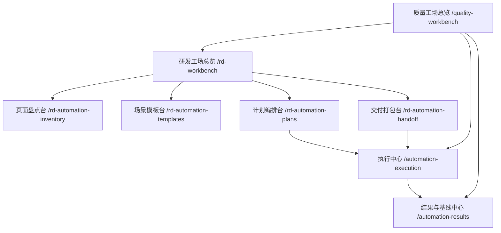

# 研发工场自动化模块化拆分设计

> 日期：2026-04-03
> 范围：`spring-boot-iot-ui`、`sql/init-data.sql`、`docs/02`、`docs/05`、`docs/08`、`docs/21`
> 主题：在现有质量工场基础上，以研发为主角色重构自动化工场，把资产编排进一步拆成研发工场分模块能力
> 状态：设计已确认，已完成自检，待用户审阅

## 1. 背景

`质量工场` 第一轮已经从单页 `自动化工场` 拆成：

1. `/quality-workbench` 质量工场总览
2. `/automation-assets` 自动化资产中心
3. `/automation-execution` 执行中心
4. `/automation-results` 结果与基线中心
5. `/automation-test` 兼容入口

这一步解决了“资产、执行、结果都堆在一个页面”的问题，但当前研发视角仍然存在第二层臃肿：

1. `自动化资产中心` 仍同时承载页面盘点、模板起步、场景编排、计划导入导出、覆盖分析等多种动作。
2. 研发最常见的主任务是“先把资产编排好”，但当前入口仍然是通用质量工场，而不是研发优先工作台。
3. 资产编排链路里“页面盘点 / 模板沉淀 / 正式计划 / 交付整理”已经是四类不同工作，不应继续堆在一页。
4. 如果后续继续补充 AI 场景补全、模板治理、交付清单、研发自测摘要，`AutomationAssetsView.vue` 会再次膨胀。

因此，下一轮优化目标不是重做执行中心或结果中心，而是在现有质量工场之上新增 **研发工场** 这一层，让研发优先入口和资产编排链路真正模块化。

## 2. 目标

1. 以研发为主角色，新增“研发工场”主入口。
2. 把当前自动化资产中心继续拆分为职责单一的研发子模块。
3. 保持执行中心和结果与基线中心为跨角色共享模块，不重复建设第二套执行/结果页面。
4. 保持现有 `useAutomationPlanBuilder`、`acceptance-registry`、`scripts/auto` 和本地计划资产的兼容性。
5. 让研发的主路径清晰变成“盘点 -> 模板 -> 计划 -> 交付 -> 执行 -> 结果”。

## 3. 非目标

1. 本轮不为测试、发布/验收、运维分别建设平行工场。
2. 本轮不新增新的后端自动化服务、任务调度中心或持久化表。
3. 本轮不建立第二套执行模型或结果模型。
4. 本轮不推翻现有 `/automation-execution` 与 `/automation-results` 的职责边界。
5. 本轮不把质量工场改成一组多层嵌套路由的大型页签应用。

## 4. 用户已确认方向

对话中已经明确确认以下边界：

1. 拆分维度选择“按团队职责拆”，不是按测试类型拆或按工作阶段抽象平台。
2. 首要服务角色是“研发”。
3. 研发主入口最优先解决的高频动作是“快速编排和维护自动化用例资产”。
4. 拆分深度选择“做成研发工场总入口，下面再挂资产编排、执行、结果等不同角色视图”。
5. 在该前提下，采用三种方案中的 **B 方案**：
   - 新增研发工场总览
   - 把资产编排进一步拆成多个研发模块
   - 执行中心和结果中心继续作为共享模块保留

## 5. 方案对比与决策

### 5.1 A 方案：轻量职责分层

结构：

1. 保留现有质量工场总览
2. 保留自动化资产中心
3. 仅新增研发快捷入口或研发总览

问题：

1. 资产中心内部仍然过大。
2. 只是重新排列入口，不是彻底拆出研发链路。
3. 后续依然容易回流为“大资产页”。

### 5.2 B 方案：研发工场独立分组

结构：

1. 新增研发工场总览
2. 将资产编排拆为：
   - 页面盘点台
   - 场景模板台
   - 计划编排台
   - 交付打包台
3. 保持执行中心与结果与基线中心为共享模块

优势：

1. 最符合“研发优先 + 资产编排优先”的明确目标。
2. 能真正拆空当前 `AutomationAssetsView.vue` 的多职责聚合。
3. 不会为了研发重新复制一套执行中心和结果中心。
4. 可以继续复用现有路由风格、共享页壳和执行口径。

### 5.3 C 方案：全角色工场矩阵

结构：

1. 研发工场
2. 测试工场
3. 验收工场
4. 巡检工场

问题：

1. 菜单、路由、权限和文档都会成倍增加。
2. 很容易产生重复页面和双份流程口径。
3. 超出当前“先把研发自动化资产编排做清楚”的范围。

### 5.4 最终决策

采用 **B 方案**，即：

1. 保留 `质量工场` 作为上层质量能力分组。
2. 新增 `研发工场` 作为研发优先工作台。
3. 把原自动化资产中心拆成研发子模块。
4. 执行与结果继续使用共享专项页。

## 6. 目标信息架构

目标结构如下：

### 6.1 质量工场总览

第一层仍然是质量工场总览，但卡片结构应调整为：

1. 研发工场
2. 执行中心
3. 结果与基线中心

不再把“自动化资产中心”直接暴露为研发主入口。

### 6.2 研发工场总览

这是研发主入口，只回答“本轮研发先做什么”，不承载编辑正文。

应承接：

1. 最近草稿计划
2. 尚未覆盖页面数
3. 最近失败摘要
4. 待交付包摘要
5. 四个研发子模块入口

不承接：

1. 大段场景编辑
2. 执行配置
3. 运行结果导入
4. 验收注册表全文

### 6.3 页面盘点台

主任务是“知道还有哪些页面没被纳入自动化资产”。

应承接：

1. 页面清单
2. 覆盖缺口
3. 人工补录页面
4. 批量生成候选场景
5. 覆盖状态筛选

### 6.4 场景模板台

主任务是“沉淀可复用模板，而不是直接编具体计划”。

应承接：

1. 页面冒烟模板
2. 表单提交模板
3. 列表详情模板
4. 模板分类、命名与复制
5. 模板适用范围说明

### 6.5 计划编排台

主任务是“把盘点和模板组合成正式计划”。

应承接：

1. 场景顺序
2. 步骤与断言
3. 变量捕获
4. 导入计划
5. 导出 JSON
6. 覆盖粒度预览

这是研发自动化资产编排的主战场。

### 6.6 交付打包台

主任务是“把研发自测成果整理成可交接内容”。

应承接：

1. 计划摘要
2. 推荐执行命令
3. 基线说明
4. 验收备注
5. 当前风险/已知限制
6. 面向测试或验收负责人的交付视图

交付打包台只消费当前计划，不反向承担场景编辑。

### 6.7 执行中心

继续保留现有职责：

1. 目标环境配置
2. 执行范围
3. 验收注册表
4. 命令预览
5. 阻断口径说明

### 6.8 结果与基线中心

继续保留现有职责：

1. 导入 `registry-run-*.json`
2. 查看失败场景
3. 处理质量建议
4. 查看基线证据
5. 做结果复盘

## 7. 路由与导航设计

### 7.1 新增路由

本轮新增以下研发工场路由：

1. `/rd-workbench`
2. `/rd-automation-inventory`
3. `/rd-automation-templates`
4. `/rd-automation-plans`
5. `/rd-automation-handoff`

### 7.2 保留共享路由

继续复用：

1. `/quality-workbench`
2. `/automation-execution`
3. `/automation-results`

### 7.3 兼容路由

兼容策略如下：

1. `/automation-assets` 第一阶段保留为兼容入口，默认跳转或包装到 `/rd-workbench`。
2. `/automation-test` 继续保留兼容入口，避免历史收藏、旧菜单和旧文档直链失效。
3. 第一阶段不立即删除原有质量工场和自动化资产中心菜单项，而是通过文案明确说明其兼容属性。

### 7.4 导航首页调整

`sectionWorkspaces.ts` 中 `质量工场` 首页卡片从当前：

1. 自动化资产中心
2. 执行中心
3. 结果与基线中心

调整为：

1. 研发工场
2. 执行中心
3. 结果与基线中心

研发相关子页面则挂在研发工场总览内部展示。

## 8. 组件与状态拆分策略

### 8.1 总原则

不建立第二套全局 store，不推翻现有资产编排底座，只对页面级状态做进一步切片。

### 8.2 现有底座保留

继续以 `useAutomationPlanBuilder` 作为核心底座，原因如下：

1. 当前页面盘点、场景编排、计划导入导出已经围绕它组织。
2. 它是当前计划真源，直接推倒会增加迁移成本。
3. 执行中心和结果中心已经围绕其结果派生出轻量适配层。

### 8.3 页面级 composable 拆分

建议把资产中心继续切成更薄的页面级组合层，例如：

1. `useAutomationInventoryWorkbench`
2. `useAutomationTemplateWorkbench`
3. `useAutomationPlanComposer`
4. `useAutomationHandoffWorkbench`

已存在的：

1. `useAutomationExecutionWorkbench`
2. `useAutomationResultsWorkbench`

继续保留。

### 8.4 当前大页组件归位建议

#### 页面盘点台

优先承接：

1. `AutomationPageDiscoveryPanel`
2. `AutomationManualPageDrawer`

#### 场景模板台

优先承接：

1. 模板新增入口
2. 模板分类
3. 模板复制/改名
4. 模板预览

模板能力可以先从当前 `AutomationScenarioEditor` 的模板入口里抽出最小版，不要求一步到位做完整模板治理平台。

#### 计划编排台

优先承接：

1. `AutomationScenarioEditor`
2. `AutomationPlanImportDrawer`
3. 步骤编辑
4. 断言与捕获
5. 场景预览
6. JSON 导出

#### 交付打包台

优先承接：

1. 计划摘要卡
2. 导出命令摘要
3. 基线说明
4. 验收备注
5. 当前风险提示

## 9. 数据流设计

数据流应固定为：

1. 页面盘点台产出页面清单、覆盖缺口和候选场景输入。
2. 场景模板台产出可复用模板资产。
3. 计划编排台消费盘点结果和模板资产，形成正式计划。
4. 交付打包台消费当前计划，生成交接内容。
5. 执行中心继续消费同一份计划和统一验收注册表。
6. 结果与基线中心继续消费统一运行汇总和建议数据。

### 9.1 计划真源

计划真源只能保留一份，即当前浏览器计划模型。

不允许出现：

1. 研发版计划模型
2. 执行版计划模型
3. 交付版计划模型

三份相互转换的情况。

### 9.2 交付打包台的边界

交付打包台只做“消费并整理”，不反向修改执行模型或结果模型。

这样可以避免：

1. 交付页偷偷变成第二个计划编辑器
2. 交付备注反向污染执行配置
3. 研发、测试、验收三侧出现不同计划口径

## 10. 测试与验证策略

### 10.1 前端 contract test

优先补以下回归：

1. 研发工场首页卡片结构测试
2. 路由元数据测试
3. 新增研发子页面 source contract test
4. 兼容路由行为测试

### 10.2 视图职责测试

应保证：

1. 页面盘点台不再承载场景编辑器
2. 场景模板台不再承载执行注册表
3. 计划编排台不再承载结果导入
4. 交付打包台不再承载页面盘点表格

### 10.3 既有门禁

继续执行：

1. `npm test -- --run ...`
2. `npm run build`
3. `npm run component:guard`
4. `npm run list:guard`
5. `npm run style:guard`
6. `node scripts/docs/check-topology.mjs`
7. `node scripts/run-quality-gates.mjs`

## 11. 文档与菜单更新范围

本轮若进入实现，必须同步更新：

1. `docs/02-业务功能与流程说明.md`
2. `docs/05-自动化测试与质量保障.md`
3. `docs/08-变更记录与技术债清单.md`
4. `docs/21-业务功能清单与验收标准.md`
5. `sql/init-data.sql`

必要时同步调整：

1. 研发工场菜单种子
2. 兼容入口菜单文案
3. 页面职责和验收矩阵说明

## 12. 实施顺序建议

第一批建议按如下顺序推进：

1. 新增 `研发工场总览` 与 4 个研发子页面路由。
2. 扩展 `sectionWorkspaces.ts`，把质量工场首页改为“研发工场 + 执行中心 + 结果与基线中心”。
3. 将当前 `AutomationAssetsView.vue` 拆分为页面盘点台、场景模板台、计划编排台、交付打包台。
4. 将 `/automation-assets` 退化为兼容入口。
5. 更新菜单种子、验收文档和页面矩阵。

## 13. 风险与控制

### 13.1 风险：拆分后页面数变多

控制方式：

1. 仅增加研发工场这一组页面，不同步扩展测试、验收、巡检工场。
2. 执行与结果仍共用原专项页，控制增长速度。

### 13.2 风险：资产能力被拆散后体验割裂

控制方式：

1. 研发工场总览承担流程导航。
2. 在页面之间提供明显的前后跳转建议。
3. 维持统一视觉语言和共享页壳。

### 13.3 风险：兼容入口过多导致认知混乱

控制方式：

1. 明确 `/automation-assets` 与 `/automation-test` 为兼容入口。
2. 所有新文档、新菜单和首页推荐入口统一改指向 `研发工场`。

## 14. 结论

本轮设计的核心不是继续把质量工场做大，而是：

1. 保持质量工场作为上层质量能力分组；
2. 新增研发工场作为研发自动化资产编排的主入口；
3. 把当前过大的资产中心拆成页面盘点、场景模板、计划编排、交付打包四个研发模块；
4. 继续复用统一执行中心和结果与基线中心，避免重复建设。

这个方案既能进一步消除自动化工厂的页面臃肿问题，也能保持当前项目架构、执行口径和共享页面模式的稳定性。
