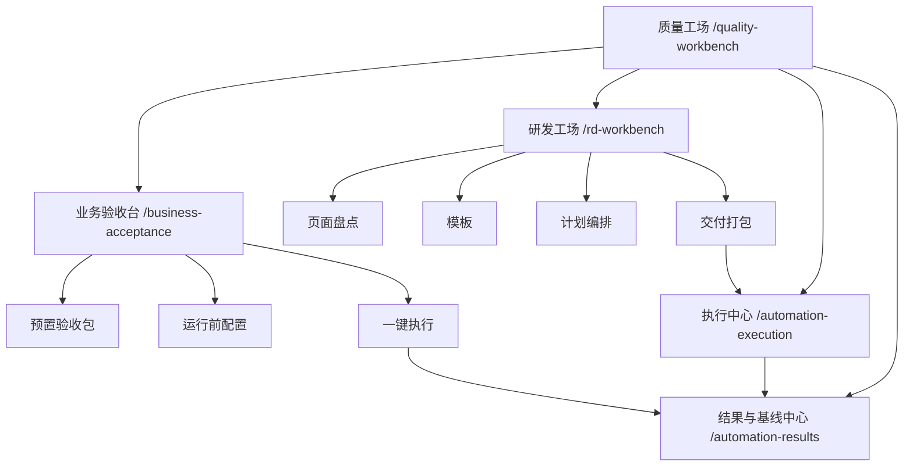

# 业务验收台设计

> 日期：2026-04-04
> 范围：`spring-boot-iot-ui`、`spring-boot-iot-report`、`docs/02`、`docs/05`、`docs/08`、`docs/21`
> 主题：在现有质量工场基础上，为验收人员、产品和项目经理新增“按交付清单一键运行”的业务验收台
> 状态：设计已确认，已完成自检，待用户审阅

## 1. 背景

当前质量工场已经形成一套偏研发视角的自动化链路：

1. `质量工场总览 /quality-workbench`
2. `研发工场总览 /rd-workbench`
3. `页面盘点台 /rd-automation-inventory`
4. `场景模板台 /rd-automation-templates`
5. `计划编排台 /rd-automation-plans`
6. `交付打包台 /rd-automation-handoff`
7. `执行中心 /automation-execution`
8. `结果与基线中心 /automation-results`

这条链路已经适合研发和测试维护自动化资产，但对验收人员、产品和项目经理存在明显门槛：

1. 当前入口语言偏研发，强调页面盘点、模板、计划、执行器、注册表和阻断口径。
2. 普通业务角色的主任务不是“编排自动化资产”，而是“按交付清单快速跑一次验收并得到结论”。
3. 当前执行中心仍要求用户理解执行范围、命令预览和统一注册表，不适合作为业务角色第一入口。
4. 当前结果与基线中心虽然已经具备历史台账、失败场景和证据复盘能力，但它本质是结果消费页，不是业务角色发起验收的首页。

因此，下一轮优化目标不是继续教业务角色如何使用研发工场，而是在现有自动化底座之上，新增一条面向业务角色的低门槛链路：

- 按交付清单选择预置验收包
- 只暴露环境、账号模板和模块范围这三个必要配置
- 一键运行
- 第一屏直接给出“是否通过”和“哪些模块没过”
- 需要时再一键展开到失败步骤、接口和页面动作

## 2. 目标

1. 为验收人员、产品和项目经理新增独立的“业务验收台”入口。
2. 第一阶段支持按交付清单选择预置验收包，一键执行验收。
3. 运行前只保留业务人员可理解的轻配置：
   - 环境
   - 账号模板
   - 模块范围
4. 结果页第一屏直接回答：
   - 是否通过
   - 哪些模块未通过
5. 支持对未通过模块一键展开到：
   - 失败场景
   - 失败步骤
   - 关联接口
   - 页面动作
6. 保持预置验收包只由研发/测试维护，业务人员只负责选择和运行。
7. 继续复用现有执行器、统一验收注册表、结果台账和证据模型，不新起第二套自动化底座。

## 3. 非目标

1. 本轮不开放业务人员自己编排或修改验收包。
2. 本轮不让业务人员接触页面盘点、场景模板、计划编排、执行命令或注册表全文。
3. 本轮不重建第二套执行中心或结果中心。
4. 本轮不直接上自然语言生成验收计划的 AI 助理。
5. 本轮不推翻现有 `browserPlan / apiSmoke / messageFlow / riskDrill` 执行器模型。
6. 本轮不引入新的数据库归档体系或新的自动化调度系统。

## 4. 已确认决策

对话中已经明确确认以下边界：

1. 第一批目标用户是：
   - 验收人员
   - 产品
   - 项目经理
2. 第一阶段主目标是：
   - 一键运行预置业务验收
3. 预置验收包的组织方式按交付清单，而不是按角色任务或自由文本输入。
4. 第一批建议的预置验收包为：
   - 产品与设备
   - 设备上报与链路
   - 风险运营闭环
   - 平台治理基础
5. 结果首页第一屏必须优先展示：
   - 是否通过
   - 哪些模块没过
6. 当某个模块未通过时，用户应能一键展开到：
   - 具体失败步骤
   - 关联接口
   - 页面动作
7. 业务人员发起运行前，至少需要可手动选择：
   - 环境
   - 账号模板
   - 模块范围
8. 预置验收包只允许研发/测试维护，业务人员只负责消费和运行。

## 5. 方案对比与决策

### 5.1 方案 A：新增独立“业务验收台”

结构：

1. 在质量工场下新增“业务验收台”
2. 业务角色从“业务验收台”进入
3. 研发/测试继续从“研发工场”进入
4. 两侧继续共享执行中心和结果与基线中心底座

优势：

1. 业务语言与研发语言彻底分层，心智最清楚。
2. 最符合“业务角色只关心是否通过和失败模块”的目标。
3. 可以复用现有执行与结果底座，落地风险较低。

代价：

1. 需要新增一个业务入口和一层业务映射模型。
2. 需要维护“业务验收包”和“底层执行计划”的对应关系。

### 5.2 方案 B：在现有工场中增加“业务模式”

结构：

1. 不新增业务入口
2. 在现有质量工场/执行中心里通过开关切到业务模式

优点：

1. 表面改动较小

问题：

1. 研发概念和业务概念仍混在一起
2. 用户仍会看到执行器、命令、注册表、计划等专业概念
3. 学习成本下降有限

### 5.3 方案 C：直接做 AI 自然语言验收助理

结构：

1. 业务角色通过自然语言输入“我要验收什么”
2. 系统自动生成执行包并运行

优点：

1. 长期体验最好，智能化上限最高

问题：

1. 第一阶段范围过大
2. 需要额外解决计划生成正确性、参数安全边界和执行解释性问题
3. 超出当前“先把一键业务验收做稳定”的目标

### 5.4 最终决策

采用 **方案 A：新增独立业务验收台**。

即：

1. 业务角色进入“业务验收台”
2. 研发/测试继续使用“研发工场”
3. 执行与结果继续复用现有共享模块
4. 第一阶段先做“预置验收包 + 一键执行 + 模块级结论 + 失败明细展开”
5. 第二阶段再增强智能归因和建议
6. 第三阶段才进入 AI 自然语言验收

## 6. 目标信息架构

目标结构如下：

### 6.1 业务验收台

业务验收台只回答四个问题：

1. 本次要验收哪一类交付清单
2. 在哪个环境、用哪个账号模板来跑
3. 要跑哪些模块范围
4. 跑完后哪些模块通过、哪些模块失败

它不承接：

1. 页面盘点
2. 场景模板维护
3. 计划编排
4. 执行命令预览
5. 验收注册表全文编辑

### 6.2 研发工场

研发工场继续保持当前职责：

1. 页面盘点
2. 模板沉淀
3. 计划编排
4. 交付打包

研发工场是“自动化资产生产层”，业务验收台是“自动化能力消费层”。

### 6.3 执行中心与结果中心

执行中心与结果中心继续作为共享底座存在：

1. 执行中心继续负责：
   - 目标环境
   - 执行范围
   - 统一注册表
   - 命令预览
2. 结果中心继续负责：
   - 历史台账
   - 当前选中运行详情
   - 失败场景
   - 证据预览

业务验收台不复制这两套能力，而是调用它们的既有执行与结果数据。

## 7. 业务验收台页面设计

### 7.1 首页结构

首页固定分为三段：

1. 预置验收包区
2. 运行前配置区
3. 最近一次结果摘要区

#### 预置验收包区

第一批固定展示 4 个卡片：

1. 产品与设备
2. 设备上报与链路
3. 风险运营闭环
4. 平台治理基础

每个卡片至少展示：

1. 验收包名称
2. 覆盖的业务模块说明
3. 最近一次执行状态
4. 进入执行按钮

#### 运行前配置区

业务人员只能看到 3 类配置：

1. 环境
   - `dev`
   - `test`
   - 指定验收环境
2. 账号模板
   - 验收账号模板
   - 产品账号模板
   - 项目经理账号模板
3. 模块范围
   - 基于当前验收包，勾选或取消部分模块子项

不展示：

1. 执行器类型
2. 阻断等级配置
3. CLI 命令
4. 统一注册表原文
5. 场景步骤编辑器

#### 最近一次结果摘要区

用于帮助业务人员快速判断：

1. 该验收包最近一次是否跑通过
2. 上次失败集中在哪些模块
3. 是否值得直接复测

### 7.2 运行按钮

业务验收台首页只保留一个主操作：

1. `一键执行验收`

允许附带一个次操作：

1. `查看最近结果`

不再出现：

1. 导入计划
2. 编辑步骤
3. 复制命令
4. 查看注册表

### 7.3 结果页结构

业务结果页分三层：

#### 第一层：业务结论

第一屏必须直接展示：

1. 本次验收是否通过
2. 通过模块数量
3. 未通过模块数量
4. 未通过模块名称列表
5. 总耗时

这是业务角色的主答案层。

#### 第二层：模块级结论

点击某个未通过模块后，展示：

1. 模块名称
2. 当前状态
3. 失败场景名称
4. 建议处理方向
   - 前端
   - 后端
   - 环境
   - 数据准备

第一阶段若无法稳定自动归因，可先显示“待研发/测试复核”，第二阶段再补齐更强的智能归因。

#### 第三层：失败明细

业务人员可一键展开到：

1. 失败步骤
2. 关联接口
3. 页面动作

例如：

1. 模块：设备上报与链路
2. 场景：MQTT 上报后在线状态更新
3. 失败步骤：校验设备在线状态失败
4. 关联接口：`GET /api/device/code/{deviceCode}`
5. 页面动作：点击查询并检查状态字段

### 7.4 与结果与基线中心的关系

业务验收台的结果页应优先消费业务聚合视图。

但仍保留“进入结果与基线中心”的跳转，用于进一步查看：

1. 历史台账
2. 完整运行摘要
3. 失败场景明细
4. 文本证据预览

这样可以保证：

1. 业务角色先看简化结论
2. 研发/测试需要时再下钻到底层证据

## 8. 数据与执行模型设计

### 8.1 新增业务验收包模型

需要在现有执行模型之上新增一层“业务验收包”抽象。

每个验收包至少包含：

1. `packageCode`
2. `packageName`
3. `description`
4. `targetRoles`
5. `defaultModules`
6. `supportedEnvironments`
7. `defaultAccountTemplate`
8. `scenarioRefs`

其中：

1. `scenarioRefs` 指向现有统一验收注册表中的场景或场景组合
2. 业务验收包不是新的执行器，只是对现有场景集合的业务化打包

### 8.2 账号模板模型

业务验收台需要新增“账号模板”概念，用于给业务角色提供可理解的预设。

账号模板至少包含：

1. `templateCode`
2. `templateName`
3. `username`
4. `roleHint`
5. `supportedEnvironments`

第一阶段可先通过前端配置或轻量后端接口提供，不强求一次上数据库表。

### 8.3 模块范围模型

模块范围来自业务验收包内部的模块分组，而不是底层执行器。

例如“产品与设备”包下可拆为：

1. 产品新增
2. 产品查询
3. 设备新增
4. 设备查询

业务人员只勾选这些模块名，不接触更细的底层场景编码。

### 8.4 执行映射

业务验收台发起执行时，后台或前端适配层需要完成如下映射：

1. 业务验收包
2. 模块范围
3. 对应场景引用
4. 对应统一验收注册表条目
5. 对应现有执行器

即：

`业务选择 -> 业务验收包 -> 场景集合 -> 统一验收注册表 -> browserPlan/apiSmoke/messageFlow/riskDrill`

### 8.5 结果聚合

业务结果页需要在现有运行结果之上额外生成“模块级聚合结果”。

每个模块聚合结果至少包含：

1. `moduleCode`
2. `moduleName`
3. `status`
4. `failedScenarioCount`
5. `failedScenarioTitles`
6. `relatedRunId`

失败明细至少补齐：

1. `scenarioTitle`
2. `stepLabel`
3. `apiRef`
4. `pageAction`
5. `summary`

第一阶段如底层数据缺少部分字段，可先通过配置映射补齐，不要求一步到位自动推断全部动作。

## 9. 角色与权限设计

### 9.1 业务角色

验收人员、产品、项目经理的权限应限制为：

1. 查看业务验收包
2. 选择环境、账号模板、模块范围
3. 发起执行
4. 查看运行结论与失败明细
5. 跳转结果与基线中心查看证据

不允许：

1. 修改业务验收包定义
2. 修改底层计划
3. 修改统一验收注册表
4. 修改执行器参数

### 9.2 研发/测试角色

继续拥有：

1. 研发工场维护权限
2. 执行中心完整配置权限
3. 结果中心完整复盘权限
4. 业务验收包定义维护权限

### 9.3 权限原则

权限边界遵循：

1. 业务人员只能消费，不生产自动化资产
2. 研发/测试生产和维护底层自动化资产
3. 结果与证据可跨角色消费，但展示层级不同

## 10. 异常与降级设计

### 10.1 运行前异常

若环境、账号模板或模块范围校验失败：

1. 只在业务验收台显示业务化提示
2. 不向业务人员暴露底层执行器报错原文

### 10.2 执行中异常

若底层执行失败：

1. 业务结果页先显示：
   - 本次验收未完成
   - 哪些模块未得到有效结果
2. 允许跳结果中心查看底层证据

### 10.3 结果聚合失败

若模块级聚合失败，但原始运行结果仍可读：

1. 保留整体是否通过的顶层结论
2. 模块区显示“模块级结果生成失败，请查看底层结果”
3. 不影响已有结果台账

### 10.4 环境阻塞

若当前环境不可达或账号失效：

1. 结果页显式标记为环境阻塞
2. 不把环境阻塞误表述成业务功能失败

## 11. 测试与验证策略

### 11.1 前端

至少覆盖：

1. 业务验收台首页仅展示业务入口，不出现研发编排组件
2. 运行前配置只包含环境、账号模板、模块范围
3. 一键执行后结果首页优先显示：
   - 是否通过
   - 哪些模块没过
4. 点击未通过模块后，可展开失败步骤、接口和页面动作
5. 跳转结果与基线中心时，能够正确带入本次运行上下文

### 11.2 后端 / 适配层

至少覆盖：

1. 业务验收包到统一注册表条目的映射正确
2. 模块范围筛选正确
3. 运行结果可正确聚合为模块级结果
4. 环境阻塞不会被误标为业务失败

### 11.3 真实环境验收

第一阶段至少验证：

1. 从业务验收台选择“产品与设备”包并一键执行
2. 手动切换环境、账号模板、模块范围后运行成功
3. 结果首页能正确显示通过/未通过结论
4. 点击失败模块能展开到步骤、接口和页面动作
5. 可跳转到结果与基线中心继续查看证据

## 12. 文档影响

若进入实现，必须同步更新：

1. `docs/02-业务功能与流程说明.md`
2. `docs/05-自动化测试与质量保障.md`
3. `docs/08-变更记录与技术债清单.md`
4. `docs/21-业务功能清单与验收标准.md`

当前判断：

1. `README.md` 本轮仅做业务验收台实现时再评估是否需要补入口说明
2. `AGENTS.md` 当前无需因为设计稿本身而调整

## 13. 分阶段实施顺序

### 13.1 Phase 1：一键业务验收

交付内容：

1. 新增业务验收台入口
2. 新增 4 个预置验收包
3. 新增轻配置：
   - 环境
   - 账号模板
   - 模块范围
4. 新增业务结果首页：
   - 是否通过
   - 哪些模块没过
5. 新增失败明细展开：
   - 步骤
   - 接口
   - 页面动作

这是第一阶段的冻结范围。

### 13.2 Phase 2：智能归因与处理建议

在 Phase 1 稳定后再补：

1. 自动判定失败更像：
   - 前端问题
   - 后端问题
   - 环境问题
   - 数据准备问题
2. 输出建议处理人或建议协作角色
3. 输出复测建议

### 13.3 Phase 3：AI 验收助理

最后再进入：

1. 自然语言发起验收
2. 自动推荐验收包组合
3. 自动生成复测路径

这样可以避免第一阶段被 AI 范围拖大。

## 14. 风险与控制

### 14.1 风险：业务验收台和研发工场能力重叠

控制方式：

1. 明确消费层与生产层边界
2. 业务验收台绝不承接模板和计划维护

### 14.2 风险：业务验收包与底层执行计划口径漂移

控制方式：

1. 所有业务验收包只引用统一注册表和底层计划真源
2. 不允许业务侧维护平行计划

### 14.3 风险：结果聚合层失真

控制方式：

1. 模块级聚合只作为业务展示层
2. 始终保留跳转到结果与基线中心查看原始运行结果和证据的能力

### 14.4 风险：第一阶段做得过重

控制方式：

1. 冻结 Phase 1 只做一键业务验收
2. 智能归因和自然语言能力后移

## 15. 结论

本轮设计的核心不是继续优化研发工场，而是补上一条真正适合业务角色的自动化消费链路：

1. 在质量工场下新增“业务验收台”
2. 面向验收人员、产品和项目经理
3. 按交付清单组织预置验收包
4. 运行前只保留环境、账号模板、模块范围三类轻配置
5. 结果页第一屏直接回答“是否通过”和“哪些模块没过”
6. 失败模块支持一键展开到步骤、接口和页面动作
7. 继续复用现有执行中心、统一验收注册表、结果台账和证据体系

这样可以在不推翻当前自动化底座的前提下，把自动化能力从“研发可维护”进一步提升到“业务可使用”。
